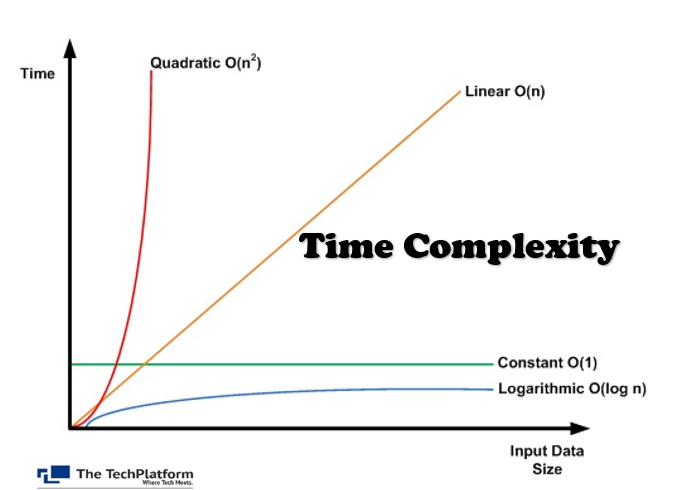
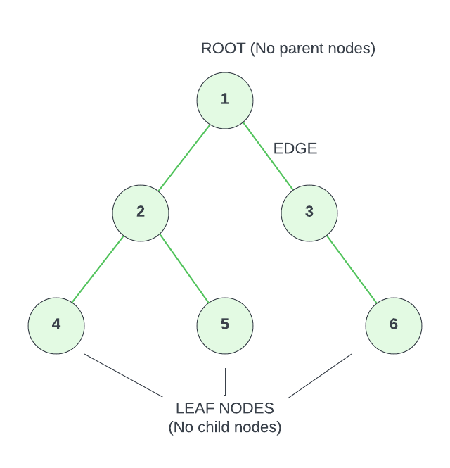
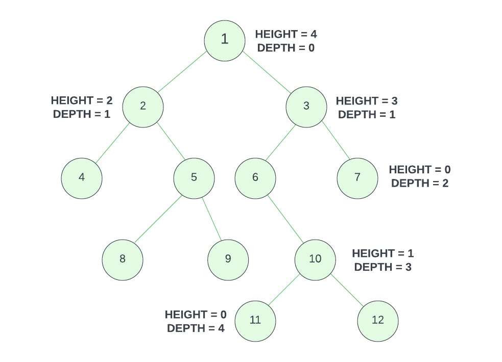

<!--~~~~~~~~~~~~~~~~~~~~~~~~~~~~~~~~~~~~~~~~~~~~~~~~~~~~~~~~~~~~~~~~~~~~~~~~~~~~~~~~~~~~~~~~~~~~-->
<!--~~~~~~~~~~~~~~~~~~~~~~~~~ readme.md for JS-Cellardoor.bauska.org ~~~~~~~~~~~~~~~~~~~~~~~~~~~-->

<!-- 102 in table of contents -->
<!--~~~~~~~~~~~~~~~~~~~~~~~~~~~~~~~~~~~~~~~~~~~~~~~~~~~~~~~~~~~~~~~~~~~~~~~~~~~~~~~~~~~~~~~~~~~~-->
# 01. Challenge: Count Vowels
<!--~~~~~~~~~~~~~~~~~~~~~~~~~~~~~~~~~~~~~~~~~~~~~~~~~~~~~~~~~~~~~~~~~~~~~~~~~~~~~~~~~~~~~~~~~~~~-->
## Instructions

Write a function called `countVowels` that takes in a string and returns the number of 
vowels in the string.

### Function Signature

```js
/**
 * Returns the number of vowels in a string.
 * @param {string} str - The string to search.
 * @returns {number} - The number of vowels in the string.
 */
function countVowels(str: string): number;
```

### Examples

```js
countVowels('hello'); // 2
countVowels('why'); // 0
countVowels('mississippi'); // 4
```

### Constraints

- It shouldn't matter if the input string is uppercase or lowercase

### Hints


## Solutions

<details open>
  <summary>Click For Solution</summary>

```js
function countVowels(str) {
  const formattedStr = str.toLowerCase();
  let count = 0;

  for (let i = 0; i < formattedStr.length; i++) {
    const char = formattedStr[i];

    if (
      char === 'a' ||
      char === 'e' ||
      char === 'i' ||
      char === 'o' ||
      char === 'u'
    ) {
      count++;
    }
  }

  return count;
}
```

## Explanation

- Make the string lowercase. This is because we want to count both uppercase and 
  lowercase vowels.
- Create a variable called `count` and set it to `0`. This is the variable we will 
  use to keep track of how many vowels we have found.
- Create a `for` loop that will loop through each character in the string. We then 
  create a variable called `char` and set it to the current character in the string.
- Check if the character is a vowel. If it is, we increment `count` by `1`. Once we 
  have looped through the entire string, we return `count`.

</details>

### Test Cases

```js
test('Counting vowels in a string', () => {
  expect(countVowels('Hello, World!')).toBe(3);
  expect(countVowels('JavaScript')).toBe(3);
  expect(countVowels('OpenAI Chatbot')).toBe(6);
  expect(countVowels('Coding Challenge')).toBe(5);
});
```
<!--~~~~~~~~~~~~~~~~~~~~~~~~~~~~~~~~~~~~~~~~~~~~~~~~~~~~~~~~~~~~~~~~~~~~~~~~~~~~~~~~~~~~~~~~~~~~-->
# 02. Challenge: Palindrome
<!--~~~~~~~~~~~~~~~~~~~~~~~~~~~~~~~~~~~~~~~~~~~~~~~~~~~~~~~~~~~~~~~~~~~~~~~~~~~~~~~~~~~~~~~~~~~~-->
A palindrome is a word, phrase, number, or other sequence of characters which reads the 
same backward or forward. An example of a palindrome is "madam".

## Instructions

Write a function called `isPalindrome` that takes in a string and returns `true` if the 
string is a palindrome and `false` if it is not.

### Function Signature

```js
/**
 * Returns true if the string is a palindrome.
 * @param {string} str - The string to check.
 * @returns {boolean} - True if the string is a palindrome, false otherwise.
 */
function isPalindrome(str: string): boolean;
```

### Examples

```JS
isPalindrome('madam') // true
isPalindrome('racecar') // true
isPalindrome('hello') // false
isPalindrome('') // true
```

### Constraints

- The input string will only contain lowercase letters and spaces
- The function should ignore spaces when checking if the string is a palindrome

### Hints

- You can solve this in a way that is similar to the reverse string challenge with some 
added steps.
- Remember, you want to remove any non-alphanumeric characters from the string before 
comparing it to the reversed string. There are multiple ways to do this, but one way is 
to use the `replace` method with a regular expression of `/[^a-z0-9]/g`.

## Solutions

<details open>
  <summary>Click For Solution 1</summary>

Using `replace` with a regular expression is the easiest way to solve this challenge.

```js
function isPalindrome(str) {
  const formattedStr = str.toLowerCase().replace(/[^a-z0-9]/g, '');
  const reversedStr = formattedStr.split('').reverse().join('');
  return formattedStr === reversedStr;
}
```

### Explanation

- Take the input string and make it lowercase.
- Use the `replace` method with a regular expression to remove any non-alphanumeric 
characters from the string. That way we can compare the string without worrying about 
spaces or punctuation, such as 'racecar' and 'race car'.
- Store the result in a variable called `formattedStr`.
- Reverse the string, just like we did in the last challenge.
- Compare the original string to the reversed string and return the result. If it is a 
palindrome, the two strings will be equal, so we return `true`. If it is not a palindrome, 
the two strings will not be equal, so we return `false`.

</details>

<details open>
  <summary>Click For Solution 2</summary>

If you do not want to use a regular expression to strip out non-alphanumeric characters, 
there are a few ways to do it. We are going to create some helper functions to make it 
easier.

```js
function isPalindrome(str) {
  const formattedStr = removeNonAlphanumeric(str.toLowerCase());
  const reversedStr = reverseString(formattedStr);
  return formattedStr === reversedStr;
}

function removeNonAlphanumeric(str) {
  let formattedStr = '';
  for (let i = 0; i < str.length; i++) {
    const char = str[i];
    if (isAlphaNumeric(char)) {
      formattedStr += char;
    }
  }
  return formattedStr;
}

function isAlphaNumeric(char) {
  const code = char.charCodeAt(0);
  return (
    (code >= 48 && code <= 57) || // Numbers 0-9
    (code >= 97 && code <= 122) // Lowercase letters a-z
  );
}

function reverseString(str) {
  let reversed = '';
  for (let i = str.length - 1; i >= 0; i--) {
    reversed += str[i];
  }
  return reversed;
}
```

### Explanation

This solution is a bit tougher.

- Create a helper function called `removeNonAlphanumeric` that takes in a string and 
returns a new string with all non-alphanumeric characters removed. We do this by 
looping through the string and checking if each character is alphanumeric with 
another helper function called `isAlphaNumeric`.

- In the `isAlphaNumeric` function, we use the `charCodeAt` method to get the character 
code of the character. We then check if the character code is between 48 and 57, which 
is the range for numbers 0-9, or if it is between 97 and 122, which is the range for 
lowercase letters a-z. If it is, we return `true`. If it is not, we return `false`.

- Once we have a string with only alphanumeric characters, we can reverse it and 
compare it to the original string to see if it is a palindrome.

</details>

### Test Cases

```js
test('Checking for palindrome strings', () => {
  expect(isPalindrome('racecar')).toBe(true);
  expect(isPalindrome('Hello')).toBe(false);
  expect(isPalindrome('A man, a plan, a canal, Panama')).toBe(true);
  expect(isPalindrome('12321')).toBe(true);
});
```

<!--~~~~~~~~~~~~~~~~~~~~~~~~~~~~~~~~~~~~~~~~~~~~~~~~~~~~~~~~~~~~~~~~~~~~~~~~~~~~~~~~~~~~~~~~~~~~-->
# 03. Challenge: Reverse String
<!--~~~~~~~~~~~~~~~~~~~~~~~~~~~~~~~~~~~~~~~~~~~~~~~~~~~~~~~~~~~~~~~~~~~~~~~~~~~~~~~~~~~~~~~~~~~~-->

## Instructions

Write a function called `reverseString` that takes in a string and returns the reverse 
of that string. In this section, we are really focusing on loops without using any 
built-in methods, so try that first. If you get stuck, you can always use the built-in 
methods to solve the problem.

### Function Signature

```js
/**
 * Returns the reverse of a string.
 * @param {string} str - The string to reverse.
 * @returns {string} - The reverse of the string.
 */
function reverseString(str: string): string;
```

### Examples

```JS
reverseString('hello') // 'olleh'
reverseString('world') // 'dlrow'
reverseString('') // ''
```

### Constraints

- The input string will only contain lowercase letters and spaces

### Hints

- You can also do this without using any of the built-in methods and just use a for loop.
- You could also use the methods `split`, `reverse`, and `join` to solve this problem.

## Solutions

<details open>
  <summary>Click For Solution 1</summary>

This solution uses a for loop to reverse the string.

```js
function reverseString(str) {
  let reversed = '';

  for (let i = str.length - 1; i >= 0; i--) {
    reversed += str[i];
  }

  return reversed;
}
```

## Explanation

- Create a variable called `reversed` and set it equal to an empty string.
- Create a for loop that starts at the last index of `str` and decrements by 1 until it reaches 0.
- Add the character at the current index to the `reversed` variable.
- Return the `reversed` variable.

</details>

<details open>
  <summary>Click For Solution 2</summary>

This solution uses built-in methods to reverse the string.

```js
function reverseString(str) {
  return str.split('').reverse().join('');
}
```

### Explanation

We created a function called `reverseString` that takes in a string called `str`. We 
then return the result of chaining the `split`, `reverse`, and `join` methods on `str`.

The `split` function takes in a string and turns it into an array. We passed in an 
empty string as an argument to `split` so that it will split the string into an array 
of characters.(["h", "e", "l", "l", "o"])

The `reverse` function takes in an array and reverses it. (["o", "l", "l", "e", "h"])

The `join` function takes in an array and turns it into a string. We passed in an 
empty string as an argument to `join` so that it will join the array of characters 
into a string. ('olleh')

</details>

### Test Cases

```JS
test('Reversing a string', () => {
  expect(reverseString('Hello')).toBe('olleH');
  expect(reverseString('JavaScript')).toBe('tpircSavaJ');
  expect(reverseString('12345')).toBe('54321');
});

```
<!--~~~~~~~~~~~~~~~~~~~~~~~~~~~~~~~~~~~~~~~~~~~~~~~~~~~~~~~~~~~~~~~~~~~~~~~~~~~~~~~~~~~~~~~~~~~~-->
# 04. Challenge: Title Case
<!--~~~~~~~~~~~~~~~~~~~~~~~~~~~~~~~~~~~~~~~~~~~~~~~~~~~~~~~~~~~~~~~~~~~~~~~~~~~~~~~~~~~~~~~~~~~~-->

## Instructions

Write a function called `titleCase` that takes in a string and returns the string with 
the first letter of each word capitalized.

### Function Signature

```js
/**
 * Returns a string with the first letter of each word capitalized.
 * @param {string} str - The string to capitalize.
 * @returns {string} - The string with the first letter of each word capitalized.
 */
function titleCase(str: string): string;
```

### Examples

```js
titleCase("I'm a little tea pot"); // I'm A Little Tea Pot
titleCase('sHoRt AnD sToUt'); // Short And Stout
titleCase('HERE IS MY HANDLE HERE IS MY SPOUT'); // Here Is My Handle Here Is My Spout
```

### Constraints

- You may assume that each word consists of only letters and spaces

### Hints

## Solutions

<details open>
  <summary>Click For Solution 1</summary>

```php
function titleCase(str) {
  const words = str.toLowerCase().split(' ');

  for (let i = 0; i < words.length; i++) {
    words[i] = words[i][0].toUpperCase() + words[i].slice(1);
  }

  return words.join(' ');
}
```

### Explanation

- Split the string into an array of words and put them all in lowercase.
- Iterate through the array and capitalize the first letter of each word by using the 
  0 index of the word and concatenating it with the rest of the word.
- Join the array back into a string and return it.

</details>

<details open>
  <summary>Click For Solution 2</summary>

```js
function titleCase(str) {
  return str.replace(/\b\w/g, (match) => match.toUpperCase());
}
```

## Explanation

In this example, we are using the replace method to find the first letter of each word 
and replace it with the uppercase version of itself.

The regex `/\b\w/g` matches the first letter of each word.

- `\b` matches the word boundary
- `\w` matches the first letter of each word
- The `g` flag is used to replace all occurrences of the regex in the string

The second argument is a callback function that returns the uppercase version of the 
matched letter.

</details>

### Test Cases

```js
test('Converting string to title case', () => {
  expect(titleCase('hello world')).toBe('Hello World');
  expect(titleCase('javascript programming')).toBe('Javascript Programming');
  expect(titleCase('openai chatbot')).toBe('Openai Chatbot');
});
```

<!--~~~~~~~~~~~~~~~~~~~~~~~~~~~~~~~~~~~~~~~~~~~~~~~~~~~~~~~~~~~~~~~~~~~~~~~~~~~~~~~~~~~~~~~~~~~~-->
# 05. Challenge: Find Max Number
<!--~~~~~~~~~~~~~~~~~~~~~~~~~~~~~~~~~~~~~~~~~~~~~~~~~~~~~~~~~~~~~~~~~~~~~~~~~~~~~~~~~~~~~~~~~~~~-->

## Instructions

Write a function called `findMaxNumber` that takes in an array of numbers and returns 
the largest number in the array.

### Function Signature

```js
/**
 * Returns the largest number in an array.
 * @param {number[]} arr - The array of numbers.
 * @returns {number} - The largest number in the array.
 */
function findMaxNumber(arr: number[]): number;
```

### Examples

```js
findMaxNumber([1, 2, 3, 4, 5, 6, 7, 8, 9, 10]); // 10
findMaxNumber([10, 9, 8, 7, 6, 5, 4, 3, 2, 1]); // 10
findMaxNumber([1, 2, 3, 4, 5, 10, 9, 8, 7, 6]); // 10
```

### Hints

- There is a very easy way to do this using a specific built-in method. I would 
  suggest not doing it that way. Try to solve this problem using a `for` loop.

## Solutions

<details open>
  <summary>Click For Solution 1</summary>

This is the easy way to do it. There is a method called `Math.max()` that will return 
the largest number in an array. This is not the way I would suggest doing it, but it 
is good to know that this method exists.

```js
function findMaxNumber(arr) {
  return Math.max(...arr);
}
```

### Explanation

There is not too much explanation needed here.

</details>

<details open>
  <summary>Click For Solution 2</summary>

Here is another way of solving it using a `for` loop.

```js
function findMaxNumber(arr) {
  let max = arr[0];

  for (let i = 1; i < arr.length; i++) {
    if (arr[i] > max) {
      max = arr[i];
    }
  }

  return max;
}
```

### Explanation

- Create a variable called `max` and setting it equal to the first element in the array.
- Loop through the array starting at the second element.
- Check if the current element is greater than the current value of `max`. If it is, 
  we set `max` equal to the current element.
- Return `max` after the loop is finished.

</details>

### Test Cases

```js
test('Finding the maximum number in an array', () => {
  expect(findMaxNumber([1, 5, 3, 9, 2])).toBe(9);
  expect(findMaxNumber([0, -1, -5, 2])).toBe(2);
  expect(findMaxNumber([10, 10, 10, 10])).toBe(10);
});
```

<!--~~~~~~~~~~~~~~~~~~~~~~~~~~~~~~~~~~~~~~~~~~~~~~~~~~~~~~~~~~~~~~~~~~~~~~~~~~~~~~~~~~~~~~~~~~~~-->
# 06. Challenge: Remove Duplicates
<!--~~~~~~~~~~~~~~~~~~~~~~~~~~~~~~~~~~~~~~~~~~~~~~~~~~~~~~~~~~~~~~~~~~~~~~~~~~~~~~~~~~~~~~~~~~~~-->

## Instructions

Write a function called `removeDuplicates` that takes in an array and returns a new 
array with duplicates removed.

### Function Signature

```js
/**
 * Returns a new array with duplicates removed.
 * @param {any[]} arr - The array to remove duplicates from.
 * @returns {any[]} - The new array with duplicates removed.
 */
function removeDuplicates(arr: any[]): any[];
```

### Examples

```js
removeDuplicates([1, 2, 3, 4, 5, 6, 7, 8, 9, 10]); // [1, 2, 3, 4, 5, 6, 7, 8, 9, 10]
removeDuplicates([1, 1, 1, 1, 1, 1, 1, 1, 1, 1]); // [1]
removeDuplicates([1, 2, 3, 4, 5, true, 1, 'hello' 2, 3, 'hello', true]); // [1, 2, 3, 4, 5, true, 'hello']
```

### Constraints

- The array can contain any data type

### Hints

- You can do this with a traditional 'for' loop, but if you are familiar with the `Set` 
  object, you can use that to solve this problem. Maybe try both ways!

## Solutions

<details open>
  <summary>Click For Solution 1</summary>

Using a for loop

```js
function removeDuplicates(arr) {
  const uniqueArr = [];

  for (let i = 0; i < arr.length; i++) {
    if (!uniqueArr.includes(arr[i])) {
      uniqueArr.push(arr[i]);
    }
  }

  return uniqueArr;
}
```

### Explanation

- Create a new array called `uniqueArr`.
- Create a `for` loop that will loop through each element in the array and check if the 
  current element is in `uniqueArr`.
- If it is not, we push it into `uniqueArr`.
- Once we have looped through the entire array, we return `uniqueArr`.

</details>

<details open>
  <summary>Click For Solution 2</summary>

Using a Set

```js
function removeDuplicates(arr) {
  return Array.from(new Set(arr));
}
```

### Explanation

This solution is extremely simple. We take in an array with duplicates and we create a 
new `Set` from that array. We then convert that `Set` back into an array and return it.

The reason that this works is because a `Set` can only contain unique values. So when 
we create a `Set` from an array, it will remove all the duplicates automatically.

</details>

### Test Cases

```js
test('Removing duplicates from an array', () => {
  expect(removeDuplicates([1, 2, 3, 2, 4, 1, 5])).toEqual([1, 2, 3, 4, 5]);
  expect(
    removeDuplicates(['apple', 'banana', 'orange', 'banana', 'kiwi'])
  ).toEqual(['apple', 'banana', 'orange', 'kiwi']);
  expect(removeDuplicates([true, true, false, true, false])).toEqual([
    true,
    false,
  ]);
});
```
<!--~~~~~~~~~~~~~~~~~~~~~~~~~~~~~~~~~~~~~~~~~~~~~~~~~~~~~~~~~~~~~~~~~~~~~~~~~~~~~~~~~~~~~~~~~~~~-->
# 07. Challenge: Count Occurrences
<!--~~~~~~~~~~~~~~~~~~~~~~~~~~~~~~~~~~~~~~~~~~~~~~~~~~~~~~~~~~~~~~~~~~~~~~~~~~~~~~~~~~~~~~~~~~~~-->

## Instructions

Write a function called `countOccurrences()` that takes in a string and a character and 
returns the number of occurrences of that character in the string.

### Function Signature

```js
/**
 * Returns the number of occurrences of a character in a string.
 * @param {string} str - The string to search.
 * @param {string} char - The character to search for.
 * @returns {number} - The number of occurrences of the character in the string.
 */
function countOccurrences(str: string, char: string): number;
```

### Examples

```js
countOccurrences('hello', 'l'); // 2
countOccurrences('hello', 'z'); // 0
```

### Constraints

- Lowercase and uppercase characters are considered different characters. If you want, 
  you can make the function case insensitive

### Hints

- You can loop through a string just like you can loop through an array.
- You can use the `++` operator to increment a variable.
- You could take another approach and use the `split()` method to split the string into 
  an array of substrings based on the given character.

## Solutions

<details open>
  <summary>Click For Solution 1</summary>

```JavaScript
function countOccurrences(str, char) {
  let count = 0;

  for (let i = 0; i < str.length; i++) {
    if (str[i] === char) {
      count++;
    }
  }

  return count;
}

// Case insensitive version
// function countOccurrences(str, char) {
//   const lowerStr = str.toLowerCase();
//   const lowerChar = char.toLowerCase();

//   let count = 0;

//   for (let i = 0; i < lowerStr.length; i++) {
//     if (lowerStr[i] === lowerChar) {
//       count++;
//     }
//   }

//   return count;
// }

```

### Explanation

- Initialize a `count` variable to 0.

- Iterate through the string and check if the current character is equal to the character 
  we're looking for. If it is, we increment the `count` variable.

- After the loop, we return the `count` variable.

- To make the function case insensitive, we can convert the string and character to 
  lowercase before looping through the string.

</details>

<details open>
  <summary>Click For Solution 2</summary>

```JavaScript
const countOccurrences = (str, char) => str.split(char).length - 1;
```

### Explanation

- Utilize the split method of the string to split it into an array of substrings based 
  on the given character.

- Since splitting the string removes the character, the resulting array will have one 
  less element than the number of occurrences of the character. Therefore, we can simply 
  subtract 1 from the length of the array to get the count of occurrences.

This solution may be prettier, but it actually is not as efficient as the loop. The for 
loop solution directly counts the occurrences while iterating through the string, whereas 
the split solution involves splitting the string into an array and performing additional 
operations. The difference is negligible, but it is still good to be aware of.

</details>

### Test Cases

```js
test('Count Occurrences of a Character', () => {
  expect(countOccurrences('hello', 'l')).toBe(2);
  expect(countOccurrences('programming', 'm')).toBe(2);
  expect(countOccurrences('banana', 'a')).toBe(3);
});
```

<!--~~~~~~~~~~~~~~~~~~~~~~~~~~~~~~~~~~~~~~~~~~~~~~~~~~~~~~~~~~~~~~~~~~~~~~~~~~~~~~~~~~~~~~~~~~~~-->
# 08. Challenge: Calculator
<!--~~~~~~~~~~~~~~~~~~~~~~~~~~~~~~~~~~~~~~~~~~~~~~~~~~~~~~~~~~~~~~~~~~~~~~~~~~~~~~~~~~~~~~~~~~~~-->

## Instructions

Write a function called `calculator` that takes in 2 numbers and an operator and 
returns the result of the calculation.

### Function Signature

```js
/**
 * Returns the result of a calculation.
 * @param {number} num1 - The first number.
 * @param {number} num2 - The second number.
 * @param {string} operator - The operator to use in the calculation.
 * @returns {number} - The result of the calculation.
 */
function calculator(num1: number, num2: number, operator: string): number;
```

### Examples

```JS
calculator(1, 2, '+') // 3
calculator(10, 5, '-') // 5
calculator(2, 2, '*') // 4
calculator(10, 5, '/') // 2
```

### Constraints

- The function must return a number
- The function must throw or log an error if an invalid operator is given

### Hints

- You can use `if` statements or `switch` statements to determine which operator was given.

## Solutions

<details open>
  <summary>Click For Solution 1</summary>

#### Using a switch:

```js
function calculator(num1, num2, operator) {
  let result;

  switch (operator) {
    case '+':
      result = num1 + num2;
      break;
    case '-':
      result = num1 - num2;
      break;
    case '*':
      result = num1 * num2;
      break;
    case '/':
      result = num1 / num2;
      break;
    default:
      throw new Error('Invalid operator');
  }

  return result;
}
```

### Explanation

- Created a function called `calculator` that takes in three arguments: `num1`, 
  `num2`, and `operator`.
- Create a variable called `result` to store the result of the calculation.
- Used a `switch` statement to determine which operator was given. If it was +, -, \* or /, 
  we did the calculation. If the operator is anything else, we throw an error.

</details>

<details open>
 <summary>Click For Solution 2</summary>

#### Using an if statement:

```js
function calculator(num1, num2, operator) {
  let result;

  if (operator === '+') {
    result = num1 + num2;
  } else if (operator === '-') {
    result = num1 - num2;
  } else if (operator === '*') {
    result = num1 * num2;
  } else if (operator === '/') {
    result = num1 / num2;
  } else {
    throw new Error('Invalid operator');
  }

  return result;
}
```

### Explanation

- Create a function called `calculator` that takes in three arguments: `num1`, `num2`, 
  and `operator`.
- Create a variable called `result` to store the result of the calculation.
- Use an `if` statement to determine which operator was given. If it was +, -, \* or /, 
  we did the calculation. If the operator is anything else, we throw an error.

 </details>

### Test Cases

```js
test('Performing arithmetic operations using the calculator function', () => {
  // Test case inputs
  const num1 = 5;
  const num2 = 7;

  // Addition
  expect(calculator(num1, num2, '+')).toBe(12);

  // Subtraction
  expect(calculator(num1, num2, '-')).toBe(-2);

  // Multiplication
  expect(calculator(num1, num2, '*')).toBe(35);

  // Division
  expect(calculator(num1, num2, '/')).toBeCloseTo(0.7143, 4);

  // Invalid operator
  expect(() => calculator(num1, num2, '^')).toThrow('Invalid operator');
});
```
<!--~~~~~~~~~~~~~~~~~~~~~~~~~~~~~~~~~~~~~~~~~~~~~~~~~~~~~~~~~~~~~~~~~~~~~~~~~~~~~~~~~~~~~~~~~~~~-->
# 09. Challenge: Get Sum
<!--~~~~~~~~~~~~~~~~~~~~~~~~~~~~~~~~~~~~~~~~~~~~~~~~~~~~~~~~~~~~~~~~~~~~~~~~~~~~~~~~~~~~~~~~~~~~-->

This is another very basic practice challenge just to get you into the hang of things.

## Instructions

Write a function called `getSum` that takes in two numbers and returns the sum of those two numbers.

### Function Signature

```js
/**
 * Returns the sum of two numbers.
 * @param {number} a - The first number.
 * @param {number} b - The second number.
 * @returns {number} - The sum of the two numbers.
 */
function getSum(a: number, b: number): number;
```

### Examples

```JS
getSum(1, 2) // 3
getSum(10, 5) // 15
getSum(2, 2) // 4
getSum(10, 5) // 15
```

### Constraints

- The function must return a number

### Hints

- You can use the `+` operator to add two numbers together.

## Solutions

<details open>
  <summary>Click For Solution</summary>

```JS
function getSum(a, b) {
  return a + b;
}
```

### Explanation

This is a pretty simple challenge. We created a function that takes in two values and we 
added those two values together. We then returned the sum of those two values.

</details>

### Test Cases

```JS
test('Calculating the sum of two numbers', () => {
  // Test case inputs
  const num1 = 5;
  const num2 = 7;

  // Call the function
  const result = getSum(num1, num2);

  // Check if the result is equal to the expected sum
  expect(result).toBe(12);
});
```

<!--~~~~~~~~~~~~~~~~~~~~~~~~~~~~~~~~~~~~~~~~~~~~~~~~~~~~~~~~~~~~~~~~~~~~~~~~~~~~~~~~~~~~~~~~~~~~-->
# 10. Challenge: Hello World Sample Challenge
<!--~~~~~~~~~~~~~~~~~~~~~~~~~~~~~~~~~~~~~~~~~~~~~~~~~~~~~~~~~~~~~~~~~~~~~~~~~~~~~~~~~~~~~~~~~~~~-->

This is a practice challenge to show you how things are set up and how to test, etc.

## Instructions

Write a function called `helloWorld` that returns a string of 'Hello World!'.

### Function Signature

```js
/**
 * Returns a string containing 'Hello World!'.
 * @returns {string} - The string 'Hello World!'.
 */
function helloWorld(): string;
```

### Examples

```JS
helloWorld() // 'Hello World!'
```

### Constraints

I will put any constraints here. They will vary depending on the challenge.

- The function must return a string

### Hints

- I will put a couple hints here. You can choose to use them or not.

## Solutions

<details open>
  <summary>Click For Solution</summary>

```JS
function printHelloWorld() {
  return 'Hello World!';
}
```

### Explanation

I will put the explanation to the solution here. The length and depth of the explanation 
will vary depending on the challenge.

</details>

### Test Cases

The Jest tests will go here. They are already included in the course files. You just need 
to run `npm test`. Sometimes I will also put manual tests here.

```JS
test("Returning 'Hello, World!' as a string", () => {
  const result = helloWorld();
  expect(result).toBe('Hello World!');
});
```

<!--~~~~~~~~~~~~~~~~~~~~~~~~~~~~~~~~~~~~~~~~~~~~~~~~~~~~~~~~~~~~~~~~~~~~~~~~~~~~~~~~~~~~~~~~~~~~-->
# 11. Challenge: Array Intersection
<!--~~~~~~~~~~~~~~~~~~~~~~~~~~~~~~~~~~~~~~~~~~~~~~~~~~~~~~~~~~~~~~~~~~~~~~~~~~~~~~~~~~~~~~~~~~~~-->

## Instructions

Write a function called `arrayIntersection` that takes in two arrays and returns an array 
containing the intersection of the two input arrays (i.e., the common elements that appear 
in both arrays).

### Function Signature

```js
/**
 * Returns the intersection of two arrays.
 * @param {number[]} arr1 - The first array.
 * @param {number[]} arr2 - The second array.
 * @returns {number[]} - The intersection of the two arrays.
 */
function arrayIntersection(arr1: number[], arr2: number[]): number[];
```

### Examples

```js
arrayIntersection([1, 2, 3, 4, 5], [1, 3, 5, 7, 9]); // should return [1, 3, 5]
arrayIntersection([1, 1, 1, 1, 1], [2, 2, 2, 2, 2]); // should return []
arrayIntersection([1, 2, 3, 4, 5], [5, 4, 3, 2, 1]); // should return [1, 2, 3, 4, 5]
```

### Constraints

- The input arrays can contain any number of elements
- The input arrays can contain any positive integer

### Hints

- You could use a for loop to iterate through the first array and check if each element 
  is in the second array using the `includes` method.
- You could also take the approach of using a Set to store the elements of the first 
  array and then iterate through the second array and check if each element is in the 
  Set using the `has` method.

## Solutions

<details open>
  <summary>Click For Solution 1</summary>

```js
function arrayIntersection(arr1, arr2) {
  const intersection = [];

  for (let i = 0; i < arr1.length; i++) {
    if (arr2.includes(arr1[i]) && !intersection.includes(arr1[i])) {
      intersection.push(arr1[i]);
    }
  }

  return intersection;
}
```

### Explanation

- Iterate through the first array
- For each element, check if it is in the second array using the `includes` method
- If it is, check if it is already in the intersection array using the `includes` method
- If it is not, push it into the intersection array
- Return the intersection array

</details>

<details open>
  <summary>Click For Solution 2</summary>

In this solution, we will use a Set. A Set is a data structure that stores unique values. 
We will have a section on maps, sets later. If you are not familiar with sets, that is 
fine. You can still follow along with this solution.

```js
function arrayIntersection(arr1, arr2) {
  const set1 = new Set(arr1);
  const intersection = [];

  for (let num of arr2) {
    if (set1.has(num)) {
      intersection.push(num);
    }
  }

  return intersection;
}
```

### Explanation

- Create a new Set from the first array
- Iterate through the second array and check if each element is in the set using the `has` method
- If it is, push it into the intersection array
- Return the intersection array

</details>

### Test Cases

```js
test('Finding array intersection', () => {
  expect(arrayIntersection([1, 2, 3, 4, 5], [3, 4, 5, 6, 7])).toEqual([
    3, 4, 5,
  ]);
  expect(arrayIntersection([10, 20, 30], [30, 40, 50])).toEqual([30]);
  expect(arrayIntersection([1, 2, 3], [4, 5, 6])).toEqual([]);
});
```
<!--~~~~~~~~~~~~~~~~~~~~~~~~~~~~~~~~~~~~~~~~~~~~~~~~~~~~~~~~~~~~~~~~~~~~~~~~~~~~~~~~~~~~~~~~~~~~-->
# 12. Challenge: Display Likes
<!--~~~~~~~~~~~~~~~~~~~~~~~~~~~~~~~~~~~~~~~~~~~~~~~~~~~~~~~~~~~~~~~~~~~~~~~~~~~~~~~~~~~~~~~~~~~~-->

## Instructions

Write a function called `displayLikes` that takes in an array of names and returns a string of who likes the post.

The function should return a string formatted as follows:

- If no one likes it, it should return `'no one likes this'`
- If one person likes it, it should return `'{name} likes this'`
- If two people like it, it should return `'{name1} and {name2} like this'`
- If three people like it, it should return `'{name1}, {name2} and {name3} like this'`
- If more than three people like it, it should return `'{name1}, {name2} and {x} others like this'`

### Function Signature

```js
/**
 * Returns a string of who likes the post.
 * @param {string[]} names - The names of the people who like the post.
 * @returns {string} - A string of who likes the post.
 */
function displayLikes(names: string[]): string;
```

### Examples

```JS
displayLikes([]) // 'no one likes this'
displayLikes(['Peter']) // 'Peter likes this'
displayLikes(['Jacob', 'Alex']) // 'Jacob and Alex like this'
displayLikes(['Max', 'John', 'Mark']) // 'Max, John and Mark like this'
displayLikes(['Alex', 'Jacob', 'Mark', 'Max']) // 'Alex, Jacob and 2 others like this'
displayLikes(['Alex', 'Jacob', 'Mark', 'Max', 'Jill']) // 'Alex, Jacob and 3 others like this'
```

### Constraints

- The input array will only contain strings

### Hints

## Solutions

<details open>
  <summary>Click For Solution</summary>

```js
function displayLikes(names) {
  const length = names.length;

  if (length === 0) {
    return 'no one likes this';
  } else if (length === 1) {
    return `${names[0]} likes this`;
  } else if (length === 2) {
    return `${names[0]} and ${names[1]} like this`;
  } else if (length === 3) {
    return `${names[0]}, ${names[1]} and ${names[2]} like this`;
  } else {
    return `${names[0]}, ${names[1]} and ${length - 2} others like this`;
  }
}
```

### Explanation

This is pretty simple as it just requires a bunch of if statements. We could also use a switch statement here, but it would be a bit more verbose.

- Get the length of the array and then check if it's 0, 1, 2, 3, or more. Depending on the length, we return the appropriate string.
- If there are more than 3 names, we return the first two names, and then the length minus 2 for the number of others.

</details>

### Test Cases

```js
test('Display Likes', () => {
  expect(displayLikes([])).toEqual('no one likes this');
  expect(displayLikes(['Peter'])).toEqual('Peter likes this');
  expect(displayLikes(['Jacob', 'Alex'])).toEqual('Jacob and Alex like this');
  expect(displayLikes(['Max', 'John', 'Mark'])).toEqual(
    'Max, John and Mark like this'
  );
  expect(displayLikes(['Alex', 'Jacob', 'Mark', 'Max'])).toEqual(
    'Alex, Jacob and 2 others like this'
  );
  expect(displayLikes(['Alex', 'Jacob', 'Mark', 'Max', 'Jill'])).toEqual(
    'Alex, Jacob and 3 others like this'
  );
});
```

<!--~~~~~~~~~~~~~~~~~~~~~~~~~~~~~~~~~~~~~~~~~~~~~~~~~~~~~~~~~~~~~~~~~~~~~~~~~~~~~~~~~~~~~~~~~~~~-->
# 13. Challenge: Find The Missing Number
<!--~~~~~~~~~~~~~~~~~~~~~~~~~~~~~~~~~~~~~~~~~~~~~~~~~~~~~~~~~~~~~~~~~~~~~~~~~~~~~~~~~~~~~~~~~~~~-->

## Instructions

Write a function called `findMissingNumber` that takes in an array of unique numbers from 1 to n 
(inclusive), where one number is missing. It should return the missing number.

### Function Signature

```js
/**
 * Returns the missing number in an array of unique numbers from 1 to n (inclusive).
 * @param {number[]} arr - The array of numbers.
 * @returns {number} - The missing number.
 */
function findMissingNumber(arr: number[]): number;
```

### Examples

```js
findMissingNumber([1, 2, 3, 4, 6, 7, 8, 9, 10]); // 5
findMissingNumber([10, 8, 6, 7, 5, 4, 2, 3, 1]); // 9
findMissingNumber([10, 5, 1, 2, 4, 6, 8, 3, 9]); // 7
```

### Constraints

- If an empty array is passed in, it should return `1`
- If nothing is passed in, it should return `undefined`

### Hints

- Calculate the sum of the numbers from 1 to n (inclusive). The formula for this is `n * (n + 1) / 2`. `n` is the length of the array plus 1.
- Calculate the sum of the numbers in the array.
- Subtract the sum of the numbers in the array from the sum of the numbers from 1 to n (inclusive).
- You could use a for loop or the reduce method to calculate the sum of the numbers in the array. We will be focusing on methods like reduce in the next section, but I will still show you both ways.

## Solutions

<details open>
  <summary>Click For Solution</summary>

```js
function findMissingNumber(arr) {
  if (!arr || arr.length === 0) {
    return undefined;
  }

  const n = arr.length + 1;
  const expectedSum = (n * (n + 1)) / 2;

  let actualSum = 0;
  for (let i = 0; i < arr.length; i++) {
    actualSum += arr[i];
  }

  return expectedSum - actualSum;
}

// Using reduce
function findMissingNumber(arr) {
  if (!arr || arr.length === 0) {
    return undefined;
  }

  const n = arr.length + 1;
  const expectedSum = (n * (n + 1)) / 2;

  const actualSum = arr.reduce((sum, num) => sum + num, 0);

  return expectedSum - actualSum;
}
```

### Explanation

The `findMissingNumber` function takes in an array of unique numbers from 1 to n (inclusive), where one number is missing, and returns the missing number.

We first calculate the sum of the numbers from 1 to n (inclusive) using the formula `n * (n + 1) / 2`. This is called the gauss formula. We store this value in a variable called `expectedSum`.

To be more clear, let's look at an example. If we have an array of numbers from 1 to 10, the sum of those numbers is 55. We can calculate this using the gauss formula. `10 * (10 + 1) / 2 = 55`. We can also calculate this using a for loop or the reduce method.

Next, we calculate the sum of the numbers in the array. We store this value in a variable called `actualSum`.

We then return the difference between the expected sum and the actual sum. This will be the missing number.

Again, you can use a for loop or the reduce method to calculate the sum of the numbers in the array.

</details>

### Test Cases

```js
test('Finding the missing number', () => {
  expect(findMissingNumber([1, 2, 3, 5])).toBe(4);
  expect(findMissingNumber([10, 8, 6, 7, 5, 4, 2, 3, 1])).toBe(9);
  expect(findMissingNumber([1, 3, 4, 5, 6])).toBe(2);
});
```

<!--~~~~~~~~~~~~~~~~~~~~~~~~~~~~~~~~~~~~~~~~~~~~~~~~~~~~~~~~~~~~~~~~~~~~~~~~~~~~~~~~~~~~~~~~~~~~-->
# 14. Challenge: Find Missing Letter
<!--~~~~~~~~~~~~~~~~~~~~~~~~~~~~~~~~~~~~~~~~~~~~~~~~~~~~~~~~~~~~~~~~~~~~~~~~~~~~~~~~~~~~~~~~~~~~-->

## Instructions

Write a function called `findMissingLetter` that takes in an array of consecutive (increasing) letters as input and returns the missing letter in the array.

### Function Signature

```js
/**
 * Returns the missing letter in an array of consecutive letters.
 * @param {string[]} arr - An array of consecutive letters.
 * @returns {string} - The missing letter.
 */
function findMissingLetter(arr: string[]): string;
```

### Examples

```js
findMissingLetter(['a', 'b', 'c', 'd', 'f']); // => "e"
findMissingLetter(['O', 'Q', 'R', 'S']); // => "P"
findMissingLetter(['t', 'u', 'v', 'w', 'x', 'z']); // => "y"
```

### Constraints

- The input array will only contain letters in one case (lower or upper)
- If no letters are in the array, return an empty string

### Hints

- You can put the alphabet in a string and use the `indexOf` method to get the index of a letter in the alphabet string.
- Another approach would be to use the `charCodeAt` method to get the unicode value of a letter. 

## Solutions

<details open>
  <summary>Click For Solution 1 </summary>

```js
function findMissingLetter(arr) {
  const alphabet = 'abcdefghijklmnopqrstuvwxyzABCDEFGHIJKLMNOPQRSTUVWXYZ';
  const startIndex = alphabet.indexOf(arr[0]);

  for (let i = 0; i < arr.length; i++) {
    if (arr[i] !== alphabet[startIndex + i]) {
      return alphabet[startIndex + i];
    }
  }

  return '';
}
```

### Explanation

- Declare a variable `alphabet` and assign it a string of all the letters of the alphabet.
- Declare a variable `startIndex` and assigned it the index of the first letter of the input array in the `alphabet` string.
- Loop through the input array and check if the current letter in the input array is not equal to the letter at the current index in the `alphabet` string.
- If it is not equal, return the letter at the current index in the `alphabet` string.
- If we get to the end of the loop without returning anything, we return an empty string.

</details>

<details open>
  <summary>Click For Solution 2 </summary>

```js
function findMissingLetter(arr) {
  let start = arr[0].charCodeAt(0);
  for (let i = 1; i < arr.length; i++) {
    const current = arr[i].charCodeAt(0);
    if (current - start > 1) {
      return String.fromCharCode(start + 1);
    }
    start = current;
  }
  return '';
}
```

### Explanation

- Declare a variable `start` and assigned it the ASCII code of the first letter of the input array.
- Loop through the input array and check if the ASCII code of the current letter minus the ASCII code of the previous letter is greater than 1.
- If it is, return the letter that is one greater than the previous letter.
- If we get to the end of the loop without returning anything, we return an empty string.

</details>

### Test Cases

```js
test('Find Missing Letter', () => {
  expect(findMissingLetter(['a', 'b', 'c', 'e'])).toBe('d');
  expect(findMissingLetter(['X', 'Z'])).toBe('Y');
  expect(findMissingLetter(['m', 'n', 'o', 'q', 'r'])).toBe('p');
  expect(findMissingLetter(['F', 'G', 'H', 'J'])).toBe('I');
});
```

<!--~~~~~~~~~~~~~~~~~~~~~~~~~~~~~~~~~~~~~~~~~~~~~~~~~~~~~~~~~~~~~~~~~~~~~~~~~~~~~~~~~~~~~~~~~~~~-->
# 15. Challenge: Are all characters unique?
<!--~~~~~~~~~~~~~~~~~~~~~~~~~~~~~~~~~~~~~~~~~~~~~~~~~~~~~~~~~~~~~~~~~~~~~~~~~~~~~~~~~~~~~~~~~~~~-->

## Instructions

Write a function called `areAllCharactersUnique` that takes in a string and returns 
`true` or `false` depending on whether all characters in the string are unique (i.e., 
no character is repeated).

### Function Signature

```js
/**
 * Returns true if all characters in a string are unique.
 * @param {string} str - The string to check.
 * @returns {boolean} - Whether all characters in the string are unique.
 */
function areAllCharactersUnique(str: string): boolean;
```

### Examples

```js
areAllCharactersUnique('abcdefg'); // true
areAllCharactersUnique('abcdefgA'); // true
areAllCharactersUnique('programming'); // false
areAllCharactersUnique(''); // true
areAllCharactersUnique('a'); // true
```

### Constraints

- It should be case sensitive, so `a` and `A` are considered different characters
- An empty string should return `true` by default

### Hints

- You can use a for loop to iterate through the string and check if the current character is in the set or object.

## Solutions

<details open>
  <summary>Click For Solution 1</summary>

Using a `Set`:

```js
function areAllCharactersUnique(str) {
  const charSet = new Set();

  for (let i = 0; i < str.length; i++) {
    const char = str[i];
    if (charSet.has(char)) {
      return false;
    }
    charSet.add(char);
  }

  return true;
}
```

### Explanation

-Initialize a new `Set` to keep track of the characters we've seen so far.

- Iterate through the string and check if the current character is in the set. If it is, 
  we return `false` because it means we've seen the character before. If it isn't, we 
  add it to the set.
- If we make it through the entire string without returning `false`, we return `true` 
  because it means we haven't seen any characters more than once.

</details>

<details open>
  <summary>Click For Solution 2</summary>

Using an object:

```js
function areAllCharactersUnique(str) {
  const charCount = {};

  for (let i = 0; i < str.length; i++) {
    const char = str[i];
    if (charCount[char]) {
      return false;
    }
    charCount[char] = true;
  }

  return true;
}
```

### Explanation

This solution is similar except we use an object instead of a `Set` to keep track of the 
characters we've seen so far.

Then we iterate through the string and check if the current character is in the object. 
If it is, we return `false` because it means we've seen the character before. If it isn't, 
we add it to the object.

If we make it through the entire string without returning `false`, we return `true` because 
it means we haven't seen any characters more than once.

</details>

### Test Cases

```js
test('Unique Characters in a String', () => {
  expect(areAllCharactersUnique('abcdefg')).toBe(true);
  expect(areAllCharactersUnique('abcdefgA')).toBe(true);
  expect(areAllCharactersUnique('programming')).toBe(false);
  expect(areAllCharactersUnique('')).toBe(true);
  expect(areAllCharactersUnique('a')).toBe(true);
});
```

<!--~~~~~~~~~~~~~~~~~~~~~~~~~~~~~~~~~~~~~~~~~~~~~~~~~~~~~~~~~~~~~~~~~~~~~~~~~~~~~~~~~~~~~~~~~~~~-->
# 16. Challenge: Dice Game Simulation
<!--~~~~~~~~~~~~~~~~~~~~~~~~~~~~~~~~~~~~~~~~~~~~~~~~~~~~~~~~~~~~~~~~~~~~~~~~~~~~~~~~~~~~~~~~~~~~-->

## Instructions

Write a function called `diceGameSimulation` that simulates this dice game. The function should take one argument:

- `numSimulations`: The number of times to simulate the dice game.

The game rules are if a 7 or 11 are rolled, the player wins and they get a result of `win`. If a 2, 3 or 12 are rolled they lose and get a result of `lose`. Anything else and they get a result of `roll again`.

The function should return an array of objects, where each object represents a simulation result. Each object should contain the following properties:

- `dice1`: The value of the first dice (a random number between 1 and 6).
- `dice2`: The value of the second dice (a random number between 1 and 6).
- `sum`: The sum of the two dice values.
- `result`: The result of the roll, which can be "win", "lose", or "roll again".

### Function Signature

```js
/**
 * Simulates the dice game.
 * @param {number} numSimulations - The number of times to simulate the dice game.
 * @returns {Array} - An array of simulation result objects.
 */
function diceGameSimulation(numSimulations: number): Array;
```

### Example

```js
console.log(diceGameSimulation(3));
/*
  { dice1: 1, dice2: 5, sum: 6, result: 'roll again' },
  { dice1: 5, dice2: 6, sum: 11, result: 'win' },
  { dice1: 1, dice2: 1, sum: 2, result: 'lose' }
*/
```

### Hints

- You can use the `Math.random()` function to simulate rolling a die. It returns a random number between 0 (inclusive) and 1 (exclusive).

## Solution

<details open>
  <summary>Click For Solution</summary>

```js
function rollDice() {
  return Math.floor(Math.random() * 6) + 1;
}

function diceGameSimulation(numSimulations) {
  const results = [];

  for (let i = 0; i < numSimulations; i++) {
    const dice1 = rollDice();
    const dice2 = rollDice();
    const sum = dice1 + dice2;

    let result = '';
    if (sum === 7 || sum === 11) {
      result = 'win';
    } else if (sum === 2 || sum === 3 || sum === 12) {
      result = 'lose';
    } else {
      result = 'roll again';
    }

    results.push({ dice1, dice2, sum, result });
  }

  return results;
}

module.exports = diceGameSimulation;
```

### Explanation

- The `rollDice` function simulates rolling a single die. It uses `Math.random()` to generate a random decimal between 0 (inclusive) and 1 (exclusive), multiplies it by 6, rounds down, and adds 1 to get a random number between 1 and 6.
- The `diceGameSimulation` function simulates the dice game for the specified number of simulations. It uses the `rollDice` function to generate random dice values and calculates the sum of the two dice.
- Depending on the sum, the `result` property is determined according to the game rules.
- The results of each simulation are stored in an array of objects.
- The module exports the `diceGameSimulation` function to make it accessible in other files.

</details>

### Test Cases

```js
test('Dice Game Simulation', () => {
  const numSimulations = 5;
  const simulationResults = diceGameSimulation(numSimulations);

  simulationResults.forEach((result) => {
    console.log(`Simulation Result: ${result.finalResult}`);
    result.rolls.forEach((roll) => {
      console.log(
        `  Dice 1: ${roll.dice1}, Dice 2: ${roll.dice2}, Sum: ${roll.sum}, Result: ${roll.result}`
      );
    });
  });
});
```

<!--~~~~~~~~~~~~~~~~~~~~~~~~~~~~~~~~~~~~~~~~~~~~~~~~~~~~~~~~~~~~~~~~~~~~~~~~~~~~~~~~~~~~~~~~~~~~-->
# 17. Challenge: Format Phone Number
<!--~~~~~~~~~~~~~~~~~~~~~~~~~~~~~~~~~~~~~~~~~~~~~~~~~~~~~~~~~~~~~~~~~~~~~~~~~~~~~~~~~~~~~~~~~~~~-->

## Instructions

Write a function called `formatPhoneNumber` that takes in an array of numbers and returns a string representing the phone number formed by concatenating the numbers in the specified format.

### Function Signature

```js
/**
 * Returns a string representing a phone number.
 * @param {number[]} numbers - The numbers to use in the phone number.
 * @returns {string} - The formatted phone number.
 */
function formatPhoneNumber(numbers: number[]): string;
```

### Examples

```js
formatPhoneNumber([1, 2, 3, 4, 5, 6, 7, 8, 9, 0]); // => "(123) 456-7890"
formatPhoneNumber([5, 1, 9, 5, 5, 5, 4, 4, 6, 8]); // => "(519) 555-4468"
formatPhoneNumber([3, 4, 5, 5, 0, 1, 2, 5, 2, 7]); // => "(345) 501-2527"
```

### Constraints

- The input array will always have 10 numbers
- The numbers can be any integer from 0 to 9

### Hints

- You can use the `Array.join` method to concatenate the numbers in the array.
- You can use the `Array.slice` method to get a subset of the array.

## Solutions

<details open>
  <summary>Click For Solution 1</summary>

```js
function formatPhoneNumber(numbers) {
  const areaCode = numbers.slice(0, 3).join('');
  const prefix = numbers.slice(3, 6).join('');
  const lineNumber = numbers.slice(6).join('');

  return `(${areaCode}) ${prefix}-${lineNumber}`;
}
```

### Explanation

- Create 3 variables to store the area code, prefix, and line number.
- Use the `Array.slice` method to get a subset of the array.
- Use the `Array.join` method to concatenate the numbers in the array.

</details>

<details open>
  <summary>Click For Solution 2</summary>

```js
function formatPhoneNumber(numbers) {
  const formatted = numbers.join('');
  return `(${formatted.substring(0, 3)}) ${formatted.substring(
    3,
    6
  )}-${formatted.substring(6)}`;
}
```

### Explanation

- Created a variable to store the numbers in the array concatenated together.
- Use the `String.substring` method to get a subset of the string.

</details>

<details open>
  <summary>Click For Solution 3</summary>

One line arrow function:

```js
const formatPhoneNumber = (numbers) =>
  `(${numbers.slice(0, 3).join('')}) ${numbers.slice(3, 6).join('')}-${numbers
    .slice(6)
    .join('')}`;
```

### Explanation

This is similar to the second solution, but we used an arrow function and Array.slice method chaining.

</details>

### Test Cases

```js
test('Format Phone Number', () => {
  expect(formatPhoneNumber([1, 2, 3, 4, 5, 6, 7, 8, 9, 0])).toBe(
    '(123) 456-7890'
  );
  expect(formatPhoneNumber([5, 0, 2, 4, 8, 1, 9, 6, 3, 7])).toBe(
    '(502) 481-9637'
  );
  expect(formatPhoneNumber([9, 9, 9, 9, 9, 9, 9, 9, 9, 9])).toBe(
    '(999) 999-9999'
  );
});
```

<!--~~~~~~~~~~~~~~~~~~~~~~~~~~~~~~~~~~~~~~~~~~~~~~~~~~~~~~~~~~~~~~~~~~~~~~~~~~~~~~~~~~~~~~~~~~~~-->
# 18. Challenge: Validate Email
<!--~~~~~~~~~~~~~~~~~~~~~~~~~~~~~~~~~~~~~~~~~~~~~~~~~~~~~~~~~~~~~~~~~~~~~~~~~~~~~~~~~~~~~~~~~~~~-->

## Instructions

Write a function called `validateEmail` that takes in a string and returns whether the string is a valid email address. For the purposes of this challenge, a valid email address is defined as a string that contains an `@` symbol and a `.` symbol.

### Function Signature

```js
/**
 * Returns whether the string is a valid email address.
 * @param {string} email - The email address to validate.
 * @returns {boolean} - Whether the email address is valid.
 */
function validateEmail(email: string): boolean;
```

### Examples

```js
validateEmail('john@gmail.com'); // true
validateEmail('john@gmail'); // false
```

### Hints

- If you know regular expressions, this is a great place to use them. I am going to give you two solutions. One uses regular expressions and one doesn't.

## Solutions

<details open>
  <summary>Click For Solution 1</summary>

Using a regular expression:

```js
function validateEmail(email) {
  const emailRegex = /^[A-Za-z0-9._%+-]+@[A-Za-z0-9.-]+\.[A-Za-z]{2,}$/;
  return emailRegex.test(email);
}
```

### Explanation

The regular expression is a bit complicated, but it is a good example of how powerful regular expressions can be. Let's break it down:

- ^ asserts the start of the string.
- [A-Za-z0-9._%+-]+ matches one or more occurrences of letters (both uppercase and lowercase), digits, dots, underscores, percent signs, plus signs, and hyphens. This represents the local part of the email address before the "@" symbol.
- @ matches the "@" symbol.
- [A-Za-z0-9.-]+ matches one or more occurrences of letters, digits, dots, and dashes. This represents the domain name of the email address.
- \. matches the dot (".") character. It needs to be escaped with a backslash because the dot has a special meaning in regular expressions.
- [A-Za-z]{2,} matches two or more occurrences of letters. This represents the top-level domain (TLD) of the email address.
- $ asserts the end of the string.

</details>

<details open>
  <summary>Click For Solution 2</summary>

Not using regular expression:

```js
function validateEmail(email) {
  if (email.indexOf('@') === -1) {
    return false;
  }

  const [localPart, domain] = email.split('@');

  if (localPart.length === 0 || domain.length < 3) {
    return false;
  }

  const domainExtension = domain.split('.');
  if (
    domainExtension.length < 2 ||
    domainExtension[domainExtension.length - 1].length < 2
  ) {
    return false;
  }

  return true;
}
```

### Explanation

This solution is a bit more complicated, but it doesn't use regular expressions.

- Use the `indexOf` method to check if the email address contains the "@" symbol. If it doesn't, it returns `false`.
- Use the `split` method to split the email address into two parts: the local part and the domain. We use destructuring to assign the two parts to variables.
- Check if the local part is empty or if the domain is less than three characters long. If either of these conditions is true, we return `false`.
  Split the domain into parts using the `split` method. We check if the domain has at least two parts and if the last part is at least two characters long.
- If either of these conditions is false, return `false`.

Finally, if none of the conditions are false, we return `true`.

</details>

### Test Cases

```js
test('Valid Email Addresses', () => {
  expect(validateEmail('john@example.com')).toBe(true);
  expect(validateEmail('jane.doe@domain.org')).toBe(true);
});

test('Invalid Email Addresses', () => {
  expect(validateEmail('invalid-email')).toBe(false);
  expect(validateEmail('@domain.com')).toBe(false);
  expect(validateEmail('user@domain')).toBe(false);
});
```

<!--~~~~~~~~~~~~~~~~~~~~~~~~~~~~~~~~~~~~~~~~~~~~~~~~~~~~~~~~~~~~~~~~~~~~~~~~~~~~~~~~~~~~~~~~~~~~-->
# 19. What Are High Order Array Methods?
<!--~~~~~~~~~~~~~~~~~~~~~~~~~~~~~~~~~~~~~~~~~~~~~~~~~~~~~~~~~~~~~~~~~~~~~~~~~~~~~~~~~~~~~~~~~~~~-->

Most of the challenges that we have done so far have used loops. Loops are one of the biggest fundamentals in computer science in general. It's important that you know how to use them. For the next batch of challenges, I want to utilize some of the high order array methods in JavaScript, such as `map` and `filter`. These methods are very useful and can help you write cleaner code. Using loops is usually a bit more efficient, but the difference is negligible unless you are dealing with a very very large data set. In everyday code, it's better to write clean code that is easy to read and understand.

Most of you probably know what high order array methods are, but I just want to quickly go over some of the common ones before we jump into the challenges.

A high order array method is a method that takes in a function as an argument or returns a function as a result. The most common high order array methods are `map`, `filter`, and `reduce`. There are a few others, but these are the ones that I use the most. They allow us to iterate over an array and perform some sort of operation on each element.

Let's use the following array for our examples:

```js
const numbers = [1, 2, 3, 4, 5];
```

## Map

The `map` method takes in a function as an argument and returns a new array with the result of calling the function on each element in the array. Here is an example:

```js

const doubledNumbers = numbers.map((num) => {
  return num * 2;
});

console.log(doubledNumbers);

// Output: [2, 4, 6, 8, 10]
```

In the example above, we have an array of numbers. We call the `map` method on the array and pass in a function as an argument. The function takes in a number as an argument and returns the number multiplied by 2. The `map` method then returns a new array with the result of calling the function on each element in the array.

In this example I multiplied each number by 2, but you can do whatever you want in the function.

## Filter

The `filter` method takes in a function as an argument and returns a new array with all the elements that pass the test implemented by the function. Here is an example:

```js
const numbers = [1, 2, 3, 4, 5];

const evenNumbers = numbers.filter((num) => {
  return num % 2 === 0;
});

console.log(evenNumbers);

// Output: [2, 4]
```

In the example above, we have an array of numbers. We call the `filter` method on the array and pass in a function as an argument. The function takes in a number as an argument and returns `true` if the number is even and `false` if the number is odd. The `filter` method then returns a new array with all the elements that pass the test implemented by the function.

Again, in this example I filtered out all the odd numbers, but you can do whatever you want in the function.

## Reduce

The `reduce` method takes in a function as an argument and returns a single value. Here is an example:

```js
const numbers = [1, 2, 3, 4, 5];

const sum = numbers.reduce((total, num) => {
  return total + num;
}, 0);

console.log(sum);

// Output: 15
```

In the example above, we have an array of numbers. We call the `reduce` method on the array and pass in a function as an argument. The function takes in two arguments, `total` and `num`. The `total` argument is the value that we are accumulating. The `num` argument is the current value in the array. The function returns the sum of the `total` and `num`. The `reduce` method then returns a single value.

## forEach

The `forEach` method takes in a function as an argument and executes the function on each element in the array. Here is an example:

```js
const numbers = [1, 2, 3, 4, 5];

numbers.forEach((num) => {
  console.log(num);
});

// Output: 1 2 3 4 5
```

In the example above, we have an array of numbers. We call the `forEach` method on the array and pass in a function as an argument. The function takes in a number as an argument and logs the number to the console. The `forEach` method then executes the function on each element in the array.

Here are some other high order array methods that you might see:

- `some` - returns `true` if at least one element in the array passes the test implemented by the function
- `every` - returns `true` if all elements in the array pass the test implemented by the function
- `find` - returns the value of the first element in the array that passes the test implemented by the function
- `findIndex` - returns the index of the first element in the array that passes the test implemented by the function
- `sort` - sorts the elements in the array
- `reverse` - reverses the order of the elements in the array
- `includes` - returns `true` if the array contains a certain element

<!--~~~~~~~~~~~~~~~~~~~~~~~~~~~~~~~~~~~~~~~~~~~~~~~~~~~~~~~~~~~~~~~~~~~~~~~~~~~~~~~~~~~~~~~~~~~~-->
# 20. Challenge: Sum of Squares of Even Numbers
<!--~~~~~~~~~~~~~~~~~~~~~~~~~~~~~~~~~~~~~~~~~~~~~~~~~~~~~~~~~~~~~~~~~~~~~~~~~~~~~~~~~~~~~~~~~~~~-->

## Instructions

Let's start off with a fairly simple challenge, but one that uses a few different array 
methods. Write a function called `sumOfEvenSquares` that takes an array of numbers and 
returns the sum of the squares of the even numbers in the array.

### Function Signature

```js
/**
 * Returns the sum of the squares of the even numbers in the array.
 * @param {number[]} numbers - The array of numbers.
 * @returns {number} - The sum of the squares of even numbers.
 */
function sumOfEvenSquares(numbers: number[]): number
```

### Examples

```js
sumOfEvenSquares([1, 2, 3, 4, 5]); // 20 (2^2 + 4^2)
sumOfEvenSquares([-1, 0, 1, 2, 3, 4]); // 20 (0^2 + 2^2 + 4^2)
sumOfEvenSquares([]); // 0
```

### Hints

- Use the `filter` method to select the even numbers from the array.
- Then, use the `map` method to square each even number.
- Finally, use the `reduce` method to sum up the squared even numbers.

## Solutions

<details open>
  <summary>Click For Solution</summary>

```js
function sumOfEvenSquares(numbers) {
  const evenSquares = numbers
    .filter((num) => num % 2 === 0)
    .map((num) => num ** 2);

  return evenSquares.reduce((sum, square) => sum + square, 0);
}
```

### Explanation

You can format this so many different ways. This is just one example.

- Create a variable called `evenSquares` and set it equal to the result of calling the 
  `filter` method on the `numbers` array and then calling the `map` method on the result 
  of that.

- For the `filter` method, pass in a callback function that takes in a number and returns 
  `true` if the number is even and `false` otherwise. We used the modulo operator (`%`) 
  to check if the number is even.

- For the `map` method, pass in a callback function that takes in a number and returns 
  the square of that number. Now we have an array of the squares of the even numbers.

- Finally, call the `reduce` method on the `evenSquares` array and pass in a callback 
  function that takes in a sum and a square and returns the sum plus the square. We set 
  the initial value of the sum to `0`.

We could even shorten this by chaining the methods together and using an arrow function:

```js
const sumOfEvenSquares = (numbers) =>
  numbers
    .filter((num) => num % 2 === 0)
    .map((num) => num ** 2)
    .reduce((sum, square) => sum + square, 0);
```

</details>

### Test Cases

```js
test('Sum of even squares', () => {
  expect(sumOfEvenSquares([1, 2, 3, 4, 5])).toBe(20);
  expect(sumOfEvenSquares([-1, 0, 1, 2, 3, 4])).toBe(20);
  expect(sumOfEvenSquares([])).toBe(0);
});
```

<!--~~~~~~~~~~~~~~~~~~~~~~~~~~~~~~~~~~~~~~~~~~~~~~~~~~~~~~~~~~~~~~~~~~~~~~~~~~~~~~~~~~~~~~~~~~~~-->
# 21. Challenge: Calculate Total Sales
<!--~~~~~~~~~~~~~~~~~~~~~~~~~~~~~~~~~~~~~~~~~~~~~~~~~~~~~~~~~~~~~~~~~~~~~~~~~~~~~~~~~~~~~~~~~~~~-->

## Instructions

Use the given array of product objects below, each with their name, price, and quantity 
sold. Additionally, you are given a tax rate as a percentage. Write a function called 
`calculateTotalSalesWithTax` that takes in an array of product objects, along with the 
tax rate, and returns the total sales amount including tax.

```js
const products = [
  { name: 'Apple', price: 0.5, quantity: 10 },
  { name: 'Banana', price: 0.3, quantity: 20 },
  { name: 'Orange', price: 0.6, quantity: 15 },
];
```

### Function Signature

```js
/**
 * Calculates and returns the total sales amount including tax from the input array of 
   products and tax rate.
 * @param {Object[]} products - The array of product objects.
 * @param {string} products[].name - The name of the product.
 * @param {number} products[].price - The price of the product.
 * @param {number} products[].quantity - The quantity sold of the product.
 * @param {number} taxRate - The tax rate as a percentage.
 * @returns {number} - The total sales amount including tax.
 */
function calculateTotalSalesWithTax(products: { name: string, price: number, quantity: number }[], taxRate: number): number;
```

### Examples

```js
calculateTotalSalesWithTax(
  [
    { name: 'Apple', price: 0.5, quantity: 10 },
    { name: 'Banana', price: 0.3, quantity: 20 },
    { name: 'Orange', price: 0.6, quantity: 15 },
  ],
  8
); // 21.6 (20 + 8% tax)

calculateTotalSalesWithTax(
  [
    { name: 'Chocolate', price: 2.5, quantity: 5 },
    { name: 'Chips', price: 1.2, quantity: 10 },
    { name: 'Soda', price: 1.0, quantity: 8 },
    { name: 'Candy', price: 0.5, quantity: 15 },
  ],
  5
); // 42 (40 + 5% tax)
```

### Constraints

- The input array will contain at least one product object.
- The price and quantity values will be positive numbers.
- The tax rate will be a positive number less than 100.
- Round to 2 decimal places.

### Hints

- Calculate the total sales amount before applying the tax, and then add the tax amount to it.

## Solutions

<details open>
  <summary>Click For Solution</summary>

This solution calculates the total sales amount including tax by iterating through the 
products, summing up the product of price and quantity for each product, and then adding 
the tax amount.

```js
const products = [
  { name: 'Apple', price: 0.5, quantity: 10 },
  { name: 'Banana', price: 0.3, quantity: 20 },
  { name: 'Orange', price: 0.6, quantity: 15 },
];

function calculateTotalSalesWithTax(products, taxRate) {
  const totalSales = products.reduce(
    (sum, product) => sum + product.price * product.quantity,
    0
  );
  const taxAmount = (totalSales * taxRate) / 100;
  const totalSalesWithTax = totalSales + taxAmount;
  return totalSalesWithTax;
}
```

## Explanation

- Calculate the total sales by using the `reduce` method to iterate through the products 
  array, summing up the product of price and quantity for each product.
- Calculate the tax amount by multiplying the total sales by the tax rate and dividing by 100.
- Calculate the total sales including tax by adding the total sales and tax amount together.
- Return the total sales including tax.

</details>

### Test Cases

```js
test('Calculating total sales amount with tax', () => {
  expect(
    calculateTotalSalesWithTax(
      [
        { name: 'Apple', price: 0.5, quantity: 10 },
        { name: 'Banana', price: 0.3, quantity: 20 },
        { name: 'Orange', price: 0.6, quantity: 15 },
      ],
      8
    )
  ).toBe(21.6);

  expect(
    calculateTotalSalesWithTax(
      [
        { name: 'Chocolate', price: 2.5, quantity: 5 },
        { name: 'Chips', price: 1.2, quantity: 10 },
        { name: 'Soda', price: 1.0, quantity: 8 },
        { name: 'Candy', price: 0.5, quantity: 15 },
      ],
      5
    )
  ).toBe(42);
});
```

Feel free to adjust the challenge or the test cases as needed. If you have any further 
questions or need additional assistance, please let me know!

<!--~~~~~~~~~~~~~~~~~~~~~~~~~~~~~~~~~~~~~~~~~~~~~~~~~~~~~~~~~~~~~~~~~~~~~~~~~~~~~~~~~~~~~~~~~~~~-->
# 22. Challenge: Highest Scoring Word
<!--~~~~~~~~~~~~~~~~~~~~~~~~~~~~~~~~~~~~~~~~~~~~~~~~~~~~~~~~~~~~~~~~~~~~~~~~~~~~~~~~~~~~~~~~~~~~-->

## Instructions

Given a string of words, you need to find the highest scoring word. Each letter of a word scores points according to its position in the alphabet: `a` = 1, `b` = 2, `c` = 3, and so on.

You need to return the highest scoring word as a string.

If two words score the same, return the word that appears earliest in the original string.

All letters will be lowercase and all inputs will be valid.

### Function Signature

```js
/**
 * Returns the highest scoring word from a string.
 * @param {string} str - The input string.
 * @returns {string} - The highest scoring word.
 */
function highestScoringWord(str: string): string;
```

### Examples

```js
highestScoringWord('man i need a taxi up to ubud'); // 'taxi'
highestScoringWord('what time are we climbing up the volcano'); // 'volcano'
highestScoringWord('take me to semynak'); // 'semynak'
```

### Constraints

- The input string will only contain lowercase letters and spaces. It can not include numbers, special characters, or punctuation.

### Hints

- You can use the `split` method to separate the words.
- You can use the `map` method to calculate the score for each word.
- You can use the `reduce` method to find the word with the highest score.

## Solutions

<details open>
  <summary>Click For Solution 1</summary>

```js
function highestScoringWord(str) {
  const words = str.split(' ');

  const scores = words.map((word) => {
    let score = 0;
    for (const letter of word) {
      score += letter.charCodeAt(0) - 96;
    }
    return score;
  });

  let highestScore = 0;
  let highestIndex = 0;

  for (let i = 0; i < scores.length; i++) {
    if (scores[i] > highestScore) {
      highestScore = scores[i];
      highestIndex = i;
    }
  }

  return words[highestIndex];
}
```

## Explanation

- Split the input string into an array of words using the `split` method.
- Use the `map` method to calculate the score for each word. For each letter in a word, we get its character code using `charCodeAt(0)` and subtract 96 to get its position in the alphabet (e.g., `a` becomes 1, `b` becomes 2, and so on). We sum these positions to get the score for the word.
- Find the index of the word with the highest score using a loop. If the current score is greater than the highest score found so far, we update the `highestScore` and `highestIndex` variables.
- Return the word with the highest score using the `highestIndex`.

</details>

<details open>
  <summary>Click For Solution 2</summary>

This solution looks a bit cleaner than the previous one, but it's not as efficient (difference is negligible). It uses the `reduce` method to calculate the score for each word, and the `Math.max` method to find the highest score.

```js
function highestScoringWord(str) {
  const words = str.split(' ');

  const scores = words.map((word) =>
    Array.from(word).reduce(
      (score, letter) => score + letter.charCodeAt(0) - 96,
      0
    )
  );

  const highestScore = Math.max(...scores);
  const highestIndex = scores.indexOf(highestScore);

  return words[highestIndex];
}
```

## Explanation

- Split the input string into an array of words using the `split` method.
- Use the `map` method to calculate the score for each word.
- Use the `reduce` method to sum the scores for each letter in a word. For each letter in a word, we get its character code using `charCodeAt(0)` and subtract 96 to get its position in the alphabet (e.g., `a` becomes 1, `b` becomes 2, and so on). We sum these positions to get the score for the word.
- Find the highest score using the `Math.max` method.
- Find the index of the word with the highest score using the `indexOf` method.
- Return the word with the highest score using the `highestIndex`.

</details>

### Test Cases

```js
test('Finding the highest scoring word', () => {
  expect(highestScoringWord('hello my name is xavier')).toBe('xavier');
  expect(highestScoringWord('what time are we climbing up the volcano')).toBe(
    'volcano'
  );
  expect(highestScoringWord('take me to semynak')).toBe('semynak');
});
```

Remember to use the provided test cases to verify your solution

<!--~~~~~~~~~~~~~~~~~~~~~~~~~~~~~~~~~~~~~~~~~~~~~~~~~~~~~~~~~~~~~~~~~~~~~~~~~~~~~~~~~~~~~~~~~~~~-->
# 23. Challenge: Valid Anagrams
<!--~~~~~~~~~~~~~~~~~~~~~~~~~~~~~~~~~~~~~~~~~~~~~~~~~~~~~~~~~~~~~~~~~~~~~~~~~~~~~~~~~~~~~~~~~~~~-->

## Instructions

Write a function called `validAnagrams` that takes in two strings and determines whether they are valid anagrams of each other. An anagram is a word or phrase formed by rearranging the letters of a different word or phrase, typically using all the original letters exactly once.

### Function Signature

```js
/**
 * Determines whether two strings are valid anagrams.
 * @param {string} str1 - The first string.
 * @param {string} str2 - The second string.
 * @returns {boolean} - True if the strings are valid anagrams, false otherwise.
 */
function validAnagrams(str1: string, str2: string): boolean;
```

### Examples

```js
validAnagrams('listen', 'silent'); // true
validAnagrams('hello', 'world'); // false
validAnagrams('astronomer', 'moonstarer'); // true
```

### Hints

- Split the strings into arrays of characters, then reduce each array into an object of character frequencies for the strings
- Compare the frequencies

## Solutions

<details open>
  <summary>Click For Solution</summary>

```js
function validAnagrams(str1, str2) {
  const freqCount1 = str1.split('').reduce((acc, char) => {
    acc[char] = (acc[char] || 0) + 1;
    return acc;
  }, {});

  const freqCount2 = str2.split('').reduce((acc, char) => {
    acc[char] = (acc[char] || 0) + 1;
    return acc;
  }, {});

  return Object.keys(freqCount1).every(
    (char) => freqCount1[char] === freqCount2[char]
  );
}
```

### Explanation

- Create a variable `freqCount1` and assign it to the result of calling `reduce` on `str1.split('')`. This will create an object that contains the frequency count of each character in `str1`. For example, `validAnagrams('listen', 'silent')` will return `{ l: 1, i: 1, s: 1, t: 1, e: 1, n: 1 }` for `freqCount1`.
- Do the same for `freqCount2` and assign it to the result of calling `reduce` on `str2.split('')`. This will create an object that contains the frequency count of each character in `str2`.
- Object.keys will check if every character in `freqCount1` has the same frequency count in `freqCount2`. If all of the frequency counts are equal, `every` will return `true`. If any of the frequency counts are not equal, `every` will return `false` and we will know that the strings are not valid anagrams.

</details>

### Test Cases

```js
test('Checking for Valid Anagrams', () => {
  expect(validAnagrams('listen', 'silent')).toBe(true);
  expect(validAnagrams('hello', 'world')).toBe(false);
  expect(validAnagrams('astronomer', 'moonstarer')).toBe(true);
  expect(validAnagrams('apple', 'banana')).toBe(false);
});
```

<!--~~~~~~~~~~~~~~~~~~~~~~~~~~~~~~~~~~~~~~~~~~~~~~~~~~~~~~~~~~~~~~~~~~~~~~~~~~~~~~~~~~~~~~~~~~~~-->
# 24. Challenge: Hashtag Generator
<!--~~~~~~~~~~~~~~~~~~~~~~~~~~~~~~~~~~~~~~~~~~~~~~~~~~~~~~~~~~~~~~~~~~~~~~~~~~~~~~~~~~~~~~~~~~~~-->

## Instructions

Write a function called `generateHashtag` that takes a string as input and returns a hashtag-generated string according to the rules below. If the generated hashtag string is longer than 140 characters or the input/result is an empty string, the function should return `false`.

### Function Signature

```js
/**
 * Generates a hashtag from the input string.
 * @param {string} str - The input string.
 * @returns {string|boolean} - The generated hashtag string or false.
 */
function generateHashtag(str: string): string | boolean;
```

### Examples

```JS
generateHashtag("JavaScript is awesome"); // "#JavaScriptIsAwesome"
generateHashtag("hello world"); // "#HelloWorld"
generateHashtag("This is a very very very very very very very very very very very very very very long input that should result in a false hashtag because it exceeds the character limit of 140"); // false
generateHashtag(""); // false
```

### Constraints

- Return `false` if the input string is empty or contains only whitespace characters.
- Return `false` if the generated hashtag string is longer than 140 characters.
- Every word in the hashtag should start with a capital letter.
- The input string may contain leading/trailing whitespace characters.

### Hints

- You can use the string manipulation methods `trim()`, `split()`, and `join()` to work with the input string.
- You can use the string method `charAt()` to get the character at a specific index.
- Use string methods to capitalize the first letter of each word.

## Solutions

<details open>
  <summary>Click For Solution 1</summary>

```js
function generateHashtag(str) {
  if (str.trim() === '') {
    return false;
  }

  const words = str.trim().split(/\s+/);
  const capitalizedWords = words.map(
    (word) => word.charAt(0).toUpperCase() + word.slice(1)
  );

  const hashtag = '#' + capitalizedWords.join('');

  if (hashtag.length > 140) {
    return false;
  }

  return hashtag;
}
```

### Explanation

- Check if the input string is empty or contains only whitespace characters. If so, return `false`.
- Split the input string into an array of words using the `split()` method. The `split()` method accepts a regular expression as an argument. The regular expression `/\s+/` matches one or more whitespace characters.
- Use the `map()` method to create a new array of capitalized words. The `map()` method accepts a callback function as an argument. The callback function is called for each element in the array. The callback function accepts the current element as an argument. The callback function returns the capitalized word.
- Join the capitalized words into a string using the `join()` method. The `join()` method accepts a string as an argument. The string is used to join the elements of the array. In this case, we want to join the elements of the array without any characters between them.
- Check if the generated hashtag string is longer than 140 characters. If so, return `false`.
- Return the generated hashtag string.

</details>

<details open>
  <summary>Click For Solution 2</summary>

```js
function generateHashtag(str) {
  const hashtag = str.split(' ').reduce(function (tag, word) {
    return tag + word.charAt(0).toUpperCase() + word.substring(1);
  }, '#');

  return hashtag.length == 1 || hashtag.length > 140 ? false : hashtag;
}
```

### Explanation

- Split the input string into an array of words using the `split()` method.
- Use the `reduce()` method to create the hashtag string. We are passing the `#` character as the initial value of the accumulator. Then we are concatenating the accumulator with the capitalized word and then concatenating that with the rest of the word. We do this for each word in the array.
- Check if the generated hashtag string is longer than 140 characters. If so, return `false`.
- Return the generated hashtag string.

</details>

<!--~~~~~~~~~~~~~~~~~~~~~~~~~~~~~~~~~~~~~~~~~~~~~~~~~~~~~~~~~~~~~~~~~~~~~~~~~~~~~~~~~~~~~~~~~~~~-->
# 25. Challenge: Valid IPv4 Addresses
<!--~~~~~~~~~~~~~~~~~~~~~~~~~~~~~~~~~~~~~~~~~~~~~~~~~~~~~~~~~~~~~~~~~~~~~~~~~~~~~~~~~~~~~~~~~~~~-->

## Instructions

Write a function called `isValidIPv4` that takes a string as input and returns `true` if the input is a valid IPv4 address in dot-decimal format, and `false` otherwise. An IPv4 address should consist of four octets, with values between 0 and 255, inclusive.

### Function Signature

```js
/**
 * Checks if a given string is a valid IPv4 address.
 * @param {string} input - The input string to check.
 * @returns {boolean} - True if the input is a valid IPv4 address, false otherwise.
 */
function isValidIPv4(input: string): boolean;
```

### Examples

```js
isValidIPv4('1.2.3.4'); // true
isValidIPv4('123.45.67.89'); // true
isValidIPv4('1.2.3'); // false
isValidIPv4('1.2.3.4.5'); // false
isValidIPv4('123.456.78.90'); // false
isValidIPv4('123.045.067.089'); // false
```

### Constraints

- The input will be a single string.

### Hints

- You can use the `split()` method to break the string into parts based on the dot character.
- You can use `every()` to check if all octets are within the valid range of 0 to 255.

## Solutions

<details open>
  <summary>Click For Solution</summary>

```js
function isValidIPv4(input) {
  const octets = input.split('.');
  if (octets.length !== 4) {
    return false;
  }
  return octets.every((octet) => {
    const num = parseInt(octet);
    return num >= 0 && num <= 255 && octet === num.toString();
  });
}
```

## Explanation

- Split the input string into an array of strings using the `split()` method.
- Check if the array has exactly four elements. If not, return `false`.
- Use the `every()` method to check if all octets are valid.
  - Convert the octet to a number using `parseInt()`.
  - Check if the number is between 0 and 255, inclusive.
  - Check if the octet is equal to the number converted back to a string. This is to check for leading zeros.

</details>

### Test Cases

```js
test('Checking Valid IPv4 Addresses', () => {
  expect(isValidIPv4('1.2.3.4')).toBe(true);
  expect(isValidIPv4('123.45.67.89')).toBe(true);
  expect(isValidIPv4('1.2.3')).toBe(false);
  expect(isValidIPv4('1.2.3.4.5')).toBe(false);
  expect(isValidIPv4('123.456.78.90')).toBe(false);
  expect(isValidIPv4('123.045.067.089')).toBe(false);
});
```

You can use this template for your challenge to validate IPv4 addresses in dot-decimal format!

<!--~~~~~~~~~~~~~~~~~~~~~~~~~~~~~~~~~~~~~~~~~~~~~~~~~~~~~~~~~~~~~~~~~~~~~~~~~~~~~~~~~~~~~~~~~~~~-->
# 26. Challenge: Car Mileage Analysis
<!--~~~~~~~~~~~~~~~~~~~~~~~~~~~~~~~~~~~~~~~~~~~~~~~~~~~~~~~~~~~~~~~~~~~~~~~~~~~~~~~~~~~~~~~~~~~~-->

## Instructions

You are given an array of car objects, each containing information about a car's make, model, year, and mileage. Your goal is to perform some analysis on the car mileage data using high order array methods.

Implement a function called `analyzeCarMileage` which takes in an array of car objects and performs the following tasks:

1. Calculate the average mileage of all cars.
2. Find the car with the highest mileage.
3. Find the car with the lowest mileage.
4. Calculate the total mileage of all cars combined.

The function should return an object containing the calculated values as properties.

Here is an object that you can use to test your function in the run file:

```js
const cars = [
  { make: 'Toyota', model: 'Camry', year: 2020, mileage: 30800 },
  { make: 'Honda', model: 'Civic', year: 2019, mileage: 32000 },
  { make: 'Chevrolet', model: 'Impala', year: 2021, mileage: 17500 },
  { make: 'Audi', model: 'R8', year: 2020, mileage: 13000 },
  { make: 'Tesla', model: 'Model 3', year: 2018, mileage: 50000 },
];
```

### Function Signature

```js
/**
 * Analyzes car mileage data using high order array methods.
 * @param {Array} cars - An array of car objects.
 * @returns {Object} - An object containing calculated values.
 */
function analyzeCarMileage(cars: object[]): object;
```

Each car object will have the following properties:

- `make`: The make of the car (string).
- `model`: The model of the car (string).
- `year`: The year the car was manufactured (number).
- `mileage`: The mileage of the car (number).

### Examples

```js
const cars = [
  { make: 'Toyota', model: 'Corolla', year: 2020, mileage: 25000 },
  { make: 'Honda', model: 'Civic', year: 2019, mileage: 30000 },
  { make: 'Ford', model: 'Mustang', year: 2021, mileage: 15000 },
];

const analysis = analyzeCarMileage(cars);
console.log(analysis);
// Output:
// {
//   averageMileage: 23333.33,
//   highestMileageCar: { make: "Honda", model: "Civic", year: 2019, mileage: 30000 },
//   lowestMileageCar: { make: "Ford", model: "Mustang", year: 2021, mileage: 15000 },
//   totalMileage: 70000
// }
```

### Constraints

- The input array `cars` will contain at most 100 car objects.
- Each car object's `mileage` property will be a positive integer.
- Result should be rounded to 2 decimal places.

### Hints

- You can use the `reduce` method for most of the calculations.

## Solution

<details open>
  <summary>Click to view solution</summary>

```js
function analyzeCarMileage(cars) {
  const totalMileage = cars.reduce((sum, car) => sum + car.mileage, 0);
  const averageMileage = totalMileage / cars.length;
  const highestMileageCar = cars.reduce(
    (highest, car) => (car.mileage > highest.mileage ? car : highest),
    cars[0]
  );
  const lowestMileageCar = cars.reduce(
    (lowest, car) => (car.mileage < lowest.mileage ? car : lowest),
    cars[0]
  );

  return {
    averageMileage: parseFloat(averageMileage.toFixed(2)),
    highestMileageCar,
    lowestMileageCar,
    totalMileage,
  };
}
```

### Explanation

- Create a variable `totalMileage` and initialize it to the result of calling the `reduce` method on the `cars` array. The accumulator should be the sum of the accumulator and the car's mileage. The initial value of `0` will be used as the initial value of the accumulator.
- Create a variable `averageMileage` and initialize it to the result of dividing `totalMileage` by the length of the `cars` array.
- Create a variable `highestMileageCar` and initialize it to the result of calling the `reduce` method on the `cars` array. The accumulator should be the car with the highest mileage. The initial value of `cars[0]` will be used as the initial value of the accumulator.
- Create a variable `lowestMileageCar` and initialize it to the result of calling the `reduce` method on the `cars` array. The accumulator should be the car with the lowest mileage. The initial value of `cars[0]` will be used as the initial value of the accumulator.
- Return an object containing the calculated values. Round the `averageMileage` to 2 decimal places using the `toFixed` method and convert it to a number using the `parseFloat` method.

I know that `reduce` can be a little tough to understand, so let's really break it down for the `highestMileageCar` variable. Here is the code again for reference:

```js
const highestMileageCar = cars.reduce(
  (highest, car) => (car.mileage > highest.mileage ? car : highest),
  cars[0]
);
```

1. `reduce` takes two main arguments: a function and an initial value. The initial value is set to `cars[0]`, which is the first car in the list.
2. The function takes two parameters: `highest` and `car`. `highest` initially holds the first car, and car is the next car in the list.
3. For each car, the function compares the mileage of the current car `car.mileage` with the mileage of the car that was thought to be the highest so far `highest.mileage`.
4. If the current car's mileage is greater, we replace the value of `highest` with the current car.
5. If the current car's mileage is not greater, we stick with the car we thought was the best so far (highest).
6. This process repeats for each car in the list.

Whatever we return from the callback for the `reduce` method will be the new value of the accumulator.

</details>

### Test Cases

```js
test('Analyzing Car Mileage Data', () => {
  const cars = [
    { make: 'Toyota', model: 'Corolla', year: 2020, mileage: 25000 },
    { make: 'Honda', model: 'Civic', year: 2019, mileage: 30000 },
    { make: 'Ford', model: 'Mustang', year: 2021, mileage: 15000 },
  ];

  const analysis = analyzeCarMileage(cars);

  expect(analysis.averageMileage).toBeCloseTo(23333.33);
  expect(analysis.highestMileageCar).toEqual({
    make: 'Honda',
    model: 'Civic',
    year: 2019,
    mileage: 30000,
  });
  expect(analysis.lowestMileageCar).toEqual({
    make: 'Ford',
    model: 'Mustang',
    year: 2021,
    mileage: 15000,
  });
  expect(analysis.totalMileage).toBe(70000);
});
```

Feel free to add more test cases to verify the correctness of your `analyzeCarMileage` function.

<!--~~~~~~~~~~~~~~~~~~~~~~~~~~~~~~~~~~~~~~~~~~~~~~~~~~~~~~~~~~~~~~~~~~~~~~~~~~~~~~~~~~~~~~~~~~~~-->
# 27. Challenge: Password Validation
<!--~~~~~~~~~~~~~~~~~~~~~~~~~~~~~~~~~~~~~~~~~~~~~~~~~~~~~~~~~~~~~~~~~~~~~~~~~~~~~~~~~~~~~~~~~~~~-->

## Instructions

Write a function called `validatePassword` that takes in a string and validates it based on the following criteria:

1. The password must be at least 8 characters long.
2. The password must contain at least one uppercase letter.
3. The password must contain at least one lowercase letter.
4. The password must contain at least one digit.

The function should return `true` if the password is valid according to the criteria, and `false` otherwise.

### Function Signature

```js
/**
 * Validates a password based on certain criteria.
 * @param {string} password - The password to be validated.
 * @returns {boolean} - True if the password is valid, false otherwise.
 */
function validatePassword(password: string): boolean;
```

### Examples

```js
validatePassword('Abc12345'); // should return true
validatePassword('password123'); // should return false (no uppercase letter)
validatePassword('Pass'); // should return false (length less than 8 characters)
validatePassword('HelloWorld'); // should return false (no digit)
```

### Constraints

- The input password can contain any combination of letters and digits.
- The input password can contain both uppercase and lowercase letters.

### Hints

- You can use the `split` function to convert the string into an array of characters and then use the `some` function to check if at least one character meets a certain condition.

## Solution

<details open>
  <summary>Click For Solution</summary>

```js
function validatePassword(password) {
  const isLengthValid = password.length >= 8;

  const hasUppercase = password
    .split('')
    .some((char) => char === char.toUpperCase() && char !== char.toLowerCase());

  const hasLowercase = password
    .split('')
    .some((char) => char === char.toLowerCase() && char !== char.toUpperCase());

  const hasDigit = password
    .split('')
    .some((char) => !isNaN(parseInt(char, 10)));

  return isLengthValid && hasUppercase && hasLowercase && hasDigit;
}
```

### Explanation

- Create a variable called `isLengthValid` and assign it the value of `true` if the password is at least 8 characters long, and `false` otherwise.
- Create a variable called `hasUppercase` and assign it the value of `true` if the password contains at least one uppercase letter, and `false` otherwise.
- Create a variable called `hasLowercase` and assign it the value of `true` if the password contains at least one lowercase letter, and `false` otherwise.
- Create a variable called `hasDigit` and assign it the value of `true` if the password contains at least one digit, and `false` otherwise.
- Return the result of the expression `isLengthValid && hasUppercase && hasLowercase && hasDigit`.

The `some` function is used to check if at least one character in the password meets a certain condition. The `some` function takes in a callback function as an argument. The callback function is called for each character in the password. If the callback function returns `true` for at least one character, then the `some` function returns `true`. Otherwise, the `some` function returns `false`.

</details>

### Test Cases

```js
test('Password Validation', () => {
  expect(validatePassword('Abc12345')).toBe(true);
  expect(validatePassword('password123')).toBe(false);
  expect(validatePassword('Pass')).toBe(false);
  expect(validatePassword('HelloWorld')).toBe(false);
});
```

<!--~~~~~~~~~~~~~~~~~~~~~~~~~~~~~~~~~~~~~~~~~~~~~~~~~~~~~~~~~~~~~~~~~~~~~~~~~~~~~~~~~~~~~~~~~~~~-->
# 28. Challenge: Find Missing Letter Refactor
<!--~~~~~~~~~~~~~~~~~~~~~~~~~~~~~~~~~~~~~~~~~~~~~~~~~~~~~~~~~~~~~~~~~~~~~~~~~~~~~~~~~~~~~~~~~~~~-->

## Instructions

In the last section, we created a function called`findMissingLetter` that takes in an array of consecutive (increasing) letters as input and returns the missing letter in the array.

I want to do that same thing using high order array methods. It is possible to do it using `map`, `filter`, `reduce`, or `forEach`.

### Function Signature

```js
/**
 * Returns the missing letter in an array of consecutive letters.
 * @param {string[]} arr - An array of consecutive letters.
 * @returns {string} - The missing letter.
 */
function findMissingLetter(arr: string[]): string;
```

### Examples

```js
findMissingLetter(['a', 'b', 'c', 'd', 'f']); // => "e"
findMissingLetter(['O', 'Q', 'R', 'S']); // => "P"
findMissingLetter(['t', 'u', 'v', 'w', 'x', 'z']); // => "y"
```

### Constraints

- The input array will always contain at least two letters
- The input array will only contain letters in one case (lower or upper)
- Use only high order array methods. No for loops allowed.

### Hints

- You can use `map` to get an array of the unicode numbers (using charCodeAt) of the letters in the input array and then use `find` to find the missing character code.
- You can also use `filter` as well as `reduce`

## Solutions

<details open>
  <summary>Click For Solution 1 </summary>

This solution uses the `map` and `find` methods.

```js
function findMissingLetter(arr) {
  let start = arr[0].charCodeAt(0);
  const missingCharCode = arr
    .slice(1)
    .map((char) => char.charCodeAt(0))
    .find((current) => {
      if (current - start > 1) {
        return true;
      }
      start = current;
      return false;
    });
  return missingCharCode ? String.fromCharCode(missingCharCode - 1) : '';
}
```

### Explanation

- Declare a variable `start` and assigned it the ASCII code of the first letter of the input array.
- Declare a variable `missingCharCode` and assigned it the result of calling the `map` method on the input array. The callback function passed to the `map` method takes in a letter and returns the ASCII code of that letter.
- Call the `find` method on the result of the `map` method. The callback function passed to the `find` method takes in the current ASCII code and checks if the current ASCII code minus the previous ASCII code is greater than 1. If it is, it returns `true`. If it is not, it returns `false`.
- If the `find` method returns a truthy value, we return the letter that is one less than the current letter.
- If the `find` method returns a falsy value, we return an empty string.

</details>

<details open>
  <summary>Click For Solution 2 </summary>

This solution uses the `filter` method.

```js
function findMissingLetter(arr) {
  const missingCharCode = arr.filter((char, index) => {
    if (index === 0) return false;
    const prevCharCode = arr[index - 1].charCodeAt(0);
    const currentCharCode = char.charCodeAt(0);
    return currentCharCode - prevCharCode > 1;
  })[0];

  return missingCharCode
    ? String.fromCharCode(missingCharCode.charCodeAt(0) - 1)
    : '';
}
```

### Explanation

- Declare a variable `missingCharCode` and assigned it the result of calling the `filter` method on the input array.
- The callback function passed to the `filter` method takes in a letter and its index and checks if the current letter is the first letter in the array. If it is, it returns `false`. If it is not, it checks if the current letter's ASCII code minus the previous letter's ASCII code is greater than 1. If it is, it returns `true`. If it is not, it returns `false`.
- If the `filter` method returns an array with a length greater than 0, we return the letter that is one less than the current letter.
- If the `filter` method returns an array with a length of 0, we return an empty string.

</details>

<details open>
  <summary>Click For Solution 3 </summary>

This solution uses the `reduce` method.

```js
function findMissingLetter(arr) {
  let start = arr[0].charCodeAt(0);
  const missingCharCode = arr.reduce((missing, char) => {
    const current = char.charCodeAt(0);
    if (current - start > 1 && missing === null) {
      missing = start + 1;
    }
    start = current;
    return missing;
  }, null);
  return missingCharCode ? String.fromCharCode(missingCharCode) : '';
}
```

### Explanation

- Declare a variable `start` and assigned it the ASCII code of the first letter of the input array.
- Declare a variable `missingCharCode` and assigned it the result of calling the `reduce` method on the input array. The callback function passed to the `reduce` method takes in an accumulator and a letter. The accumulator is the missing ASCII code. The callback function checks if the current ASCII code minus the previous ASCII code is greater than 1 and if the accumulator is `null`. If it is, it assigns the missing ASCII code to the accumulator. It then assigns the current ASCII code to the `start` variable. It then returns the accumulator.
- If the `reduce` method returns a truthy value, we return the letter that is one less than the current letter.
- If the `reduce` method returns a falsy value, we return an empty string.

</details>

### Test Cases

```js
test('Find Missing Letter', () => {
  expect(findMissingLetter(['a', 'b', 'c', 'e'])).toBe('d');
  expect(findMissingLetter(['X', 'Z'])).toBe('Y');
  expect(findMissingLetter(['m', 'n', 'o', 'q', 'r'])).toBe('p');
  expect(findMissingLetter(['F', 'G', 'H', 'J'])).toBe('I');
});
```

<!--~~~~~~~~~~~~~~~~~~~~~~~~~~~~~~~~~~~~~~~~~~~~~~~~~~~~~~~~~~~~~~~~~~~~~~~~~~~~~~~~~~~~~~~~~~~~-->
# 29. Recursion Intro (countDown)
<!--~~~~~~~~~~~~~~~~~~~~~~~~~~~~~~~~~~~~~~~~~~~~~~~~~~~~~~~~~~~~~~~~~~~~~~~~~~~~~~~~~~~~~~~~~~~~-->

For the next few challenges, we're going to be looking at and using `recursion`, which is a popular topic in computer science. I know a lot of people struggle with recursion, so I'm going to try and explain it in really simple terms and we'll start off with some really simple examples and break them down. Understanding at least the basic concpet of recursion is important and it's something that is often asked about in job interviews.

In programming terms, `recursion` is a function that calls itself until a "base case" or a "base condition" is true. In most recursive functions, we break the problem down into smaller instances and then use that solution to solve the original problem. Ill show you what I mean with an example in a few minutes.

When we call a function it gets added to what we call the call stack and when it comes to returning values, there's a concept called `unwinding`. I'm going to go over those in the next lesson. i don't want to throw too much at you at once.

One example that I like is the analogy of a Russian doll. A Russian doll is a set of wooden dolls of decreasing size placed one inside another. To get to the smallest doll, you have to open each doll one by one until you get to the prize or whatever is in the smallest doll or the smallest box. This is a recursive process.

With the Russian doll example, you could use a for loop if you knew how many dolls there were, but if you don't know the exact amount of iterations, as you often don't in programming, recursion can be a better option.

## Recursion vs iteration

At first glance, recursion and iteration (loops) seem to be very similar. They both can be used to solve the same problems, but there are some differences between them. There are also pros and cons to both.

As we've established, recursion  is a function that calles itself until a base case is met and solves a smaller version of the same problem, while iteration is just a block of code that is executed a specific number of times.

When using recursion, you're adding function calls to the call stack and that takes up memory and can affect performance. Iteration doesn't because you aren't adding function instances. So that's one pro for iteration over recursion.

However, recursion can really minimize the amount of code needed and can be a very elegant solution and minimize complex problems.

Both recursion and iteration have their strengths and weaknesses, and the choice between them depends on the problem you're trying to solve and the code readability and efficiency you're aiming for.

#### When to use which

This really depends on the problem, the developer and many other factors, but in general:

- Use recursion when the problem can be broken down into smaller instances of the same problem and you have a clear base case. Recursion is often used for problems that have a natural recursive structure, like traversing trees or finding combinations.

- Use iteration when you need to repeat a block of code a specific number of times or until a condition is met. Iteration is generally simpler to implement and understand for simpler repetitive tasks.

## Code example

Let's look at a really simple example of recursion:

```js
function countDown(num) {
  // Base case
  if (num <= 0) {
    console.log('All done!');
    return;
  }

  // Recursive case
  console.log(num);
  num--;
  countDown(num);
}

countDown(3);
```

In this example, we have a function called `countDown` that takes in a number. We have what we call the `base case`, which is when the number is less than or equal to 0. If this is true, we log "All done!" and return. If it is not true, we run the `recursive case`, which will log the number, subtract 1 from it, and then call the function again with the new number. This will continue until the number is less than or equal to 0.

We are calling the same function with a smaller number each time. This is recursion.


In the next batch of challenges, we will be using recursion to solve some problems.

<!--~~~~~~~~~~~~~~~~~~~~~~~~~~~~~~~~~~~~~~~~~~~~~~~~~~~~~~~~~~~~~~~~~~~~~~~~~~~~~~~~~~~~~~~~~~~~-->
# 30. Unwinding
<!--~~~~~~~~~~~~~~~~~~~~~~~~~~~~~~~~~~~~~~~~~~~~~~~~~~~~~~~~~~~~~~~~~~~~~~~~~~~~~~~~~~~~~~~~~~~~-->

We talked about the basics of recursion and looked at a simple example in the last lesson. In this lesson, I want to look at a key concept in recursion called "unwinding".

We know that when we run a function recursively, it calls itself until it reaches a base case. After it reaches that base is when it starts returning values as it "unwinds" the recursion. The order in which the function calls are returned is the reverse order of the function calls. This is because the function calls are added to the call stack, which is a LIFO (last in, first out) data structure.

We're actually going to look at stacks and other data structures later. In fact we will create our own implementation of a stack. I do want to explain the basics now though so that you can understand how recursion and unwinding work.

Let's look at an example of this. Consider the following function:

```js
function sumUpTo(n) {
  if (n === 1) {
    return 1;
  }

  return n + sumUpTo(n - 1);
}
```

This function uses recursion to calculate the sum of positive integers up to `n`. For example, if the input is 5, the function should return 15 (1 + 2 + 3 + 4 + 5).

Let's see how this function works. When we call `sumUpTo(5)`, it executes `sumUpTo(4) + 5`. Now, `sumUpTo(4)` calls `sumUpTo(3) + 4`. Continuing, `sumUpTo(3)` calls `sumUpTo(2) + 3`. In the next call, `sumUpTo(2)` calls `sumUpTo(1) + 2`. Finally, `sumUpTo(1)` returns 1.

Now, we can start "unwinding" the recursion and adding the numbers to form the sum:

```js
sumUpTo(1) returns 1
sumUpTo(2) returns 1 + 2 = 3
sumUpTo(3) returns 1 + 2 + 3 = 6
sumUpTo(4) returns 1 + 2 + 3 + 4 = 10
sumUpTo(5) returns 1 + 2 + 3 + 4 + 5 = 15
```

As you can see, the function starts returning values as it "unwinds" the recursion. It returns in the reverse order of the function calls, which is why it's called "unwinding".

## A Look At The Call Stack

As I said above, the call stack is a LIFO (last in, first out) data structure, which means that the last function that was added to the call stack is the first one to be removed. This is why the function calls are returned in the reverse order of the function calls.

When we first call `sumUpTo(5)`, it is added to the call stack. Then, `sumUpTo(4)` is added to the call stack and so on...


Once `sumUpTo(1)` is called, it returns 1 and is removed from the call stack. Then, `sumUpTo(2)` returns 3 and is removed from the call stack. This continues until `sumUpTo(5)` returns 15 and is removed from the call stack.


We can see this by logging the function calls and the return values:

```js
function sumUpTo(n) {
  if (n === 1) {
    console.log(`sumUpTo(${n}) returns 1`);
    return 1;
  }

  console.log(`sumUpTo(${n}) calls sumUpTo(${n - 1}) + ${n}`);
  const result = n + sumUpTo(n - 1);
  console.log(`sumUpTo(${n}) returns ${result}`);
  return result;
}
```

<!--~~~~~~~~~~~~~~~~~~~~~~~~~~~~~~~~~~~~~~~~~~~~~~~~~~~~~~~~~~~~~~~~~~~~~~~~~~~~~~~~~~~~~~~~~~~~-->
# 31. Challenge: Reverse String Recursion
<!--~~~~~~~~~~~~~~~~~~~~~~~~~~~~~~~~~~~~~~~~~~~~~~~~~~~~~~~~~~~~~~~~~~~~~~~~~~~~~~~~~~~~~~~~~~~~-->

## Instructions

Write a function called `reverseString` that takes in a string and returns the reversed version of the string. Be sure to use recursion in your solution.

### Function Signature

```js
/**
 * Returns the reverse of a string.
 * @param {string} str - The string to reverse.
 * @returns {string} - The reverse of the string.
 */
function reverseString(str: string): string;
```

## Examples

```js
reverseString('hello'); // should return 'olleh'
reverseString('world'); // should return 'dlrow'
reverseString(''); // should return ''
reverseString('a'); // should return 'a'
reverseString('racecar'); // should return 'racecar'
```

### Hints

- As a base case, you can check if the string is empty and return an empty string if so.
- You can use recursion to reverse the string by recursively calling the function with the substring starting from the second character and then concatenating the first character at the end.
- Remember how unwinding works and how function returns are added to the call stack in the reverse order of the function calls.

## Solutions

<details open>
  <summary>Click For Solution</summary>

```js
function reverseString(str) {
  if (str === '') {
    return '';
  }

  return reverseString(str.substr(1)) + str[0];
}
```

### Explanation

The `reverseString` function uses recursion to reverse the string.

- If the input string is empty (`str === ''`), return an empty string (`''`). Otherwise, it calls itself with the substring starting from the second character (`str.substr(1)`) and concatenates the first character of the original string at the end (`str[0]`).

For example, if the input is `'hello'`, the function first calls itself with `'ello'` and concatenates `'h'` at the end. Then it calls itself with `'llo'` and concatenates `'e'` at the end. This process continues until the input becomes an empty string, and then the function starts concatenating the characters in reverse order, resulting in the reversed string `'olleh'`.

It is important to have that base case of an empty string, otherwise the function will continue to call itself with substrings of the original string until it runs out of memory and crashes.

#### More Explanation

Let's break it down a little more...

1. When we call reverseString('hello'), it executes reverseString('ello') + 'h'.
2. Now, reverseString('ello') calls reverseString('llo') + 'e'.
3. Continuing, reverseString('llo') calls reverseString('lo') + 'l'.
4. In the next call, reverseString('lo') calls reverseString('o') + 'l'.
5. Finally, reverseString('o') returns 'o'.

Now, we can start "unwinding" the recursion and concatenating the characters to form the reversed string:

1. 'o' + 'l' gives 'ol'.
2. 'ol' + 'l' gives 'oll'.
3. 'oll' + 'e' gives 'olle'.
4. 'olle' + 'h' gives 'olleh'.

So, the function concatenates the characters in reverse order as it "unwinds" the recursion, effectively reversing the original string.

We could even cut this solution down to a single line:

```js
// Shorter version
const reverseString = (str) =>
  str === '' ? '' : reverseString(str.substr(1)) + str.charAt(0);
```

</details>

### Test Cases

```js
test('Reversing a string', () => {
  expect(reverseString('Hello')).toBe('olleH');
  expect(reverseString('JavaScript')).toBe('tpircSavaJ');
  expect(reverseString('12345')).toBe('54321');
});
```

<!--~~~~~~~~~~~~~~~~~~~~~~~~~~~~~~~~~~~~~~~~~~~~~~~~~~~~~~~~~~~~~~~~~~~~~~~~~~~~~~~~~~~~~~~~~~~~-->
# 32. Challenge: Fibonacci Sequence Using Recursion
<!--~~~~~~~~~~~~~~~~~~~~~~~~~~~~~~~~~~~~~~~~~~~~~~~~~~~~~~~~~~~~~~~~~~~~~~~~~~~~~~~~~~~~~~~~~~~~-->

We looked at a very simple example of recursion in the last lesson. Now I want to look at a very popular example that is often used with recursion: the Fibonacci sequence. This could very well be a question you get asked in an interview, so it's important to understand how it works. You can also use loops to solve this problem, but recursion is a more elegant solution. Later we will also look at using a binary tree to solve this problem.

## What is the Fibonacci sequence?

The Fibonacci sequence is a series of numbers where the sequence starts with 0 and 1, and then each number is the sum of the previous two numbers. So the sequence would look like this:

`0, 1, 1, 2, 3, 5, 8, 13, 21, 34...`

`F(n) = F(n-1) + F(n-2)` is the formula for the Fibonacci sequence.

- F(n) is the number in the sequence.
- F(n-1) is the number before it.
- F(n-2) is the number before that.

So if we wanted to find the 5th number in the sequence, we would do this:

`F(5) = F(4) + F(3)`
`F(4) = F(3) + F(2)`
`F(3) = F(2) + F(1)`
`F(2) = F(1) + F(0)`
`F(1) = 1`
`F(0) = 0`

So we can see that `F(2) = 1 + 0 = 1`, `F(3) = 1 + 1 = 2`, `F(4) = 2 + 1 = 3`, and `F(5) = 3 + 2 = 5`. So the 5th number in the sequence is 5.

## Instructions

Write a function called `fibonacci` that takes in a number and returns the number at that index of the Fibonacci sequence.

### Function Signature

```js
/**
 * Returns the number at the given index of the Fibonacci sequence.
 * @param {number} num - The index of the Fibonacci sequence.
 * @returns {number} - The number at the given index of the Fibonacci sequence.
 */
function fibonacci(num: number): number;
```

### Examples

```js
fibonacci(4); // 3
fibonacci(6); // 8
fibonacci(10); // 55
```

### Constraints

- The input number will always be a positive integer

### Hints

- You know that the formula is `F(n) = F(n-1) + F(n-2)`. ` F`` is the function, and  `n` is the number in the sequence.
- You know that the first two numbers in the sequence are `0` and `1`. So if the number is less than 2, you can return the number.

## Solutions

<details open>
  <summary>Click For Solution</summary>

```js
function fibonacci(num) {
  // Base case
  if (num < 2) return num;

  // Recursive case
  return fibonacci(num - 1) + fibonacci(num - 2);
}
```

### Explanation

- We have what we call the `base case`, which is when the number is less than 2.
- If this is true, we return the number.
- If it is not true, we run the `recursive case`, which will return the sum of the previous two numbers. This will continue until the number is less than 2.

Let's look at this step by step using an example where input num is 5:

1. Initial Call: `fibonacci(5)` is called.
2. Recursive Call 1: `fibonacci(5)` calls `fibonacci(4) + fibonacci(3)`.
3. Recursive Call 2: `fibonacci(4)` calls `fibonacci(3) + fibonacci(2)`.
4. Recursive Call 3: `fibonacci(3)` calls `fibonacci(2) + fibonacci(1)`.
5. Base Case 1: `fibonacci(2)` returns 1.
6. Base Case 2: `fibonacci(1)` returns 1.
7. Unwinding Process: As the recursive calls return, the function accumulates the results:

- `fibonacci(1)` returns 1.
- `fibonacci(2)` returns 1.
- `fibonacci(3)` returns `fibonacci(2) + fibonacci(1)` = 1 + 1 = `2`.
- `fibonacci(4)` returns `fibonacci(3) + fibonacci(2)` = 2 + 1 = `3`.
- `fibonacci(5)` returns `fibonacci(4) + fibonacci(3)` = 3 + 2 = `5`.

So, `fibonacci(5)` returns `5`, which is the fifth number in the Fibonacci sequence.

We could make this a one liner by using the ternary operator:

```js
const fibonacci = (num) =>
  num < 2 ? num : fibonacci(num - 1) + fibonacci(num - 2);
```

</details>

### Test Cases

```js
describe('fibonacci', () => {
  it('should return the correct Fibonacci number', () => {
    expect(fibonacci(0)).toBe(0); // The 0th Fibonacci number is 0
    expect(fibonacci(1)).toBe(1); // The 1st Fibonacci number is 1
    expect(fibonacci(2)).toBe(1); // The 2nd Fibonacci number is 1 (0 + 1)
    expect(fibonacci(3)).toBe(2); // The 3rd Fibonacci number is 2 (1 + 1)
    expect(fibonacci(4)).toBe(3); // The 4th Fibonacci number is 3 (1 + 2)
    expect(fibonacci(5)).toBe(5); // The 5th Fibonacci number is 5 (2 + 3)
    expect(fibonacci(6)).toBe(8); // The 6th Fibonacci number is 8 (3 + 5)
    expect(fibonacci(7)).toBe(13); // The 7th Fibonacci number is 13 (5 + 8)
  });
});
```

<!--~~~~~~~~~~~~~~~~~~~~~~~~~~~~~~~~~~~~~~~~~~~~~~~~~~~~~~~~~~~~~~~~~~~~~~~~~~~~~~~~~~~~~~~~~~~~-->
# 33. Challenge: Factorial Using Recursion
<!--~~~~~~~~~~~~~~~~~~~~~~~~~~~~~~~~~~~~~~~~~~~~~~~~~~~~~~~~~~~~~~~~~~~~~~~~~~~~~~~~~~~~~~~~~~~~-->

## Description

The factorial of a number/integer is the product of that number and all of the numbers below it. It is denoted as `5!` (factorial of 5).

```text
- 0! = 1
- 1! = 1
- 2! = 2 * 1 = 2
- 3! = 3 * 2 * 1 = 6
- 4! = 4 * 3 * 2  * 1 = 24
- 5! = 5 * 4 * 3 * 2 * 1 = 120
```

The factorial function is commonly used in various mathematical and programming applications. It grows very quickly as `n` increases, which makes it a suitable challenge for exploring recursive functions.

## Instructions

Write a function called `factorial` that takes in a number and returns the factorial of that number.

### Function Signature

```js
/**
 * Returns the factorial of a number.
 * @param {number} num - The number.
 * @returns {number} - The factorial of the number.
 */
function factorial(num: number): number;
```

### Constraints

- The input number will always be a positive integer

### Hints

- Check if the number is 0 or 1. If it is, return 1.
- You can use recursion to calculate the factorial by multiplying the current number by the factorial of the previous number until you hit the base case.

### Examples

```js
factorial(0); // 1
factorial(5); // 120 (5! = 5 * 4 * 3 * 2 * 1 = 120)
factorial(10); // 3628800 (10! = 10 * 9 * 8 * 7 * 6 * 5 * 4 * 3 * 2 * 1 = 3628800)
```

## Solutions

<details open>
  <summary>Click For Solution </summary>

```js
function factorial(num) {
  if (num === 0 || num === 1) {
    return 1;
  }

  return num * factorial(num - 1);
}
```

### Explanation

The factorial function calculates the factorial of a given number using recursion.

If the input number is 0 or 1, the base case is reached, and the function returns 1 since 0! and 1! are both defined as 1.

For other input numbers, the recursive case is executed. The function calculates the factorial by multiplying the current number num with the factorial of num - 1, which is calculated recursively. This process continues until the base case is reached, at which point the recursion starts "unwinding" and the final result is obtained.

Let's go step by step to calculate factorial(5):

```js
factorial(5) = 5 * factorial(4)
factorial(4) = 4 * factorial(3)
factorial(3) = 3 * factorial(2)
factorial(2) = 2 * factorial(1)
factorial(1) = 1 (base case)
```

Unwinding the recursion:

```js
factorial(2) = 2 * 1 = 2
factorial(3) = 3 * 2 = 6
factorial(4) = 4 * 6 = 24
factorial(5) = 5 * 24 = 120
```

The final result is indeed 120, which is the correct factorial of 5.

</details>

### Test Cases

```js
test('Factorial of 0 should be 1', () => {
  expect(factorial(0)).toBe(1);
});

test('Factorial of 5 should be 120', () => {
  expect(factorial(5)).toBe(120);
});

test('Factorial of 10 should be 3628800', () => {
  expect(factorial(10)).toBe(3628800);
});
```

<!--~~~~~~~~~~~~~~~~~~~~~~~~~~~~~~~~~~~~~~~~~~~~~~~~~~~~~~~~~~~~~~~~~~~~~~~~~~~~~~~~~~~~~~~~~~~~-->
# 34. Power
<!--~~~~~~~~~~~~~~~~~~~~~~~~~~~~~~~~~~~~~~~~~~~~~~~~~~~~~~~~~~~~~~~~~~~~~~~~~~~~~~~~~~~~~~~~~~~~-->

## Instructions

Write a function called `power` that takes in a `base` and an `exponent` and returns the result of raising the `base` to the power of the `exponent`. Use recursion to solve this problem.

### Function Signature

```js
/**
 * Returns the result of raising the base to the power of the exponent.
 * @param {number} base - The base number.
 * @param {number} exponent - The exponent.
 * @returns {number} - The result of the calculation.
 */
function power(base: number, exponent: number): number;
```

### Examples

```js
power(2, 3); // 8 (2^3 = 2 * 2 * 2 = 8)
power(5, 2); // 25 (5^2 = 5 * 5 = 25)
power(3, 4); // 81 (3^4 = 3 * 3 * 3 * 3 = 81)
```

### Constraints

- The base and exponent will always be positive integers

### Hints

- Remember that any number raised to the power of 0 is 1. This should give you the base case
- Think about how you can break down the problem into smaller parts using recursion

## Solutions

<details open>
  <summary>Click For Solution</summary>

```js
function power(base, exponent) {
  if (exponent === 0) {
    return 1;
  } else {
    return base * power(base, exponent - 1);
  }
}
```

### Explanation

- The base case of the recursion is when the exponent is 0. In this case, we return 1 because any number raised to the power of 0 is 1.
- For any other value of exponent, we break down the problem into smaller parts. To raise the base to the power of exponent, we can start by multiplying the base by the result of the function called with the same base and the exponent decremented by 1. This recursive step forms the essence of the algorithm, as it continually reduces the problem until it reaches the base case.

Let's us `power(2, 5)` and look at the exact steps including reaching the base case and unwinding and cycling through the returns:

```js
base = 2
exponent = 5
exponent !== 0 so base case is skipped
return 2 * power(2, 4)
exponent = 4
return 2 * power(2, 3)
exponent = 3
return 2 * power(2, 2)
exponent = 2
return 2 * power(2, 1)
exponent = 1
return 2 * power(2, 0)
exponent = 0
return 1
```

Now we start unwinding:

```js
return 1 * 2 = 2
return 2 * 2 = 4
return 4 * 2 = 8
return 8 * 2 = 16
return 16 * 2 = 32
```

</details>

### Test Cases

```js
test('Calculate Power of Base to Exponent', () => {
  expect(power(2, 3)).toEqual(8);
  expect(power(5, 2)).toEqual(25);
  expect(power(3, 4)).toEqual(81);
});
```

<!--~~~~~~~~~~~~~~~~~~~~~~~~~~~~~~~~~~~~~~~~~~~~~~~~~~~~~~~~~~~~~~~~~~~~~~~~~~~~~~~~~~~~~~~~~~~~-->
# 35. Challenge: Array Sum Using Recursion
<!--~~~~~~~~~~~~~~~~~~~~~~~~~~~~~~~~~~~~~~~~~~~~~~~~~~~~~~~~~~~~~~~~~~~~~~~~~~~~~~~~~~~~~~~~~~~~-->

## Description

Let's practice using recursion by creating a function that calculates the sum of an array of numbers. Write a function called `arraySum` that takes in an array of numbers and returns their sum using recursion.

## Instructions

Write a function called `arraySum` that takes in an array of numbers and returns their sum using recursion.

### Function Signature

```js
/**
 * Calculates the sum of an array of numbers using recursion.
 * @param {Array} arr - The array of numbers.
 * @returns {number} - The sum of the numbers.
 */
function arraySum(arr: Array): number;
```

### Constraints

- The input array can contain positive and/or negative integers.

### Hints

- Think about what your base case might be with an array
- Think about how you can break down the problem of calculating the sum of an array into smaller sub-problems.
- You can use `arr.slice(1)` to create a new array excluding the first element.

### Examples

```js
arraySum([1, 2, 3, 4, 5]); // should return 15 (1 + 2 + 3 + 4 + 5 = 15)
arraySum([-1, -2, -3, -4, -5]); // should return -15 (-1 + -2 + -3 + -4 + -5 = -15)
arraySum([]); // should return 0 (empty array)
```

## Solutions

<details open>
  <summary>Click For Solution</summary>

```js
function arraySum(arr) {
  if (arr.length === 0) {
    return 0;
  } else {
    return arr[0] + arraySum(arr.slice(1));
  }
}
```

### Explanation

- The `arraySum` function uses a recursive approach to calculate the sum of an array of numbers.
- The base case is when the array is empty. In this case, the function returns 0, as the sum of an empty array is 0.
- In the recursive case, the function adds the first element of the array (`arr[0]`) to the sum of the rest of the array (`arraySum(arr.slice(1))`).
- The recursion continues until the array becomes empty and the base case is reached.

Here's a breakdown of how the recursion progresses when calculating the sum of [1, 2, 3, 4, 5]:

- `arraySum([1, 2, 3, 4, 5])` returns 1 + arraySum([2, 3, 4, 5])
- `arraySum([2, 3, 4, 5])` returns 2 + arraySum([3, 4, 5])
- `arraySum([3, 4, 5])` returns 3 + arraySum([4, 5])
- `arraySum([4, 5])` returns 4 + arraySum([5])
- `arraySum([5])` returns 5 + arraySum([])
- `arraySum([])` reaches the base case and returns 0
- At this point, the recursive calls start "unwinding," and the values are added up:

- 5 + 0 = 5 Returned from arraySum([5])
- 4 + 5 = 9 Returned from arraySum([4, 5])
- 3 + 9 = 12 Returned from arraySum([3, 4, 5])
- 2 + 12 = 14 Returned from arraySum([2, 3, 4, 5])
- 1 + 14 = 15 Returned from arraySum[1, 2, 3, 4, 5]

So, the final result is 15, which is the sum of all the numbers in the original array [1, 2, 3, 4, 5].

</details>

### Test Cases

```js
test('Calculate Sum of Array Using Recursion', () => {
  expect(arraySum([1, 2, 3, 4, 5])).toEqual(15);
  expect(arraySum([-1, -2, -3, -4, -5])).toEqual(-15);
  expect(arraySum([])).toEqual(0);
});
```

<!--~~~~~~~~~~~~~~~~~~~~~~~~~~~~~~~~~~~~~~~~~~~~~~~~~~~~~~~~~~~~~~~~~~~~~~~~~~~~~~~~~~~~~~~~~~~~-->
# 36. Challenge: Number Range Using Recursion
<!--~~~~~~~~~~~~~~~~~~~~~~~~~~~~~~~~~~~~~~~~~~~~~~~~~~~~~~~~~~~~~~~~~~~~~~~~~~~~~~~~~~~~~~~~~~~~-->

## Instructions

Write a function called `numberRange` that takes in a `startNum` and an `endNum` and returns an array of numbers from `startNum` to `endNum`, inclusive. Be sure to use recursion in your solution.

### Function Signature

```js
/**
 * Returns an array of numbers from startNum to endNum, inclusive.
 * @param {number} startNum - The starting number.
 * @param {number} endNum - The ending number.
 * @returns {number[]} - An array of numbers.
 */
function numberRange(startNum: number, endNum: number): number[];
```

### Examples

```js
numberRange(1, 5); // should return [1, 2, 3, 4, 5]
numberRange(3, 10); // should return [3, 4, 5, 6, 7, 8, 9, 10]
numberRange(7, 7); // should return [7] (only one number)
```

### Hints

- You can construct the array by first calling `numberRange` on a smaller range and then adding the `endNum` to the array.

## Solutions

<details open>
  <summary>Click For Solution</summary>

```js
function numberRange(startNum, endNum) {
  if (startNum === endNum) {
    return [startNum];
  }

  const numbers = numberRange(startNum, endNum - 1);
  numbers.push(endNum);
  return numbers;
}
```

### Explanation

- We first add our base case and check if the `startNum` is equal to the `endNum`. If so, we return the `startNum` in an array.
- For the recursive case, we set the variable `numbers` to the function with the startNum and one less than the `endNum`.
- Then we add the `endNum` to the `numbers` array and return it.

That is the gist of it, but let's go step by step for `numberRange(1, 5)`

Step 1: Since `startNum(1)` is not equal to `endNum(5)`, we move to the recursive block.

Step 2: We make a recursive call to `numberRange(1, 4)`, which will further call `numberRange(1, 3)` and so on, until we reach the base case.

Step 3: The base case is reached when `startNum(1)` becomes equal to endNum (1). At this point, the function returns an array containing just the number 1.

Step 4: The unwinding begins. The result of `numberRange(1, 2)` is now an array `[1, 2]`. Then, the result of `numberRange(1, 3)` is `[1, 2, 3]`, and so on, until we finally get the result of `numberRange(1, 5)` as `[1, 2, 3, 4, 5]`.

The function follows the same recursive process to build the array of numbers, starting with the base case and adding numbers one by one as it unwinds the recursive calls.

</details>

### Test Cases

```js
test('Calculating the range of numbers', () => {
  expect(numberRange(1, 5)).toEqual([1, 2, 3, 4, 5]);
  expect(numberRange(3, 10)).toEqual([3, 4, 5, 6, 7, 8, 9, 10]);
  expect(numberRange(7, 7)).toEqual([7]);
});
```

<!--~~~~~~~~~~~~~~~~~~~~~~~~~~~~~~~~~~~~~~~~~~~~~~~~~~~~~~~~~~~~~~~~~~~~~~~~~~~~~~~~~~~~~~~~~~~~-->
# 37. Challenge: Flatten Array
<!--~~~~~~~~~~~~~~~~~~~~~~~~~~~~~~~~~~~~~~~~~~~~~~~~~~~~~~~~~~~~~~~~~~~~~~~~~~~~~~~~~~~~~~~~~~~~-->

## Instructions

Write a function called `flattenArray` that takes in an array containing nested arrays of integers and returns a new array with all the integers from the nested arrays flattened into a single level.

### Function Signature

```js
/**
 * Returns a flattened array.
 * @param {number[]} arr - The array containing nested arrays.
 * @returns {number[]} - The flattened array.
 */
function flattenArray(arr: number[]): number[];
```

### Examples

```js
flattenArray([1, [2, 3], [4, 5, [6]]]); // should return [1, 2, 3, 4, 5, 6]
flattenArray([
  [1, 2],
  [3, [4, 5]],
  [6, [7]],
]); // should return [1, 2, 3, 4, 5, 6, 7]
flattenArray([1, [2, [3, [4, [5]]]]]); // should return [1, 2, 3, 4, 5]
```

### Constraints

- The input array can contain nested arrays of any depth
- The input array can contain any number of nested arrays

### Hints

- You can use recursion to traverse the nested arrays and flatten them.
- If the current element is an array, you can recursively call the `flattenArray` function on that element to flatten it further.

## Solutions

<details open>
  <summary>Click For Solution</summary>

```js
function flattenArray(arr) {
  let result = [];

  for (const item of arr) {
    if (Array.isArray(item)) {
      result = result.concat(flattenArray(item));
    } else {
      result.push(item);
    }
  }

  return result;
}
```

### Explanation

- Create a variable `result` to store the flattened array.
- Loop through the input array using a `for...of` loop.
- If the current element is an array, recursively call the `flattenArray` function on that element to flatten it further, and then concatenate the result to the `result` array.
- If the current element is not an array, push it to the `result` array.
- Return the `result` array.

The base case is implicitly handled within the loop structure. As the loop iterates through each element of the input array arr, the recursion eventually reaches the point where there are no more elements left to process.

When the input array arr is empty, the loop will not execute, and the function will directly return the empty result array.

</details>

### Test Cases

```js
test('Flatten Nested Arrays', () => {
  expect(flattenArray([1, [2, 3], [4, 5, [6]]])).toEqual([1, 2, 3, 4, 5, 6]);
  expect(
    flattenArray([
      [1, 2],
      [3, [4, 5]],
      [6, [7]],
    ])
  ).toEqual([1, 2, 3, 4, 5, 6, 7]);
  expect(flattenArray([1, [2, [3, [4, [5]]]]])).toEqual([1, 2, 3, 4, 5]);
});
```

<!--~~~~~~~~~~~~~~~~~~~~~~~~~~~~~~~~~~~~~~~~~~~~~~~~~~~~~~~~~~~~~~~~~~~~~~~~~~~~~~~~~~~~~~~~~~~~-->
# 38. Challenge: Permutations
<!--~~~~~~~~~~~~~~~~~~~~~~~~~~~~~~~~~~~~~~~~~~~~~~~~~~~~~~~~~~~~~~~~~~~~~~~~~~~~~~~~~~~~~~~~~~~~-->

## Instructions

Write a function called `permutations` that takes in a string as a parameter and returns an array of all possible permutations of the characters in the string.

### Function Signature

```js
/**
 * Returns all possible permutations of the characters in a string.
 * @param {string} str - The string to permute.
 * @returns {string[]} - An array of all possible permutations of the characters in the string.
 */
function permutations(str: string): string[];
```

### Examples

```js
permutations('abc'); // ['abc', 'acb', 'bac', 'bca', 'cab', 'cba']
permutations('dog'); // ['dog', 'dgo', 'odg', 'ogd', 'gdo', 'god']
```

### Constraints

- The input string will only contain lowercase letters
- The input string will not contain any duplicate characters

### Hints

- Think about how you can break down the problem of generating permutations using recursion.
- Consider what the base case for your recursion should be.
- You can use the `slice` method to remove a character from a string.
- you can use a for loop to iterate over the characters in the string and another for loop to iterate over the sub-permutations.

## Solutions

<details open>
  <summary>Click For Solution</summary>

```js
function permutations(str) {
  const result = [];

  if (str.length === 0) {
    result.push('');
    return result;
  }

  for (let i = 0; i < str.length; i++) {
    const firstChar = str[i];
    const restOfString = str.slice(0, i) + str.slice(i + 1);
    const subPermutations = permutations(restOfString);

    for (let j = 0; j < subPermutations.length; j++) {
      result.push(firstChar + subPermutations[j]);
    }
  }

  return result;
}
```

### Explanation

- Intialize an empty array result to store the permutations.
- The base case is checked at the beginning. If the input string str is empty (length is 0), it means there are no characters to permute. In this case, an empty string is added to the result array, representing the only permutation for an empty string. The function then returns the result array.
- If the input string is not empty, the function proceeds to generate permutations using recursion and a loop.
- The outer loop iterates through each character of the input string str.
- Inside the loop, it extracts the current character (firstChar) from the input string.
- Create the restOfString by removing the current character from the input string. This restOfString will be used for generating permutations of the remaining characters.
- The function recursively calls itself with the restOfString to get all possible permutations of the remaining characters.
- The inner loop iterates through each permutation obtained from the recursive call (subPermutations).
- In the inner loop, the function appends the current character firstChar to each permutation obtained from the recursive call. This creates new permutations by inserting the current character in different positions.
- The new permutations are added to the result array.
- After the outer loop finishes, the function has generated all possible permutations of the input string.
- Finally, the result array containing all permutations is returned as the output of the function.

</details>

### Test Cases

```js
test('Permutations', () => {
  expect(permutations('abc')).toEqual([
    'abc',
    'acb',
    'bac',
    'bca',
    'cab',
    'cba',
  ]);
  expect(permutations('dog')).toEqual([
    'dog',
    'dgo',
    'odg',
    'ogd',
    'gdo',
    'god',
  ]);
  expect(permutations('')).toEqual(['']);
});
```

<!--~~~~~~~~~~~~~~~~~~~~~~~~~~~~~~~~~~~~~~~~~~~~~~~~~~~~~~~~~~~~~~~~~~~~~~~~~~~~~~~~~~~~~~~~~~~~-->
# 39. What Is Time Complexity?
<!--~~~~~~~~~~~~~~~~~~~~~~~~~~~~~~~~~~~~~~~~~~~~~~~~~~~~~~~~~~~~~~~~~~~~~~~~~~~~~~~~~~~~~~~~~~~~-->

So we have done quite a few challenges. I want to talk a little bit about concepts such as time complexity, runtime, space complexity and Big O notation. This is stuff that you may be asked about in a technical interview, so it's important to at least have a basic understanding of it.

Don't get overwhelmed. If you don't understand some of this stuff right away, that's okay. It's a lot to take in. 

There are several different types of time complexity. I am going to go over the most common ones in this course.

## Runtime vs Time Complexity

When we talk about `runtime`, runtime pertains to how long it takes for a function to run. We can measure this in seconds, milliseconds, or any other unit of time.

When we talk about `time complexity`, we're talking about how the runtime scales as the input grows. So when we analyze the time complexity of a function, we're essentially trying to understand how the function's runtime will change and increase as the input size increases. This provides us with insight into how efficient the function or algorithm is. So if we pass in 1 number as the input, whats the increase in runtime if we pass in 100 or 1000 or 1000000 numbers. That's what time complexity is. 

We measure in time complexity, which is more abstract over straight runtime because runtime can vary based on many factors like hardware, system load, how the function was written, etc.

Time complexity is often expressed in terms of "big O" notation, which describes the upper bound of the number of basic operations performed by the algorithm relative to the size of the input. We'll talk more about Big O notation in the next lesson.

As I said, there are several types of time complexity, but we are going to focus on 4 of the most common ones:

- Constant Time
- Linear Time
- Quadratic Time
- Logarithmic Time

Let's look at a chart to help us visualize these different types of time complexity.


We are going to go through most of these by example, but for now, I'll give you a quick explanation of each one.

## Constant Time Complexity

Constant time is when the runtime is always the same, no matter how big the input is. So if the input, meaning the function parameter is 1 number or 1 million numbers, the runtime will always be around the same. 

If we look at the chart, we can see that the constant line is flat. So the runtime is constant. It doesn't matter how big the input is. The runtime will always be around the same. This is the most efficient type of time complexity, however achieving constant time complexity is not usually possible due to the nature of computation and is typically associated with simple operations or data structures that can be accessed directly in a single step.

## Linear Time Complexity

Linear time is when the runtime scales linearly as the input grows. So if the input is 1 number, the runtime will be 1 step. If the input is 1 million numbers, the runtime will be 1 million steps. That's why the orange line is at a 45 degree angle in the chart. As the input grows, the runtime grows at the same rate.

I would say linear is the most common type of complexity that you'll see. It accounts for about 95% or more of the challeneges that we've done in this course. As far as efficiency, it is fairly efficient as it's a one to one growth. It's more efficient than quadratic time complexity, which we'll talk about next.


## Quadratic Time Complexity

Quadratic time is when the runtime scales quadratically as the input grows. “Quadratic” is the fancy adjective used to describe squaring, or raising to the power of 2. So if the input size is 1, the runtime is 1 step. If the input size is 10, the runtime is 100 steps. If the input size is 100, the runtime is 10,000 steps. And so on.

If we look at the chart, we can see that the quadratic line is a curve. So the runtime is growing at a much faster rate compared to linear growth. This is not very efficient. We want to avoid quadratic time complexity if possible.

## Logarithmic Time Complexity

Logarithmic time is when the runtime scales logarithmically as the input grows. So as the input size increases, the time taken by the algorithm increases, but at a much slower rate compared to linear or quadratic growth.

Mathematically, a logarithm is the inverse function or the opposite of an exponent. So if we have 2 to the power of 3, the logarithm is 3. If we have 2 to the power of 4, the logarithm is 4. If we have 2 to the power of 5, the logarithm is 5. And so on.

If we look at the chart, we can see that the logarithmic line is almost flat. It does increase but at a much slower rate. So anny function or algorithm that uses logarithmic time is very efficient.


In the next lesson, I want to talk about `Big O notation` and how we can use it to describe the time complexity of a function.

<!--~~~~~~~~~~~~~~~~~~~~~~~~~~~~~~~~~~~~~~~~~~~~~~~~~~~~~~~~~~~~~~~~~~~~~~~~~~~~~~~~~~~~~~~~~~~~-->
# 40. Big O Notation
<!--~~~~~~~~~~~~~~~~~~~~~~~~~~~~~~~~~~~~~~~~~~~~~~~~~~~~~~~~~~~~~~~~~~~~~~~~~~~~~~~~~~~~~~~~~~~~-->

We talked about time complexity in the last lesson. Time complexity represents how the runtime changes as the input grows.

`Big O notation` is a way to describe the time complexity of an algorithm. More specifically, it is a way to describe the upper bound or worst-case scenario of how the runtime or space requirements of an algorithm grow in relation to the size of its input. 

Big O uses mathematical expressions to represent the relationship between the input size (often denoted as "n") and the algorithm's performance. The "O" in Big O stands for "order of" and indicates the rate at which the algorithm's performance grows relative to the input size. We talked about this in the last lesson.

I'm not going to get deep into the math here. I just want you to be able to recognize the different types of time complexity and how to describe them in Big O notation.

### Constant Time Complexity - O(1)

Constant time is when the runtime is always the same, no matter how big the input is.

`0(1)` is the notation for constant time. It's pronounced "O of 1" or "big O of 1".

### Linear Time Complexity - O(n)

Linear time is when the runtime scales linearly as the input grows.

`O(n)` is the notation for linear time. It's pronounced "O of n" or "big O of n".

### Quadratic Time Complexity - O(n^2)

Quadratic time is when the runtime scales quadratically as the input grows.

`O(n^2)` is the notation for quadratic time. It's pronounced "O of n squared" or "big O of n squared".

### Logarithmic Time Complexity - O(log n)

Logarithmic time is when the runtime scales logarithmically as the input grows.

`O(log n)` is the notation for logarithmic time. It's pronounced "O of log n" or "big O of log n".

### Exponential Time Complexity - O(2^n)

Exponential time is when the runtime scales exponentially as the input grows.

`O(2^n)` is the notation for exponential time. It's pronounced "O of 2 to the n" or "big O of 2 to the n".

### Factorial Time Complexity - O(n!)

Factorial time is when the runtime scales factorially as the input grows.

`O(n!)` is the notation for factorial time. It's pronounced "O of n factorial" or "big O of n factorial".

## Array operations and time complexity

Just about every operation in your code has some kind of time complexity, not just entire functions or algorithms. Time complexity refers to how the execution time of an operation scales as the size of the data it operates on increases. This concept doesn't only apply to complete functions with input parameters but also to the individual actions performed on data structures like arrays. So I want to go over the different operations of an array and their time complexity. 

- Accessing elements by index (read): O(1) - Accessing an element by its index is a constant-time operation because arrays use contiguous memory blocks, allowing direct access to elements. So no matter how big the array is, it will always take the same amount of time to access an element by its index. The input doesn't always have to be just a function argument. In this case, the input is the index.

- Insertion and deletion at the end: O(1) - If you add or remove elements at the end of the array, it is usually a constant-time operation because there is no need to shift or reorganize other elements. in this case the input is the array size and the specific element being inserted or deleted.

- Insertion and deletion at the beginning: O(n) - Adding or removing elements at the beginning of the array requires shifting all existing elements to make space for the new element, which takes linear time.

- Insertion and deletion in the middle: O(n) - Similarly, adding or removing elements in the middle of the array requires shifting elements, resulting in a linear time complexity.

- Searching for an element: O(n) - In the worst case, searching for an element in an unsorted array requires checking each element, which takes linear time. You basically are searching one by one.

- Searching for an element with binary search (only applicable to sorted arrays): O(log n) - If the array is sorted, you can perform binary search, which has a logarithmic time complexity. This is very efficient. We'll talk more about binary search in a later lesson. You basically split the sorted array in half and eliminate the half that doesn't include the element you're looking for. Then You split in half again and eliminate until you find the element. Again, the array has to be sorted for this.

So now that you know about the main time complexities and Big O notation, in the next lesson, I want to give you can example of `constant` time.

<!--~~~~~~~~~~~~~~~~~~~~~~~~~~~~~~~~~~~~~~~~~~~~~~~~~~~~~~~~~~~~~~~~~~~~~~~~~~~~~~~~~~~~~~~~~~~~-->
# 41. Constant Time Complexity `O(1)`
<!--~~~~~~~~~~~~~~~~~~~~~~~~~~~~~~~~~~~~~~~~~~~~~~~~~~~~~~~~~~~~~~~~~~~~~~~~~~~~~~~~~~~~~~~~~~~~-->

We have established that `constant` time complexity is when the runtime is always the same, no matter how big the input is. `Linear` time complexity is when the runtime scales linearly with the input. To describe this in Big O notation, we use `O(1)` (pronounced "O of 1" or "big O of 1").

Let's look at an example of a constant time O(1) function.

```js
function accessElement(arr, index) {
  return arr[index];
}
```

This function takes in an array and an index and returns the element at that index. No matter how big the array is, the runtime will always be the same because it is only doing one operation. We can describe this function as `O(1)` in Big O notation.

We can test this in VS Code by adding the following to a .js file:

```js
function accessElement(arr, index) {
  return arr[index];
}

const arr1 = [1, 2, 3, 4, 5];
console.time('Access Element 1');
console.log(accessElement(arr1, 1));
console.timeEnd('Access Element 1');

const arr2 = Array.from({ length: 10000 }, (_, index) => index + 1);

console.time('Access Element 2');
console.log(accessElement(arr2, 1));
console.timeEnd('Access Element 2');
```

With the `console.time` and `console.timeEnd` functions, we can see how long it takes to run the code between them.

`Access Element 1` passes in an array with 5 elements and `Access Element 2` passes in an array with 10,000 elements.

Run the code either by right-clicking and selecting `Run Code` or by running it in the terminal with `node <filename>.js`.

All of you will get a different result. As I said in the last lesson, there are so many factors including your computer, your operating system, and what other programs you have running. Also, the way that your computer allocates memory can affect the runtime. The one truth is that if you increase the size of the array, the runtime will still stay in the same general range.

Change the length of the array in `Access Element 2` to 100,000 and run the code again.

```js
const arr2 = Array.from({ length: 100000 }, (_, index) => index + 1);
```

You should see that the runtime is still in the same general range.


<!--~~~~~~~~~~~~~~~~~~~~~~~~~~~~~~~~~~~~~~~~~~~~~~~~~~~~~~~~~~~~~~~~~~~~~~~~~~~~~~~~~~~~~~~~~~~~-->
# 42. Linear Time Complexity `O(n)`
<!--~~~~~~~~~~~~~~~~~~~~~~~~~~~~~~~~~~~~~~~~~~~~~~~~~~~~~~~~~~~~~~~~~~~~~~~~~~~~~~~~~~~~~~~~~~~~-->

We have established that linear time complexity is when the runtime scales linearly with the input. As the input size increases, the runtime of the algorithm also increases in a linear fashion. This behavior is denoted by Big O notation as O(n), where n represents the size of the input.

Let's look at an example of a linear time O(n) function.

```js
function sumArray(arr) {
  let sum = 0;
  for (let i = 0; i < arr.length; i++) {
    sum += arr[i];
  }
  return sum;
}
```

This function takes in an array and adds the numbers together. For each number in the array, it will run one step. If the array has 2 number, it will run 2 steps. If the array has 1 million numbers, it will run 1 million steps, which obviously takes longer.

Let's try it out.

```js
function sumArray(arr) {
  let sum = 0;
  for (let i = 0; i < arr.length; i++) {
    sum += arr[i];
  }
  return sum;
}

const arr1 = [1, 2, 3, 4, 5];
console.time('Sum Array 1');
sumArray(arr1);
console.timeEnd('Sum Array 1');

const arr2 = Array.from({ length: 10000 }, (_, index) => index + 1);

console.time('Sum Array 2');
sumArray(arr2);
console.timeEnd('Sum Array 2');
```

In `Sum Array 1`, we have an array with 5 numbers. In `Sum Array 2`, we have an array with 10,000 numbers. Let's run this code and see how long it takes.

Your results will be different, but I get the following:

```js
Sum Array 1: 0.039ms
Sum Array 2: 0.152ms
```

Let's increase the size of the array in `Sum Array 2` to 100,000.

```js
const arr2 = Array.from({ length: 100000 }, (_, index) => index + 1);
```

Now, run the code again. I get something pretty similar

```js
Sum Array 1: 0.042ms
Sum Array 2: 1.565ms
```

Let's add two more zeros and make the array 10 million.

Now I get this:

```js
Sum Array 1: 0.039ms
Sum Array 2: 9.09ms
```

So a huge jump there.

This is an example of linear time complexity. The runtime scales linearly with the input.

Most of the challenges that we have done are `O(n)` because they have to iterate over the input.

Even something like this:

```js
function reverseString(str) {
  return str.split('').reverse().join('');
}
```

is `O(n)` because it has to iterate over the string. We did not write a loop, but the `split`, `reverse`, and `join` methods all have to iterate over the string.

There are other complexities that we will look at later, but for now, we will focus on `O(1)` and `O(n)`.

## Dice Game Complexity

Remember the dice game that we made? Let's look at the complexity of that. Here is the function:

```js
function diceGameSimulation() {
  const rollDice = () => Math.floor(Math.random() * 6) + 1;

  const initialSum = rollDice() + rollDice();

  if (initialSum === 7 || initialSum === 11) {
    return 'Win';
  } else if (initialSum === 2 || initialSum === 3 || initialSum === 12) {
    return 'Lose';
  }

  while (true) {
    const newSum = rollDice() + rollDice();
    if (newSum === 7 || newSum === 11) {
      return 'Win';
    } else if (newSum === initialSum) {
      return 'Lose';
    }
  }
}
```

This function has a few different parts. Let's look at each one.

```js
const rollDice = () => Math.floor(Math.random() * 6) + 1;
```

This function is `O(1)` because it does not depend on the input. It will always run in the same amount of time.

```js
const initialSum = rollDice() + rollDice();

if (initialSum === 7 || initialSum === 11) {
  return 'Win';
} else if (initialSum === 2 || initialSum === 3 || initialSum === 12) {
  return 'Lose';
}
```

This part is also `O(1)` because it does not depend on the input. It will always run in the same amount of time.

```js
while (true) {
  const newSum = rollDice() + rollDice();
  if (newSum === 7 || newSum === 11) {
    return 'Win';
  } else if (newSum === initialSum) {
    return 'Lose';
  }
}
```

This part is `O(n)` because it depends on the input. The more times the loop runs, the longer it will take.

So the overall complexity of the function is `O(n)` because the `O(1)` parts are insignificant compared to the `O(n)` part.

<!--~~~~~~~~~~~~~~~~~~~~~~~~~~~~~~~~~~~~~~~~~~~~~~~~~~~~~~~~~~~~~~~~~~~~~~~~~~~~~~~~~~~~~~~~~~~~-->
# 43. Quadratic Time Complexity `O(n^2)`
<!--~~~~~~~~~~~~~~~~~~~~~~~~~~~~~~~~~~~~~~~~~~~~~~~~~~~~~~~~~~~~~~~~~~~~~~~~~~~~~~~~~~~~~~~~~~~~-->

Quadratic time complexity is when the runtime scales quadratically with the input. As the input size increases, the runtime of the algorithm also increases in a quadratic fashion (i.e. the runtime is proportional to the square of the input size). So if the input size is 1, the runtime is 1 step. If the input size is 10, the runtime is 100 steps. If the input size is 100, the runtime is 10,000 steps. And so on.

This behavior is denoted by Big O notation as O(n^2) or "O of n squared", where n represents the size of the input.

Let's look at an example of a quadratic time O(n^2) function.

```js
function sumArray(arr) {
  let sum = 0;
  let sum2 = 0;
  for (let i = 0; i < arr.length; i++) {
    sum += arr[i];
    for (let j = 0; j < arr.length; j++) {
      sum2 += arr[j];
    }
  }
  return sum + sum2;
}
```

In the given example, we have a function called `sumArray` that calculates the sum of all elements in an array. However, this implementation exhibits quadratic time complexity (O(n^2)) due to the presence of nested loops.

The outer loop iterates over each element of the input array once, while the inner loop iterates over the array again for each outer loop iteration. As a result, for every element encountered in the outer loop, the inner loop iterates over the entire array.

This leads to a significant increase in the number of operations performed as the input size grows. For an array of length n, the number of total operations becomes roughly proportional to n \* n, resulting in a quadratic relationship between the input size and the runtime.

Due to the nested loops, the time required to execute the sumArray function increases exponentially with the input size. As the array becomes larger, the execution time grows much faster, making it inefficient for larger inputs.

We can see this by looking at our chart:



So in general, quadratic time complexity is not very efficient. However, there are some cases where it is the best or the only solution.

You can test the runtime on your machine by running the following code:

```js
function sumArray(arr) {
  let sum = 0;
  let sum2 = 0;
  for (let i = 0; i < arr.length; i++) {
    sum += arr[i];
    for (let j = 0; j < arr.length; j++) {
      sum2 += arr[j];
    }
  }
  return sum + sum2;
}

const arr1 = [1, 2, 3, 4, 5];
console.time('Sum Array 1');
sumArray(arr1);
console.timeEnd('Sum Array 1');

const arr2 = Array.from({ length: 10000000 }, (_, index) => index + 1);

console.time('Sum Array 2');
sumArray(arr2);
console.timeEnd('Sum Array 2');
```

You may have to right click in the `Output` in VS Code and select "Stop Code Run" because it will take a long time to run `Sum Array 2`.

<!--~~~~~~~~~~~~~~~~~~~~~~~~~~~~~~~~~~~~~~~~~~~~~~~~~~~~~~~~~~~~~~~~~~~~~~~~~~~~~~~~~~~~~~~~~~~~-->
# 44. Logarithmic Time Complexity `O(log n)`
<!--~~~~~~~~~~~~~~~~~~~~~~~~~~~~~~~~~~~~~~~~~~~~~~~~~~~~~~~~~~~~~~~~~~~~~~~~~~~~~~~~~~~~~~~~~~~~-->

Logarithmic time complexity is when the runtime grows logarithmically with the input size. As the input size increases, the runtime of the algorithm increases, but at a much slower rate compared to linear or quadratic time complexities. In a logarithmic time algorithm, the number of operations scales logarithmically with the input size.

Logarithmic time complexity is denoted by Big O notation as O(log n) or "O of log n", where n represents the size of the input.

## Example: Logarithmic Time Complexity Function

Consider a function called `findPower` that calculates the power of a number using recursion. The function takes two parameters:

- `base` - the base number.
- `exponent` - the exponent to which the base is raised.

We will be using recursion in this example, which we learned about in the last section.

```js
function findPower(base, exponent) {
  if (exponent === 0) {
    return 1;
  }

  if (exponent % 2 === 0) {
    const halfPower = findPower(base, exponent / 2);
    return halfPower * halfPower;
  } else {
    const halfPower = findPower(base, (exponent - 1) / 2);
    return base * halfPower * halfPower;
  }
}
```

In the `findPower` function, we use recursion to efficiently calculate the power of a number. The function exploits the property that any number raised to an even exponent can be split into two halves, and the result is the square of the number raised to half the exponent. For odd exponents, the function reduces the exponent by 1 and repeats the process.

## Efficiency and Best Use Cases

Logarithmic time complexity is highly efficient and desirable for large datasets or problems that can be divided into smaller sub-problems. It is often encountered in algorithms that utilize divide-and-conquer strategies or binary search, which we will talk about soon when we get to data structures and algorithms.

In the example of `findPower`, the algorithm efficiently computes the power of a number by reducing the number of multiplications required, making it ideal for calculations with large exponents.

## Testing the Runtime

Testing the runtime of logarithmic time algorithms can be done with larger input sizes and observing the relatively slow growth of runtime compared to linear or quadratic algorithms. However, keep in mind that logarithmic time algorithms are already highly efficient, and the difference in runtime for moderately large input sizes may not be significant.

Try running this code:

```js
console.time('Find Power 1');
findPower(2, 100);
console.timeEnd('Find Power 1');

console.time('Find Power 2');
findPower(2, 1000000000);
console.timeEnd('Find Power 2');
```

The result that I got is:

```sh
Find Power 1: 0.048ms
Find Power 2: 0.005ms
```

The runtime for `findPower` with an exponent of 1 billion is slightly faster than the runtime for an exponent of 100. This is because the algorithm is already highly efficient, and the difference in runtime is not significant. Remember, there are many other factors that can affect the runtime of an algorithm, such as the hardware and software environment.

<!--~~~~~~~~~~~~~~~~~~~~~~~~~~~~~~~~~~~~~~~~~~~~~~~~~~~~~~~~~~~~~~~~~~~~~~~~~~~~~~~~~~~~~~~~~~~~-->
# 45. What Is Space Complexity?
<!--~~~~~~~~~~~~~~~~~~~~~~~~~~~~~~~~~~~~~~~~~~~~~~~~~~~~~~~~~~~~~~~~~~~~~~~~~~~~~~~~~~~~~~~~~~~~-->

Space complexity refers to the amount of memory or storage space that an algorithm or function consumes based on the size of its input. It measures how the memory usage of an algorithm scales with the size of the input data. The goal is to optimize memory usage and minimize the additional memory required during the execution of an algorithm or program. 

There are a lot of similarities between time and space complexity. We can use the same Big O notation to describe space complexity. We have constant, linear, quadratic, logarithmic, exponential, and factorial space complexity.

In many cases, the space complexity of a function will be the same as the time complexity. If a function takes `O(n)` time, it will also take `O(n)` space. If a function takes `O(n^2)` time, it will also take `O(n^2)` space. This is because the amount of memory used by a function is often directly related to the number of operations it performs. However, this is not always the case. Sometimes a function will take up more memory than time, or vice versa.

## Rules for Calculating Space Complexity

1. **Variables and data structures take up space:** When you declare variables or use data structures (arrays, objects, etc.) in your code, they occupy memory space based on their size and data type. The space complexity increases with the number and size of variables and data structures used in your program.

2. **Function calls take up space:** Whenever you call a function, the program needs to allocate memory for the function call stack, which includes function arguments, local variables, return addresses, and other bookkeeping information. Each function call adds to the space complexity, and if you have nested function calls or recursive functions, it can lead to a significant increase in space usage.

3. **The space complexity of a function is the sum of the space complexities of all the variables, data structures, and function calls inside the function:** This means that to calculate the space complexity of a function, you need to consider all the variables and data structures used within the function and their space requirements. Additionally, if the function makes any recursive or nested function calls, you need to account for the space used by those function calls as well.

## Examples of Space Complexity

Let's take a look at some examples:

## Constant Space `O(1)`

```js
function add(num1, num2) {
  return num1 + num2;
}
```

The space complexity of this function is `constant`. The function does not create any additional data structures or variables that depend on the input size. It simply returns the result of the addition, so the amount of memory used by the function does not change with the input size.

We can describe this function as `O(1)` in Big O notation.

## Linear Space `O(n)`

```js
function createArray(num) {
  const arr = [];

  for (let i = 0; i < num; i++) {
    arr.push(i);
  }

  return arr;
}
```

The space complexity of the function createArray(num) is `linear`. This is because the function creates an array and pushes elements into it using the for loop. As the input `num` increases, the size of the array also increases proportionally. Therefore, the space complexity of the function grows linearly with the input.

We can describe this function as `O(n)` in Big O notation.

## Quadratic Space `O(n^2)`

```js
function createMatrix(num) {
  const matrix = [];

  for (let i = 0; i < num; i++) {
    matrix[i] = [];

    for (let j = 0; j < num; j++) {
      matrix[i][j] = i + j;
    }
  }

  return matrix;
}
```

The space complexity of the function createMatrix(num) is `quadratic`. This is because the function creates a two-dimensional array and fills it with values using the nested for loops. As the input `num` increases, the size of the matrix also increases proportionally. Therefore, the space complexity of the function grows quadratically with the input.

We can describe this function as `O(n^2)` in Big O notation.

## Logarithmic Space `O(log n)`

```js
function findPower(base, exponent) {
  if (exponent === 0) {
    return 1;
  }

  if (exponent % 2 === 0) {
    const halfPower = findPower(base, exponent / 2);
    return halfPower * halfPower;
  } else {
    const halfPower = findPower(base, (exponent - 1) / 2);
    return base * halfPower * halfPower;
  }
}
```

The space complexity of the function `findPower(base, exponent)` is `logarithmic`. This is because the function uses recursion to calculate the power of a number. As the input `exponent` increases, the number of recursive calls increases logarithmically. Therefore, the space complexity of the function grows logarithmically with the input.

We can describe this function as `O(log n)` in Big O notation.

In these examples, the time and space complexity are the same. However, this is not always the case. Let's look at an example where the space complexity is different from the time complexity.

## Constant Time `O(1)` and Linear Space `O(n)`

```js
function findSum(arr) {
  let sum = 0;

  for (let i = 0; i < arr.length; i++) {
    sum += arr[i];
  }

  return sum;
}
```

The time complexity of the function `findSum(arr)` is `linear` or `O(n)`, where `n` is the length of the input array `arr`. This is because the function uses a loop to iterate through each element of the array and perform a constant-time operation (adding the element to the sum). The number of iterations is directly proportional to the size of the array.

The space complexity of the function is `O(1)`, which is `constant`. This is because the function only uses a single variable sum to store the result. The space used by the variable does not depend on the size of the input array, so it remains constant regardless of the input size.


<!--~~~~~~~~~~~~~~~~~~~~~~~~~~~~~~~~~~~~~~~~~~~~~~~~~~~~~~~~~~~~~~~~~~~~~~~~~~~~~~~~~~~~~~~~~~~~-->
# 46. Challenge: Maximum Subarray Sum - O(n^2) Solution
<!--~~~~~~~~~~~~~~~~~~~~~~~~~~~~~~~~~~~~~~~~~~~~~~~~~~~~~~~~~~~~~~~~~~~~~~~~~~~~~~~~~~~~~~~~~~~~-->

## Instructions

Write a function called `maxSubarraySum` that takes an array of integers and a positive integer `k` as input. The function should find the maximum sum of any subarray of length `k` using an O(n^2) solution by using nested for loops.

We will re-visit this and use the sliding window technique to use an O(n) solution.

### Function Signature

```javascript
/**
 * Finds the maximum sum of any subarray of length k in the input array using an O(n^2) solution.
 * @param {number[]} arr - The input array of integers.
 * @param {number} k - The length of the subarray.
 * @returns {number} - The maximum sum of any subarray of length k.
 */
function maxSubarraySum(arr: number[], k: number): number
```

### Examples

```javascript
const arr1 = [2, 5, 3, 1, 11, 7, 6, 4];
const k1 = 3;
console.log(maxSubarraySum(arr1, k1)); // Output: 24

const arr2 = [-2, -5, -3, -1, -11, -7, -6, -4];
const k2 = 4;
console.log(maxSubarraySum(arr2, k2)); // Output: -9
```

### Constraints

- The input integer `k` will be between 1 and the length of the array.

### Hints

- You can use two nested loops to iterate through all possible subarrays of length `k` and calculate their sums.

### Solutions

<details open>
  <summary>Click For Solution</summary>

```javascript
function maxSubarraySum(arr, k) {
  let maxSum = 0;

  for (let i = 0; i <= arr.length - k; i++) {
    let currentSum = 0;

    for (let j = i; j < i + k; j++) {
      currentSum += arr[j];
    }

    maxSum = Math.max(maxSum, currentSum);
  }

  return maxSum;
}
```

### Explanation

- The function `maxSubarraySum` uses two nested loops to iterate through all possible subarrays of length `k`.
- For each subarray, it calculates the sum using a nested loop and keeps track of the maximum sum encountered.
- Finally, it returns the maximum sum.

</details>

### Test Cases

```javascript
test('Finding maximum subarray sum using O(n^2) solution', () => {
  const arr1 = [2, 5, 3, 1, 11, 7, 6, 4];
  const k1 = 3;
  expect(maxSubarraySum(arr1, k1)).toBe(24);

  const arr2 = [-2, -5, -3, -1, -11, -7, -6, -4];
  const k2 = 4;
  expect(maxSubarraySum(arr2, k2)).toBe(-9);
});
```

---

Please note that the provided solution has a time complexity of O(n^2) due to the nested loops.

<!--~~~~~~~~~~~~~~~~~~~~~~~~~~~~~~~~~~~~~~~~~~~~~~~~~~~~~~~~~~~~~~~~~~~~~~~~~~~~~~~~~~~~~~~~~~~~-->
# 47. Sliding Window Technique
<!--~~~~~~~~~~~~~~~~~~~~~~~~~~~~~~~~~~~~~~~~~~~~~~~~~~~~~~~~~~~~~~~~~~~~~~~~~~~~~~~~~~~~~~~~~~~~-->

The sliding window technique is a powerful algorithmic approach used to solve various array or string-related problems efficiently. It involves maintaining a "window" that slides through an array or string, allowing you to track and process a subset of elements without the need for nested loops.

This technique can be used to maximize the time complexity of your algorithms. In the last video, we did a sub array sum algorithm that used nested for loops and had a time and space complexity of O(n^2), which is not very efficient. In the next video, we're going to refactor that solution and make it linear O(n) by using this sliding window technique. The reason I'm showing you this technique is to give you an example of doing the same thing and improving efficiency and complexity.

## How it Works

Let's talk a little bit about how this works:

1. **Initialize Variables:** Set up two pointers, usually named `left` and `right`, to define the boundaries of the sliding window. Additionally, you might need variables to store the current state, like sums or frequencies. For our example, we'll need a `currentSum` and `maxSum`

2. **Initial Window:** We start by positioning the window at the beginning of the array or string and calculate the initial state or value based on the elements within the window. Since we're getting the sum of `k` elements, we'll start with a window of `k` elements. In this example `k` or the window size is `3`.

3. **Slide the Window:** We'll move the `right` pointer to the right, expanding the window by one element. Update the state or value based on the newly added element. In our case, we would calculate the new sum with the new element.

4. **Adjust the Window:** Depending on specific conditions or constraints, you might need to shrink or adjust the window by moving the `left` pointer to the right, thus excluding an element from the window. Again, update the state accordingly.

5. **Repeat:** Continue sliding and adjusting the window until the `right` pointer reaches the end of the array or string. During this process, keep track of the desired information (maximum/minimum, frequency, substring, etc.).

## Advantages

- **Optimized Time Complexity:** Sliding window reduces the time complexity by avoiding redundant calculations. It's particularly beneficial for situations where brute-force solutions would require nested loops.

- **Space Efficiency:** The technique doesn't require storing all individual subarrays or substrings, reducing memory usage.

- **Simplicity:** Once understood, sliding window problems often become easier to solve compared to their naive counterparts.

## Notes

- Sliding window is best suited for problems that involve contiguous subarrays or substrings.
- The technique can have variations such as dynamic window size or two-pointer sliding.
- Be cautious of edge cases where the window size becomes important for efficiency or correctness.


<!--~~~~~~~~~~~~~~~~~~~~~~~~~~~~~~~~~~~~~~~~~~~~~~~~~~~~~~~~~~~~~~~~~~~~~~~~~~~~~~~~~~~~~~~~~~~~-->
# 48. Challenge: Maximum Subarray Sum - O(n) Solution
<!--~~~~~~~~~~~~~~~~~~~~~~~~~~~~~~~~~~~~~~~~~~~~~~~~~~~~~~~~~~~~~~~~~~~~~~~~~~~~~~~~~~~~~~~~~~~~-->

## Instructions

Write a function called `maxSubarraySum` that takes an array of integers and a positive integer `k` as input. The function should find the maximum sum of any subarray of length `k` using an O(n) solution by using the sliding window technique.

### Function Signature

```javascript
/**
 * Finds the maximum sum of any subarray of length k in the input array using an O(n^2) solution.
 * @param {number[]} arr - The input array of integers.
 * @param {number} k - The length of the subarray.
 * @returns {number} - The maximum sum of any subarray of length k.
 */
function maxSubarraySum(arr: number[], k: number): number
```

### Examples

```javascript
const arr1 = [2, 5, 3, 1, 11, 7, 6, 4];
const k1 = 3;
console.log(maxSubarraySum(arr1, k1)); // Output: 24

const arr2 = [-2, -5, -3, -1, -11, -7, -6, -4];
const k2 = 4;
console.log(maxSubarraySum(arr2, k2)); // Output: -9
```

### Constraints

- The input integer `k` will be between 1 and the length of the array.

### Hints

- You can use the sliding window technique to efficiently track the sum of subarrays of length k as you iterate through the array.

### Solutions

<details open>
  <summary>Click For Solution</summary>

```javascript
function maxSubarraySum(arr, k) {
  let maxSum = 0;
  let currentSum = 0;

  for (let i = 0; i < k; i++) {
    maxSum += arr[i];
  }

  currentSum = maxSum;

  for (let i = k; i < arr.length; i++) {
    currentSum = currentSum - arr[i - k] + arr[i];
    console.log(`${currentSum} - ${arr[i - k]} + ${arr[i]}`); // Optional
    maxSum = Math.max(maxSum, currentSum);
  }

  return maxSum;
}
```

### Explanation

- maxSum and currentSum are initialized to 0. These variables will be used to track the maximum sum and the sum of the current sliding window, respectively.

- The first loop (for loop) calculates the sum of the first k elements in the array arr and assigns it to maxSum. This initializes the currentSum and maxSum for the first sliding window.

- currentSum is then set to the value of maxSum. This sets the initial sum of the current sliding window.

- The second loop (for loop) starts at index k and iterates through the array arr. This loop implements the sliding window technique.

- Within the second loop, currentSum is updated using the sliding window concept. The element that leaves the window (at index i - k) is subtracted, and the new element entering the window (at index i) is added.

- An optional console.log statement logs the update of currentSum for visualization purposes, showing how the window slides and how the current sum changes.

- maxSum is updated using the Math.max function to keep track of the maximum sum encountered during the sliding window traversal.

- Finally, the function returns the maxSum, which represents the maximum sum of any subarray of length k in the input array.

</details>

### Test Cases

```javascript
test('Finding maximum subarray sum using O(n^2) solution', () => {
  const arr1 = [2, 5, 3, 1, 11, 7, 6, 4];
  const k1 = 3;
  expect(maxSubarraySum(arr1, k1)).toBe(24);

  const arr2 = [-2, -5, -3, -1, -11, -7, -6, -4];
  const k2 = 4;
  expect(maxSubarraySum(arr2, k2)).toBe(-9);
});
```

---

Please note that the provided solution has a time complexity of O(n^2) due to the nested loops.

<!--~~~~~~~~~~~~~~~~~~~~~~~~~~~~~~~~~~~~~~~~~~~~~~~~~~~~~~~~~~~~~~~~~~~~~~~~~~~~~~~~~~~~~~~~~~~~-->
# 49. What Are Data Structures?
<!--~~~~~~~~~~~~~~~~~~~~~~~~~~~~~~~~~~~~~~~~~~~~~~~~~~~~~~~~~~~~~~~~~~~~~~~~~~~~~~~~~~~~~~~~~~~~-->

Now that we've done some challenges and looked at time complexity and Big O notation, I want to start to look at data structures. Data structures are used in every programming language. All a data structure is is a way of storing and organizing data so that it can be used effectively. They're not only used for storing data but they're also used for accessing and manipulating data. If we have a list of 1000 items, and we want to find a specific item in that list, we can use a data structure to store the data in a way that makes it easy to find the item we're looking for.

## Built-In Data Structures

Every language has data structures built in. JavaScript has arrays and objects as well as maps and sets. Python has lists, tuples, dictionaries, and sets. Java has arrays, lists, maps, and sets. And so on. This is a JavaScript course, so I'm looking at data structures from a JavaScript perspective, but the concepts are the same no matter what language you're using.

## More Targeted Data Structures

In addition to the built-in data structures, we have more targeted structures that work in a specific way. When look at an array in JavaScript, it can be used in many different ways using all types of methods and properties. A linked list, on the other hand, is a very specific data structure that has a very specific way of working. It's not as flexible as an array, but it's more efficient in certain situations. When creating a linked list or a stack or a queue, we can use a JavaScript array as the base and then only expose specific methods and properties that make sense for that data structure. This is what we'll be doing in this course.

You probably haven't seen a linked list used in everyday code very often. You've seen arrays and objects as they're built in and very flexible. Linked lists can be used in certain situations where they're more efficient than arrays. Also, data structures are a huge topic when it comes to technical interviews. You'll be asked to implement a linked list or a stack or a queue in an interview. You'll also be asked to use a specific data structure to solve a problem. So, it's important to know how they work and when to use them.

## Data Structures and Algorithms

Data structures and algorithms go hand in hand. An algorithm is a set of instructions for solving a problem. You can look at the challenges that we've so far as algorithms. A data structure is a way of storing and organizing data so that it can be used effectively. We've used arrays, objects and maps in the challenges that we've done so far. What I want to start to do now is create our own custom classes that implement specific data structures. We'll start with some built in data structures like `maps` and `sets` as well as a custom hash table. Then we'll move to stacks, queues, linked lists and some of the more difficult to grasp like trees, and graphs. We can then use these data structures to solve problems.

## Common Data Structures

These are some of the most common data structures that you'll see in programming. We'll be looking at each of these in this course.

- Arrays
- Objects
- Maps
- Sets
- Stacks
- Queues
- Linked Lists
- Trees
- Binary Trees
- Binary Search Trees (BST)
- Graphs
- Hash Tables

## Linear vs Non-Linear Data Structures

Data structures can be linear or non-linear. A linear data structure is a structure where data is organized sequentially, where each element is attached to its previous and next adjacent element. Some examples are arrays, stacks, queues and linked lists. A non-linear data structure is a structure where data is not organized sequentially. Some examples are trees and graphs. We'll be looking at both linear and non-linear data structures in this course.

In the next lesson, we'll look at hash tables including maps and sets.

<!--~~~~~~~~~~~~~~~~~~~~~~~~~~~~~~~~~~~~~~~~~~~~~~~~~~~~~~~~~~~~~~~~~~~~~~~~~~~~~~~~~~~~~~~~~~~~-->
# 50. Hash Table (Hash Map) Intro
<!--~~~~~~~~~~~~~~~~~~~~~~~~~~~~~~~~~~~~~~~~~~~~~~~~~~~~~~~~~~~~~~~~~~~~~~~~~~~~~~~~~~~~~~~~~~~~-->

In computing, a `hash table` (hash map) is a data structure that implements an associative array abstract data type, a structure that can map keys to values. A hash table uses a hash function to compute an index, also called a hash code, into an array of buckets or slots, where the desired value can be found along with it's index.

Here is a visual representation of a hash table:


We have our keys on the left, which are names of people, and we have our stored values on the right, which in this case, are their phone numbers. In the middle is the hash function.

## Hash Function

A `hash function` is a function that takes in a key and returns an index. The index is used to determine where the key-value pair should be stored in the hash table. The hash function should always return the same index for the same key.

## Hash Collisions

There is something called a hash collision that can occur when using hash tables. A collision occurs when two keys are mapped to the same index in the array. A good hash function will evenly distribute the keys across the hash table. This will minimize collisions and improve the time complexity of the hash table, which I'll talk about in a minute.

## Hash Tables in JavaScript

Hash tables are used in many different languages. In JavaScript, we actually have some built in structures that use hash tables. Even an object is an example of a hash table because data is represented in key-value pairs. We also have a `Map` and a `Set` data structure that use hash tables. In this section, I want to do some challenges that use maps and sets, but I also want to learn how to implement a hash table from scratch.

## Time & Space Complexity

When it comes to time complexity, hash tables are a great data structure for fast lookups. The average time complexity for lookups, insertions, and deletions is O(1). Collisions can slow down the time complexity to O(n).

Space complexity is O(n) because we have to store all of the keys and values in the hash table and the size of the hash table is proportional to the number of keys and values.

| Operation | Time Complexity | Space Complexity |
| --------- | --------------- | ---------------- |
| Access    | O(1)            | O(n)             |
| Search    | O(1)            | O(n)             |
| Insertion | O(1)            | O(n)             |
| Deletion  | O(1)            | O(n)             |

## Hash Methods

Here are some of the methods that are available on a hash table:

- `set(key, value)` - Adds a key-value pair to the hash table.
- `get(key)` - Returns the value associated with a key.
- `remove(key)` - Removes a key-value pair from the hash table.
- `has(key)` - Returns true if the key exists in the hash table, false otherwise.
- `keys()` - Returns an array of all the keys in the hash table.
- `values()` - Returns an array of all the values in the hash table.

We will get to implementing our own custom hash table, but first I want to look at `maps` and `sets` in JavaScript.

<!--~~~~~~~~~~~~~~~~~~~~~~~~~~~~~~~~~~~~~~~~~~~~~~~~~~~~~~~~~~~~~~~~~~~~~~~~~~~~~~~~~~~~~~~~~~~~-->
# 51. Maps
<!--~~~~~~~~~~~~~~~~~~~~~~~~~~~~~~~~~~~~~~~~~~~~~~~~~~~~~~~~~~~~~~~~~~~~~~~~~~~~~~~~~~~~~~~~~~~~-->

Maps were added as a data structure to JavaScript in the `ES2015` update. In JavaScript, a `map` is a collection of key-value pairs. Maps are also known as dictionaries, hashmaps, and associative arrays in other programming languages. Maps are used to store data in a way that uniquely identifies each element in the collection. This is done by using a key, which is a unique identifier for each element in the collection. The key is used to retrieve the associated value.

## Maps vs Objects

Maps are similar to objects in that both let you set keys to values, retrieve those values, delete keys, and detect whether something is stored at a key. Objects are used more because they have been around longer, but maps are preferred in certain cases. The biggest difference between maps and objects is that maps allow keys of any type, while objects only allow strings, numbers, and symbols as keys. This means that maps can use functions, objects, and any primitive type as a key.

Maps can also have better performance in scenarios involving frequent additions and removals of key-value pairs. On the other hand, objects have better performance for the case of looking up key-value pairs.

## Creating a Map

To create a map, we use the `new` keyword and the `Map()` constructor. let's create a map called `nameMap`:

```js
const nameMap = new Map();
```

We can also pass an array of arrays to the `Map()` constructor. The first element in each sub-array will be the key, and the second element will be the value. We can create a map with some key-value pairs like this:

```js
const nameMap = new Map([
  [1, 'John'],
  [2, 'Jane'],
  [3, 'Joe'],
]);
```

Let's log the map:

```js
console.log(nameMap);
```

We can see that the map has three key-value pairs. The keys are the numbers 1, 2, and 3, and the values are the strings 'John', 'Jane', and 'Joe'. Notice that I used numbers as keys in this example. We can use any type of data as a key, including objects and functions. Let's create a map with some different types of keys:

```js
const myFunction = () => {};
const emptyObj = {};

const map2 = new Map([
  ['name', 'John'],
  [1, 'number one'],
  [true, 'really true'],
  [null, 'null'],
  [myFunction, 'empty function'],
  [emptyObj, 'empty object'],
]);
```

## Retrieving Data

To retrieve data from a map, we use the `get()` method. Let's retrieve the value associated with the key `1` from the `nameMap` map:

```js
console.log(nameMap.get(1)); // John
```

Let's get the function and the object values from the `map2` map:

```js
console.log(map2.get(myFunction));
console.log(map2.get(emptyObj));
```

## Setting Data

To set data in a map, we use the `set()` method. Let's set some new key-value pairs in the `nameMap` map:

```js
nameMap.set(4, 'Jack');
nameMap.set(5, 'Jill');
```

Let's log the map:

```js
console.log(nameMap); // Map(5) { 1 => 'John', 2 => 'Jane', 3 => 'Joe', 4 => 'Jack', 5 => 'Jill' }
```

## Checking if a Key Exists

To check if a key exists in a map, we use the `has()` method. Let's check if the key `1` exists in the `nameMap` map:

```js
console.log(nameMap.has(1)); // true
console.log(nameMap.has(6)); // false
```

## Deleting Data

To delete data from a map, we use the `delete()` method. Let's delete the key-value pair with the key `1` from the `nameMap` map:

```js
nameMap.delete(1);
console.log(nameMap.has(1)); // false
```

## Getting the Size of a Map

To get the size of a map, we use the `size` property. Let's log the size of the `nameMap` map:

```js
console.log(nameMap.size); // 4
```

## Iterating Through a Map

To iterate/loop through a map, we can use the `for...of` loop. Let's loop through the `nameMap` map and log each key-value pair:

```js
for (const [key, value] of nameMap) {
  console.log(key, value);
}
```

You can also use the `forEach()` method to loop through a map. Let's log each key-value pair using the `forEach()` method:

```js
nameMap.forEach((value, key) => {
  console.log(key, value);
});
```

You can also get all of the keys or values from a map using the `keys()` and `values()` methods. Let's log all of the keys and values from the `nameMap` map:

```js
console.log(nameMap.keys()); // MapIterator { 2, 3, 4, 5 }
console.log(nameMap.values()); // MapIterator { 'Jane', 'Joe', 'Jack', 'Jill' }
```

## Clearing a Map

To clear a map, we use the `clear()` method. Let's clear the `nameMap` map:

```js
nameMap.clear();
console.log(nameMap.size);
```

Now let's try some challenges!


<!--~~~~~~~~~~~~~~~~~~~~~~~~~~~~~~~~~~~~~~~~~~~~~~~~~~~~~~~~~~~~~~~~~~~~~~~~~~~~~~~~~~~~~~~~~~~~-->
# 52. Challenge: Word Frequency Counter
<!--~~~~~~~~~~~~~~~~~~~~~~~~~~~~~~~~~~~~~~~~~~~~~~~~~~~~~~~~~~~~~~~~~~~~~~~~~~~~~~~~~~~~~~~~~~~~-->

## Instructions

Write a function called `wordFrequencyCounter` that takes a string as input and returns a map that represents the frequency of each word in the string. We did a similar challenge way back that counted the occurrences of a character. This function should count the occurrences of each word, ignoring case and excluding punctuation.

### Function Signature

```js
/**
 * Returns a map that represents the frequency of each word in the input string.
 * @param {string} str - The input string containing words.
 * @returns {Map<string, number>} - The map with word frequency.
 */
function wordFrequencyCounter(str) {
  // Your code here
}
```

### Examples

```js
wordFrequencyCounter('The quick brown fox jumps over the lazy dog.');
// Output: Map { 'the' => 2, 'quick' => 1, 'brown' => 1, 'fox' => 1, 'jumps' => 1, 'over' => 1, 'lazy' => 1, 'dog' => 1 }

wordFrequencyCounter(
  'Lorem ipsum dolor sit amet, consectetur adipiscing elit.'
);
// Output: Map { 'lorem' => 1, 'ipsum' => 1, 'dolor' => 1, 'sit' => 1, 'amet' => 1, 'consectetur' => 1, 'adipiscing' => 1, 'elit' => 1 }
```

### Constraints

- The input string will only contain letters, spaces, and punctuation marks.

### Hints

- You can use the `toLowerCase()` method to convert the input string to lowercase, so you can ignore the case when counting word frequency.
- Regular expressions can be helpful for splitting the string into words and removing punctuation marks.
- You can use a map to store the word frequencies, where the word is the key, and the count is the value. Loop through each word, update the count in the map, and return the final map.

### Solutions

<details open>
  <summary>Click For Solution</summary>

```js
function wordFrequencyCounter(str) {
  // Convert the string to lowercase and split it into an array of words
  const words = str.toLowerCase().split(/\W+/);

  // Create an empty map to store word frequencies
  const wordFrequency = new Map();

  // Loop through each word in the array
  for (const word of words) {
    // Ignore empty strings (caused by multiple spaces or punctuation marks)
    if (word === '') continue;

    // If the word is already in the map, increment its frequency
    if (wordFrequency.has(word)) {
      wordFrequency.set(word, wordFrequency.get(word) + 1);
    } else {
      // If the word is not in the map, add it with a frequency of 1
      wordFrequency.set(word, 1);
    }
  }

  return wordFrequency;
}
```

### Explanation

- Create a variable `words` to store the lowercase version of the input string, split into an array of words. The regular expression `/W+/` matches one or more non-word characters, which includes spaces and punctuation marks. This will split the string into an array of words, ignoring spaces and punctuation marks.

- Create an empty `Map` called `wordFrequency` to store the word frequencies.

- Iterate through each word in the array. If the word is an empty string (which can be caused by multiple spaces or punctuation marks), skip it using `continue`. Otherwise, we check if the word is already in the map.
- If it is, we increment its frequency by 1. If it's not in the map, we add it to the map with a frequency of 1.
- Return the `wordFrequency` map, which contains the frequency of each word in the input string.

</details>

### Test Cases

```js
test('Counting word frequencies in a string', () => {
  const result1 = wordFrequencyCounter(
    'The quick brown fox jumps over the lazy dog.'
  );
  const result2 = wordFrequencyCounter(
    'Lorem ipsum dolor sit amet, consectetur adipiscing elit.'
  );

  expect(result1.get('the')).toBe(2);
  expect(result1.get('quick')).toBe(1);
  expect(result1.get('brown')).toBe(1);
  expect(result1.get('fox')).toBe(1);
  expect(result1.get('jumps')).toBe(1);
  expect(result1.get('over')).toBe(1);
  expect(result1.get('lazy')).toBe(1);
  expect(result1.get('dog')).toBe(1);

  expect(result2.get('lorem')).toBe(1);
  expect(result2.get('ipsum')).toBe(1);
  expect(result2.get('dolor')).toBe(1);
  expect(result2.get('sit')).toBe(1);
  expect(result2.get('amet')).toBe(1);
  expect(result2.get('consectetur')).toBe(1);
  expect(result2.get('adipiscing')).toBe(1);
  expect(result2.get('elit')).toBe(1);
});
```

<!--~~~~~~~~~~~~~~~~~~~~~~~~~~~~~~~~~~~~~~~~~~~~~~~~~~~~~~~~~~~~~~~~~~~~~~~~~~~~~~~~~~~~~~~~~~~~-->
# 53. Challenge: Phone Number Directory
<!--~~~~~~~~~~~~~~~~~~~~~~~~~~~~~~~~~~~~~~~~~~~~~~~~~~~~~~~~~~~~~~~~~~~~~~~~~~~~~~~~~~~~~~~~~~~~-->

## Instructions

You are building a phone number directory application. Implement a function called `phoneNumberDirectory` that takes an array of phone numbers as input and returns a Map with names as keys and corresponding phone numbers as values.

### Function Signature

```js
/**
 * Builds a phone number directory from an array of phone numbers.
 *
 * @param {string[]} phoneNumbers - An array of phone numbers in the format "Name:PhoneNumber".
 * @returns {Map<string, string>} - A Map with names as keys and corresponding phone numbers as values.
 */
function phoneNumberDirectory(phoneNumbers: string[]): Map<string, string>
```

### Examples

```js
const phoneNumbers = [
  'John:123-456-7890',
  'Jane:987-654-3210',
  'Joe:555-555-5555',
];

console.log(phoneNumberDirectory(phoneNumbers));
// Output: Map { 'John' => '123-456-7890', 'Jane' => '987-654-3210', 'Joe' => '555-555-5555' }
```

### Constraints

- The input array elements should be formatted as `NAME:PHONENUMBER`

### Hints

- Loop through the input array and use the `split()` method to separate the name and phone number in each element of the `phoneNumbers` array before adding to the map

## Solutions

<details open>
  <summary>Click For Solution</summary>

```js
function phoneNumberDirectory(phoneNumbers) {
  const directory = new Map();

  for (const entry of phoneNumbers) {
    const [name, phoneNumber] = entry.split(':');
    directory.set(name, phoneNumber);
  }

  return directory;
}
```

### Explanation

- Create a new Map called `directory`
- Iterate through the `phoneNumbers` array using a `for...of` loop
- Use the `split()` method to separate the name and phone number from each entry using the colon `:` as the separator
- Set each name as the key and its corresponding phone number as the value in the Map
- Return the `directory`, which now contains the phone number directory

</details>

### Test Cases

```js
test('Building a phone number directory from an array of phone numbers', () => {
  const phoneNumbers = [
    'John:123-456-7890',
    'Jane:987-654-3210',
    'Joe:555-555-5555',
  ];

  const result = phoneNumberDirectory(phoneNumbers);

  expect(result.get('John')).toBe('123-456-7890');
  expect(result.get('Jane')).toBe('987-654-3210');
  expect(result.get('Joe')).toBe('555-555-5555');
});
```


<!--~~~~~~~~~~~~~~~~~~~~~~~~~~~~~~~~~~~~~~~~~~~~~~~~~~~~~~~~~~~~~~~~~~~~~~~~~~~~~~~~~~~~~~~~~~~~-->
# 54. Challenge: Anagram Grouping
<!--~~~~~~~~~~~~~~~~~~~~~~~~~~~~~~~~~~~~~~~~~~~~~~~~~~~~~~~~~~~~~~~~~~~~~~~~~~~~~~~~~~~~~~~~~~~~-->

Anagrams are words or phrases formed by rearranging the letters of another word or phrase. 
For example, `cinema` is an anagram of `iceman`.

## Instructions

Write a function called `anagramGrouping` that takes an array of strings as input and 
returns an array of arrays, where each sub-array contains words that are anagrams of 
each other.

### Function Signature

```js
/**
 * Returns an array of arrays, where each sub-array contains words that are anagrams of each other.
 * @param {string[]} words - The input array of strings containing words.
 * @returns {string[][]} - The array of arrays with anagram groups.
 */
function anagramGrouping(words: string[]): string[][];
```

### Examples

```js
anagramGrouping(['cat', 'act', 'dog', 'god', 'tac']);
// Output: [['cat', 'act', 'tac'], ['dog', 'god']]

anagramGrouping(['listen', 'silent', 'enlist', 'hello', 'world']);
// Output: [['listen', 'silent', 'enlist'], ['hello'], ['world']]
```

### Constraints

- The input array `words` will contain only lowercase alphabetical characters.

### Hints

- You can use a map to store the anagram groups, where the key is the sorted characters 
  of each word, and the value is an array of words that have the same sorted characters.
- You can sort a string by splitting it into an array of chars and calling `.sort()` and 
  then `join()` it back to a string.
- You can use `Array.from()` to convert a map to an array.

## Solutions

<details open>
  <summary>Click For Solution</summary>

```js
function anagramGrouping(words) {
  const anagramGroups = new Map();

  for (const word of words) {
    const sortedChars = word.split('').sort().join('');
    if (anagramGroups.has(sortedChars)) {
      anagramGroups.get(sortedChars).push(word);
    } else {
      anagramGroups.set(sortedChars, [word]);
    }
  }

  return Array.from(anagramGroups.values());
}
```

### Explanation

- Create a new map `anagramGroups` to store the anagram groups.
- Iterate through each word in the input array `words`. For each word, split its 
  characters into an array, sort the array in ascending order, and then join the 
  sorted characters back into a string. This sorted string becomes the key for our 
  `anagramGroups` map.
- Check if the key already exists in the map. If it does, retrieve the corresponding 
  array and add the word to it.
- If the key does not exist in the map, create a new array with the word as the first 
  element and add it to the map with the key.
- After processing all the words, extract the arrays of anagram groups from the 
  `anagramGroups` map using `Array.from(anagramGroups.values())` and return them 
  as the final output.

</details>

### Test Cases

```js
test('Grouping anagrams', () => {
  const result1 = anagramGrouping(['cat', 'act', 'dog', 'god', 'tac']);
  const result2 = anagramGrouping([
    'listen',
    'silent',
    'enlist',
    'hello',
    'world',
  ]);

  expect(result1).toEqual([
    ['cat', 'act', 'tac'],
    ['dog', 'god'],
  ]);
  expect(result2).toEqual([
    ['listen', 'silent', 'enlist'],
    ['hello'],
    ['world'],
  ]);
});
```

<!--~~~~~~~~~~~~~~~~~~~~~~~~~~~~~~~~~~~~~~~~~~~~~~~~~~~~~~~~~~~~~~~~~~~~~~~~~~~~~~~~~~~~~~~~~~~~-->
# 55. Sets
<!--~~~~~~~~~~~~~~~~~~~~~~~~~~~~~~~~~~~~~~~~~~~~~~~~~~~~~~~~~~~~~~~~~~~~~~~~~~~~~~~~~~~~~~~~~~~~-->

Now we are going to move on to `sets`. A set is a collection of unique values. A set can contain any data type. You can loop through a set in insertion order. Insertion order is the order in which the values were added to the set. A set is similar to an array, but a set is not indexed and does not contain duplicate values.

## Creating a Set

To create a set, we use the `new` keyword and the `Set()` constructor. Let's create a set called `nameSet`:

```js
const nameSet = new Set();
```

We can also pass an array to the `Set()` constructor. The values in the array will be added to the set. We can create a set with some values like this:

```js
const nameSet = new Set(['John', 'Jane', 'Joe']);
```

Let's log the set:

```js
console.log(nameSet); // Set { 'John', 'Jane', 'Joe' }
```

We can see that the set has three values. Let's create a set with some duplicate values:

```js
const nameSet = new Set(['John', 'Jane', 'Joe', 'Jane', 'Joe']);
```

Let's log the set:

```js
console.log(nameSet); // Set { 'John', 'Jane', 'Joe' }
```

We can see that even though we added duplicate values to the set, the set does not contain any duplicate values. The set only contains unique values, which can be very useful.

## Adding Data

To add data to a set, we use the `add()` method. Let's add some values to the `nameSet` set:

```js
nameSet.add('Jack');
nameSet.add('Jill');
```

Let's log the set:

```js
console.log(nameSet); // Set { 'John', 'Jane', 'Joe', 'Jack', 'Jill' }
```

## Check for a Value

To check for a value in a set, we use the `has()` method. Let's check if the set contains the value `'Jack'`:

```js
console.log(nameSet.has('Jack')); // true
```

## Deleting Data

To delete data from a set, we use the `delete()` method. Let's delete the value `'Jack'` from the set:

```js
nameSet.delete('Jack');
```

Let's log the set:

```js
console.log(nameSet); // Set { 'John', 'Jane', 'Joe', 'Jill' }
```

## Getting the Size of a Set

To get the size of a set, we use the `size` property. Let's log the size of the `nameSet` set:

```js
console.log(nameSet.size); // 4
```

## Getting All Values from a Set

To get all values from a set, we use the `values()` method. Let's log all values from the `nameSet` set:

```js
console.log(nameSet.values()); // [Set Iterator] { 'John', 'Jane', 'Joe', 'Jill' }
```

We can see that the `values()` method returns a set iterator. A set iterator is an object that contains the values from the set. We can use a `for...of` loop to loop through the set iterator and log each value

## Looping Through a Set

To loop through a set, we can use the `for...of` loop. Let's loop through the `nameSet` set and log each value:

```js
for (const value of nameSet) {
  console.log(value);
}
```

## Converting a Set to an Array

To convert a set to an array, we use the `Array.from()` method. Let's convert the `nameSet` set to an array:

```js
const nameArray = Array.from(nameSet);
console.log(nameArray); // [ 'John', 'Jane', 'Joe', 'Jill' ]
```

## Converting an Array to a Set

To convert an array to a set, we use the `Set()` constructor. Let's convert the `nameArray` array to a set:

```js
const nameSet = new Set(nameArray);
console.log(nameSet); // Set { 'John', 'Jane', 'Joe', 'Jill' }
```

## Deleting All Data from a Set

To delete all data from a set, we use the `clear()` method. Let's delete all data from the `nameSet` set:

```js
nameSet.clear();
```

Let's try some challenges using sets.


<!--~~~~~~~~~~~~~~~~~~~~~~~~~~~~~~~~~~~~~~~~~~~~~~~~~~~~~~~~~~~~~~~~~~~~~~~~~~~~~~~~~~~~~~~~~~~~-->
# 56. Challenge: Symmetric Difference Challenge
<!--~~~~~~~~~~~~~~~~~~~~~~~~~~~~~~~~~~~~~~~~~~~~~~~~~~~~~~~~~~~~~~~~~~~~~~~~~~~~~~~~~~~~~~~~~~~~-->

## Instructions

We'll start with a pretty simple challenge. Write a function called `symmetricDifference` that takes in two arrays and returns an array containing the symmetric difference of the two arrays. The symmetric difference of two arrays is a new array containing only the elements that are present in one of the arrays but not both, with no duplicates.

### Function Signature

```js
/**
 * Returns an array containing the symmetric difference of two arrays.
 * @param {number[]} arr1 - The first array of integers.
 * @param {number[]} arr2 - The second array of integers.
 * @returns {number[]} - The array containing the symmetric difference of the two arrays.
 */
function symmetricDifference(arr1: number[], arr2: number[]): number[]
```

### Examples

```js
symmetricDifference([1, 2, 3], [3, 4, 5]);
// Output: [1, 2, 4, 5]

symmetricDifference([1, 2, 2, 3, 4], [2, 3, 3, 4, 5]);
// Output: [1, 5]

symmetricDifference([1, 2, 3, 4, 5], [5, 4, 3, 2, 1]);
// Output: []

symmetricDifference([1, 2, 3], [4, 5, 6]);
// Output: [1, 2, 3, 4, 5, 6]
```

### Hints

- You can use two Sets to keep track of elements in both arrays and then find the elements that are present in only one of the sets.
- Be mindful of duplicate elements and handle them appropriately.

## Solutions

<details open>
  <summary>Click For Solution</summary>

```js
function symmetricDifference(arr1, arr2) {
  const set1 = new Set(arr1);
  const set2 = new Set(arr2);
  const result = [];

  for (const num of arr1) {
    if (!set2.has(num)) {
      result.push(num);
    }
  }

  for (const num of arr2) {
    if (!set1.has(num)) {
      result.push(num);
    }
  }

  return result;
}
```

### Explanation

- To find the symmetric difference, create two `Set` objects, `set1` and `set2`, from `arr1` and `arr2` respectively. The `Set` data structure allows us to efficiently check for the existence of an element.
- Initialize an empty array called `result` to store the symmetric difference.
- Iterate through each element in `arr1` using a `for...of` loop. For each element in `arr1`, we use the `has()` method of `set2` to check if the element exists in `set2`. If the element is not found in `set2`, it means it is present in `arr1` but not in `arr2`, and push it into the `result` array.
- Similarly, iterate through each element in `arr2` using another `for...of` loop. For each element in `arr2`, we use the `has()` method of `set1` to check if the element exists in `set1`. If the element is not found in `set1`, it means it is present in `arr2` but not in `arr1`, and push it into the `result` array.
- Return the `result` array, which contains the elements that are present in only one of the input arrays, with no duplicates.

</details>

### Test Cases

```js
test('Symmetric Difference of Two Arrays', () => {
  expect(symmetricDifference([1, 2, 3], [3, 4, 5])).toEqual([1, 2, 4, 5]);
  expect(symmetricDifference([1, 2, 2, 3, 4], [2, 3, 3, 4, 5])).toEqual([1, 5]);
  expect(symmetricDifference([1, 2, 3, 4, 5], [5, 4, 3, 2, 1])).toEqual([]);
  expect(symmetricDifference([1, 2, 3], [4, 5, 6])).toEqual([1, 2, 3, 4, 5, 6]);
});
```

<!--~~~~~~~~~~~~~~~~~~~~~~~~~~~~~~~~~~~~~~~~~~~~~~~~~~~~~~~~~~~~~~~~~~~~~~~~~~~~~~~~~~~~~~~~~~~~-->
# 57. Challenge: Two Sum
<!--~~~~~~~~~~~~~~~~~~~~~~~~~~~~~~~~~~~~~~~~~~~~~~~~~~~~~~~~~~~~~~~~~~~~~~~~~~~~~~~~~~~~~~~~~~~~-->

## Instructions

Write a function called `twoSum` that takes an array of integers and a target integer as input and returns an array of indices of the two numbers that add up to the target.

### Function Signature

```javascript
/**
 * Returns an array of indices of two numbers that add up to the target.
 * @param {number[]} nums - The input array of integers.
 * @param {number} target - The target sum.
 * @returns {number[]} - An array of indices of the two numbers.
 */
function twoSum(nums: number[], target: number): number[]
```

### Examples

```javascript
console.log(twoSum([2, 7, 11, 15], 9));
// Output: [0, 1] (2 + 7 = 9)

console.log(twoSum([3, 2, 4], 6));
// Output: [1, 2] (2 + 4 = 6)

console.log(twoSum([3, 3], 6));
// Output: [0, 1] (3 + 3 = 6)
```

### Constraints

- Each input integer is unique.

### Hints

- You can use a Set to keep track of numbers you've seen so far while iterating through the array.

### Solution

<details open>
  <summary>Click to reveal solution</summary>

```javascript
function twoSum(nums, target) {
  const numSet = new Set();

  for (let i = 0; i < nums.length; i++) {
    const complement = target - nums[i];
    if (numSet.has(complement)) {
      return [nums.indexOf(complement), i];
    }
    numSet.add(nums[i]);
  }

  return [];
}
```

### Explanation

- Create a `Set` called `numSet` to store numbers that have been seen while iterating through the array.
- Iterate through the input array `nums`. For each number, calculate its complement (the number needed to reach the target) as `target - nums[i]`.
- If the complement is already in `numSet`, return an array containing the indices of the complement and the current number.
- If the complement is not in `numSet`, add the current number to the set.
- If no solution is found, return an empty array.

</details>

### Test Cases

```javascript
const twoSum = require('./twoSum');

describe('Two Sum', () => {
  test('Test 1', () => {
    const nums = [2, 7, 11, 15];
    const target = 9;
    const result = twoSum(nums, target);
    expect(result).toEqual(expect.arrayContaining([0, 1]));
  });

  test('Test 2', () => {
    const nums = [3, 2, 4];
    const target = 6;
    const result = twoSum(nums, target);
    expect(result).toEqual(expect.arrayContaining([1, 2]));
  });

  test('Test 3', () => {
    const nums = [3, 3];
    const target = 6;
    const result = twoSum(nums, target);
    expect(result).toEqual(expect.arrayContaining([0, 1]));
  });
});
```


<!--~~~~~~~~~~~~~~~~~~~~~~~~~~~~~~~~~~~~~~~~~~~~~~~~~~~~~~~~~~~~~~~~~~~~~~~~~~~~~~~~~~~~~~~~~~~~-->
# 58. Challenge: Longest Consecutive Sequence
<!--~~~~~~~~~~~~~~~~~~~~~~~~~~~~~~~~~~~~~~~~~~~~~~~~~~~~~~~~~~~~~~~~~~~~~~~~~~~~~~~~~~~~~~~~~~~~-->

## Instructions

Write a function called `longestConsecutiveSequence` that takes an array of integers as input and returns the length of the longest consecutive sequence of integers in the array.

A consecutive sequence is a sequence of consecutive integers, meaning each integer in the sequence is exactly one more than the previous integer.

### Function Signature

```js
/**
 * Returns the length of the longest consecutive sequence in the array.
 * @param {number[]} nums - An array of integers.
 * @returns {number} - The length of the longest consecutive sequence.
 */
function longestConsecutiveSequence(nums: number[]): number
```

### Examples

```js
longestConsecutiveSequence([100, 4, 200, 1, 3, 2]); // Output: 4 (The longest consecutive sequence is [1, 2, 3, 4])
longestConsecutiveSequence([0, 3, 7, 2, 5, 8, 4, 6, 9, 1]); // Output: 10 (The longest consecutive sequence is [0, 1, 2, 3, 4, 5, 6, 7, 8, 9])
```

### Constraints

- The input array will contain only integers
- The input array may contain duplicate integers

### Hints

- You can use a Set to efficiently find consecutive sequences in the array.

## Solutions

<details open>
  <summary>Click For Solution</summary>

```js
function longestConsecutiveSequence(nums) {
  const numSet = new Set(nums);
  let longestSequence = 0;

  for (const num of numSet) {
    if (!numSet.has(num - 1)) {
      let currentNum = num;
      let currentSequence = 1;

      while (numSet.has(currentNum + 1)) {
        currentNum++;
        currentSequence++;
      }

      longestSequence = Math.max(longestSequence, currentSequence);
    }
  }

  return longestSequence;
}
```

### Explanation

- Create a Set called `numSet` from the input array `nums`. The Set will allow us to efficiently check if an integer exists in the array in constant time.
- Initialize a variable `longestSequence` to 0, which will store the length of the longest consecutive sequence found so far.
- Iterate through each integer `num` in the `numSet` using a `for...of` loop. For each integer, check if its previous integer `num - 1` exists in the `numSet`. If `num - 1` is not present, it means that `num` is the starting element of a consecutive sequence.
- Initialize two variables `currentNum` and `currentSequence`. `currentNum` is set to the current integer `num`, and `currentSequence` is set to 1, as we have found the first element of a consecutive sequence.
- Use a `while` loop to iterate as long as the next integer `currentNum + 1` exists in the `numSet`. For each iteration, increment `currentNum` and `currentSequence` to extend the consecutive sequence.
- After the `while` loop ends, update `longestSequence` to the maximum value between the current `longestSequence` and `currentSequence`. This way, we keep track of the longest consecutive sequence found so far.
- After the loop finishes, return `longestSequence` as the final output, which represents the length of the longest consecutive sequence in the input array.

</details>

### Test Cases

```js
test('Longest Consecutive Sequence', () => {
  expect(longestConsecutiveSequence([100, 4, 200, 1, 3, 2])).toBe(4);
  expect(longestConsecutiveSequence([0, 3, 7, 2, 5, 8, 4, 6, 9, 1])).toBe(10);
});
```

**Note**: You need to define the `longestConsecutiveSequence` function as shown in the example. The test cases verify that the function correctly returns the length of the longest consecutive sequence in the input array.

<!--~~~~~~~~~~~~~~~~~~~~~~~~~~~~~~~~~~~~~~~~~~~~~~~~~~~~~~~~~~~~~~~~~~~~~~~~~~~~~~~~~~~~~~~~~~~~-->
# 59. Custom Hash Table (Hash Map)
<!--~~~~~~~~~~~~~~~~~~~~~~~~~~~~~~~~~~~~~~~~~~~~~~~~~~~~~~~~~~~~~~~~~~~~~~~~~~~~~~~~~~~~~~~~~~~~-->

We looked at the built-in `Map` class, which is a hash table, but now I want to implement our own custom hash table from scratch. This is not going to be a very advanced implementation. It can get much more complex where it can handle collisions better and dynamically resize, but this will be a good starting point.

## Class & constructor

I'll start by creating a `HashTable` class and then I'll add some methods to it.

```js
class HashTable {
  constructor(limit = 14) {
    this.storage = [];
    this.limit = limit;
}
```

The constructor will take in a `limit` parameter, which will be the size of the hash table. I'll set a default value of 14, but we can change that when we create a new instance of the `HashTable` class.

I'll also initialize a `storage` array, which will be the hash table. I'll set it to an empty array for now.

## `_hash` function

Next, I'll create a hash function. This will take in a key and return an index.

The point of hashing is to get a unique index for each key. There are all kinds of hashing algorithms that can be used such as `MD5`, `SHA-1`, `SHA-256`, etc. We are going to use a very simple hashing algorithm that will just add up the character codes of each character in the key and then return the sum modulo the size of the hash table.

This isn't the best hash function because it can cause collisions, which happen when two different keys get the same hash. I just don't want to make this too advanced where it goes over everyone's heads, including my own.

```js
  _hash(key, max) {
    let hash = 0;
    for (let i = 0; i < key.length; i++) {
      hash += key.charCodeAt(i);
    }
    return hash % max;
  }
```

It takes in a key, which will be the key that we will pass into the `set` function when we create it. It will also take in a max, which will be the size of the hash table.

I'll start by initializing a `hash` variable to 0. Then I'll loop through each character in the key and add the character code to the hash. Each character has a character code. You can get the character code of a character by using the `charCodeAt()` method. I'll add the character code to the hash each time through the loop.

Then I'll return the hash modulo the max, which will be the size of the hash table. The reason for this is that is to make sure that the hash is within the range of the hash table. By using the modulo operator, we can make sure of that because the result will always be less than the max.

I added the underscore to the beginning of the function name because this is a private function. It is not meant to be called outside of the class.

## `print` Method

We will create a very simple method that just logs the table. You probably wouldn't want to do this in a real application, but it will be useful for us to see what is going on.

```js
  printTable() {
    console.log(this.storage);
  }
}
```

If you instantiate a new `HashTable` and call the `print()` method, you will see an empty array. Put this in your run file or under the class definition:

```js
const ht = new HashTable();
ht.printTable(); // []
```

## `set` Method

Let's create a method to add a key-value pair to the hash table. This will take in a key and a value. We will use the `_hash()` function to get the index where we will store the key-value pair.

```js
 set(key, value) {
    const index = this._hash(key, this.limit);
    if (this.storage[index] === undefined) {
      this.storage[index] = [[key, value]];
    } else {
      let inserted = false;

      for (let i = 0; i < this.storage[index].length; i++) {
        if (this.storage[index][i][0] === key) {
          this.storage[index][i][1] = value;
          inserted = true;
        }
      }

      if (inserted === false) {
        this.storage[index].push([key, value]);
      }
    }
  }
```

This method will take in a key and a value.

First, we get the index by passing in the key and the limit to the `_hash()` function.

Next, we do a little collision handling. Instead of just storing the key-value pair, we first check to see if there is already something stored at that index. If there is nothing there, we just store the key-value pair in an array at that index. If it is not empty, we will loop through the array at that index and check if the key already exists. If it does, we will update the value. If it doesn't, we will push the key-value pair to the array.

Let's test it out. Add this to your run file:

```js
const ht = new HashTable(8);
ht.set('john', '555-234-3544');
ht.set('james', '555-384-5523');
ht.set('jack', '555-384-9933');
ht.set('jill', '555-390-0034');
ht.printTable();
```

You should see something like this:

```js
[
  [ [ 'james', '555-384-5523' ] ],
  [ [ 'jack', '555-384-9933' ] ],
  <1 empty item>,
  [ [ 'jill', '555-390-0034' ] ],
  <3 empty items>,
  [ [ 'john', '555-234-3544' ] ]
]
```

Remember this image?


It looks very similar to what we have done here. We have an array with 8 items. We have 4 items in the array and 4 empty items. The items in the array are also arrays. Each of those arrays has a key-value pair inside of it. The key is the name and the value is the phone number.

## `get` Method

Now let's create a method to get a value from the hash table. This will take in a key and return the value.

```js
   get(key) {
    const index = this._hash(key, this.limit);
    if (this.storage[index] === undefined) {
      return undefined;
    } else {
      for (let i = 0; i < this.storage[index].length; i++) {
        if (this.storage[index][i][0] === key) {
          return this.storage[index][i][1];
        }
      }
    }
  }
```

First, we get the index by passing in the key and the limit to the `_hash()` function. Then we check if the index is empty. If it is, we will return `undefined`. If it is not empty, we will loop through the array at that index and check if the key exists. If it does, we will return the value.

Let's test it out. Add this to your run file:

```js
const ht = new HashTable(8);
ht.set('john', '555-234-3544');
ht.set('james', '555-384-5523');
ht.set('jack', '555-384-9933');
ht.set('jill', '555-390-0034');
console.log(ht.get('jill')); // 555-390-0034
console.log(ht.get('jack')); // 555-384-9933
console.log(ht.get('james')); // 555-384-5523
console.log(ht.get('john')); // 555-234-3544
```

You should get the following:

```js
555 - 390 - 0034;
555 - 384 - 9933;
555 - 384 - 5523;
555 - 234 - 3544;
```

## `remove` Method

Now let's create a method to remove a key-value pair from the hash table. This will take in a key and remove the key-value pair.

```js
  remove(key) {
    const index = this._hash(key, this.limit);
    if (this.storage[index]) {
      if (
        this.storage[index].length === 1 &&
        this.storage[index][0][0] === key
      ) {
        delete this.storage[index];
      } else {
        for (let i = 0; i < this.storage[index].length; i++) {
          if (this.storage[index][i][0] === key) {
            delete this.storage[index][i];
          }
        }
      }
    }
  }
```

First, we get the index by passing in the key and the limit to the `_hash()` function.

Then we check if the bucket exists

Then we check if the key matches the key at the index and there is only one item in the bucket, delete the bucket, otherwise loop through the bucket and delete the item that matches the key.

You should get something like the following:

```js
[
  [ [ 'james', '555-384-5523' ] ],
  <1 empty item>,
  [ [ 'jill', '555-390-0034' ] ],
  <3 empty items>
]
```

## `getValues` Method

Now let's create a method to get all the values from the hash table. This will return an array of all the values.

```js
 getValues() {
    const values = [];
    for (let i = 0; i < this.storage.length; i++) {
      if (this.storage[i]) {
        for (let j = 0; j < this.storage[i].length; j++) {
          values.push(this.storage[i][j][1]);
        }
      }
    }
    return values;
  }
```

Let's test it out. Add this to your run file:

```js
console.log(ht.getValues()); // [ '555-234-3544', '555-384-5523', '555-384-9933', '555-390-0034' ]
```

## Test Cases

Here is a Jest test that should pass if you have done everything correctly. You do not have to understand this, just run it and make sure it passes.

```js
const HashTable = require('./HashTable');

describe('HashTable', () => {
  let hashTable;

  beforeEach(() => {
    hashTable = new HashTable();
  });

  test('Set and get a key-value pair', () => {
    hashTable.set('firstName', 'John');
    expect(hashTable.get('firstName')).toBe('John');
  });

  test('Set and get multiple key-value pairs', () => {
    hashTable.set('firstName', 'John');
    hashTable.set('lastName', 'Smith');
    hashTable.set('age', 30);

    expect(hashTable.get('firstName')).toBe('John');
    expect(hashTable.get('lastName')).toBe('Smith');
    expect(hashTable.get('age')).toBe(30);
  });

  test('Get a value for a non-existent key', () => {
    expect(hashTable.get('city')).toBeUndefined();
  });

  test('Remove a key-value pair', () => {
    hashTable.set('firstName', 'John');
    hashTable.remove('firstName');

    expect(hashTable.get('firstName')).toBeUndefined();
  });

  test('Remove a non-existent key-value pair', () => {
    hashTable.set('firstName', 'John');
    hashTable.remove('lastName');

    expect(hashTable.get('firstName')).toBe('John');
  });

  test('Print the contents of the hash table', () => {
    const consoleSpy = jest.spyOn(console, 'log');
    hashTable.set('firstName', 'John');
    hashTable.set('lastName', 'Smith');
    hashTable.set('age', 30);

    hashTable.printTable();
    expect(consoleSpy).toHaveBeenCalledWith(expect.any(Array));

    consoleSpy.mockRestore();
  });

  test('Get all values from the hash table', () => {
    hashTable.set('firstName', 'John');
    hashTable.set('lastName', 'Smith');
    hashTable.set('age', 30);

    const values = hashTable.getValues();

    expect(values).toEqual(expect.arrayContaining(['John', 'Smith', 30]));
  });
});
```

## Conclusion

That's it! We have create our own hash table. We can now add, get, and remove key-value pairs from our hash table. We can also print out the hash table to see what it looks like.

Now we will do a couple challenges using this class.


<!--~~~~~~~~~~~~~~~~~~~~~~~~~~~~~~~~~~~~~~~~~~~~~~~~~~~~~~~~~~~~~~~~~~~~~~~~~~~~~~~~~~~~~~~~~~~~-->
# 60. Challenge: Word Frequency Counter using HashTable
<!--~~~~~~~~~~~~~~~~~~~~~~~~~~~~~~~~~~~~~~~~~~~~~~~~~~~~~~~~~~~~~~~~~~~~~~~~~~~~~~~~~~~~~~~~~~~~-->

## Instructions

Write a function called `wordInstanceCounter` that takes a string and a word as input and returns the number of instances of that word in the string. This function should count the occurrences of the specified word, ignoring case and excluding punctuation.

### Function Signature

```js
/**
 * Returns the number of instances of the specified word in the input string.
 * @param {string} str - The input string containing words.
 * @param {string} word - The word to count instances of.
 * @returns {number} - The number of instances of the specified word.
 */
function wordInstanceCounter(str: string, word: string): number
```

### Examples

```js
console.log(
  wordInstanceCounter('The quick brown fox jumps over the lazy dog.', 'the')
); // Output: 2
console.log(
  wordInstanceCounter(
    'Lorem ipsum dolor sit amet, consectetur adipiscing elit.',
    'ipsum'
  )
); // Output: 1
console.log(wordInstanceCounter('Hello, world!', 'hello')); // Output: 1
console.log(wordInstanceCounter('Hello, Hello, Hello!', 'hello')); // Output: 3
```

### Constraints

- The input string will only contain letters, spaces, and punctuation marks.

### Hints

- You can use a `HashTable` to store the word frequencies, where the word is the key, and the count is the value. Loop through each word, update the count in the `HashTable`, and return the count of the specified word.

### Solution

<details open>
  <summary>Click For Solution</summary>

```js
function wordInstanceCounter(str, word) {
  const words = str.toLowerCase().split(/\W+/);
  const wordFrequency = new HashTable();
  const targetWord = word.toLowerCase();
  let count = 0;

  for (const currentWord of words) {
    if (currentWord === '') continue;

    if (wordFrequency.has(currentWord)) {
      wordFrequency.set(currentWord, wordFrequency.get(currentWord) + 1);
    } else {
      wordFrequency.set(currentWord, 1);
    }

    if (currentWord === targetWord) {
      count = wordFrequency.get(currentWord);
    }
  }

  return count;
}
```

</details>

### Test Cases

```js
test('Counting instances of a word in a string', () => {
  expect(
    wordInstanceCounter('The quick brown fox jumps over the lazy dog.', 'the')
  ).toBe(2);
  expect(
    wordInstanceCounter(
      'Lorem ipsum dolor sit amet, consectetur adipiscing elit.',
      'ipsum'
    )
  ).toBe(1);
  expect(wordInstanceCounter('Hello, world!', 'hello')).toBe(1);
  expect(wordInstanceCounter('Hello, Hello, Hello!', 'hello')).toBe(3);
});
```

<!--~~~~~~~~~~~~~~~~~~~~~~~~~~~~~~~~~~~~~~~~~~~~~~~~~~~~~~~~~~~~~~~~~~~~~~~~~~~~~~~~~~~~~~~~~~~~-->
# 61. Challenge: HashTable getValues Method
<!--~~~~~~~~~~~~~~~~~~~~~~~~~~~~~~~~~~~~~~~~~~~~~~~~~~~~~~~~~~~~~~~~~~~~~~~~~~~~~~~~~~~~~~~~~~~~-->

## Instructions

Extend the existing `HashTable` class with a new method called `getValues()`. This method should return an array containing all the values stored in the hash table, irrespective of the keys.

Add the `getValues()` method to the `HashTable.js` file.

### Examples

```javascript
const myHashTable = new HashTable();

myHashTable.set('name', 'Alice');
myHashTable.set('age', 30);
myHashTable.set('city', 'New York');

console.log(myHashTable.getValues()); // Expected output: ['Alice', 30, 'New York']
```

### Hints

- You need to iterate through all buckets in the storage array and all key-value pairs within each bucket.
- Create an array to store the values, iterate through each bucket, and then iterate through each key-value pair. Push each value to the array.
- After iterating through all the key-value pairs, return the array of values.

### Solutions

<details open>
  <summary>Click For Solution</summary>

```js
 getValues() {
    const values = [];

    for (let i = 0; i < this.storage.length; i++) {
      if (this.storage[i]) {
        for (const [key, value] of this.storage[i]) {
          values.push(value);
        }
      }
    }

    return values;
  }
```

</details>

### Test Cases

```js
const HashTable = require('./HashTable');

describe('HashTable', () => {
  let hashTable;

  beforeEach(() => {
    hashTable = new HashTable();
  });

  test('Get values from hash table', () => {
    hashTable.set('name', 'Alice');
    hashTable.set('age', 30);
    hashTable.set('city', 'New York');

    const values = hashTable.getValues();
    expect(values).toEqual(expect.arrayContaining(['Alice', 30, 'New York']));
    expect(values).toHaveLength(3);
  });

  test('Get values from an empty hash table', () => {
    const values = hashTable.getValues();
    expect(values).toEqual([]);
  });
});
```


<!--~~~~~~~~~~~~~~~~~~~~~~~~~~~~~~~~~~~~~~~~~~~~~~~~~~~~~~~~~~~~~~~~~~~~~~~~~~~~~~~~~~~~~~~~~~~~-->
# 62. Challenge: Anagram Grouping Challenge
<!--~~~~~~~~~~~~~~~~~~~~~~~~~~~~~~~~~~~~~~~~~~~~~~~~~~~~~~~~~~~~~~~~~~~~~~~~~~~~~~~~~~~~~~~~~~~~-->

## Instructions

Create a function called `anagramGrouping` to use the `HashTable` class that we created. The function should take an array of words as input and return an array of arrays, where each inner array represents a group of anagrams.

### Function Signature

```js
/**
 * Groups anagrams from the input array of words using a HashTable.
 * @param {string[]} words - An array of words.
 * @returns {string[][]} - An array of arrays, each representing a group of anagrams.
 */
function anagramGrouping(words: string[]): string[][];
```

### Examples

```js
anagramGrouping(['listen', 'silent', 'hello', 'world', 'act', 'cat']);
// Output: [['listen', 'silent'], ['act', 'cat'], ['hello'], ['world']]
```

### Hints

- You can use the provided `HashTable` class to implement efficient anagram grouping.
- Convert each word to a sorted string of characters to identify anagrams.
- For each sorted string, store anagrams in the HashTable with the sorted string as the key.

## Solution

<details open>
  <summary>Click For Solution</summary>

```js
const HashTable = require('./HashTable');

function anagramGrouping(words) {
  const anagramGroups = new HashTable();

  for (const word of words) {
    const sortedChars = word.split('').sort().join('');
    if (anagramGroups.get(sortedChars)) {
      anagramGroups.get(sortedChars).push(word);
    } else {
      anagramGroups.set(sortedChars, [word]);
    }
  }

  return anagramGroups.getValues();
}

module.exports = anagramGrouping;
```

### Explanation

This is very similar to the anagram grouping where we used maps.

- Replace the `Map` with a `HashTable` to efficiently group anagrams.
- Iterate through each word in the input array and create a sorted version of the word's characters.
- This sorted string is used as a key in the `HashTable`. If the key already exists in the `HashTable`, we append the current word to the list of anagrams. If the key does not exist, we create a new entry in the `HashTable` with the key and an array containing the current word.
- After iterating through all the words, use the `getValues` method of the `HashTable` to obtain an array of arrays, where each inner array represents a group of anagrams.
- Return the array of anagram groups.

</details>

### Test Cases

```js
test('Grouping anagrams from an array of words', () => {
  const result1 = anagramGrouping([
    'listen',
    'silent',
    'hello',
    'world',
    'act',
    'cat',
  ]);
  expect(result1).toEqual(
    expect.arrayContaining([
      expect.arrayContaining(['listen', 'silent']),
      expect.arrayContaining(['act', 'cat']),
      expect.arrayContaining(['hello']),
      expect.arrayContaining(['world']),
    ])
  );
});
```

<!--~~~~~~~~~~~~~~~~~~~~~~~~~~~~~~~~~~~~~~~~~~~~~~~~~~~~~~~~~~~~~~~~~~~~~~~~~~~~~~~~~~~~~~~~~~~~-->
# 63. Stack
<!--~~~~~~~~~~~~~~~~~~~~~~~~~~~~~~~~~~~~~~~~~~~~~~~~~~~~~~~~~~~~~~~~~~~~~~~~~~~~~~~~~~~~~~~~~~~~-->

A `stack` is a linear data structure that works in a specific way and that is `Last In, First Out` or `LIFO`. This means that the last element added to the stack will be the first element removed from the stack. Think of a stack of plates. The last plate added to the stack will be the first plate removed from the stack.

To give you a better idea, we can look at this image:


In this case, each element is just a number, but it could be anything. We start with a stack with 1 element, we push another one on labeled 2. After that, another one labeled 3, and so on. In this case, the last element added to the stack is 5. We use the term `push` when we add on top of the stack.

If we want to remove an element from the stack, we remove the last one added, which is 5. We can't remove 3 or 2 or 1. We can only remove 5. Once we remove 5, we can then remove 4, 3, 2, and 1. The term for removing from the top of the stack is `pop`.

We know that in JavaScript, Arrays have a `push` and `pop` method. We can use an array as a stack. We can also create our own stack class that only exposes the push and pop methods or we can create our own `push` and `pop` methods via a class.

## Call Stack

A great example of a stack is the call stack. The call stack is a fundamental concept in programming and serves as an execution context for function calls.

The JavaScript engine in the browser has a call stack. In fact, you can view it in your browser dev tools. It is a stack data structure that keeps track of function calls in the order they are made and allows for their orderly execution and return.

When a function is called, a new frame is added to the top of the call stack. This frame contains information such as the function's arguments, local variables, and the position in the code where the function was called from. The function's execution begins, and if it calls other functions, their frames are added on top of the stack, forming a stack of nested function calls as you can see here.

The call stack can be used to debug code and find issues. I'm not going to go over it too much here. We go over this stuff in my Modern JS From the Beginning course. I also have a series on YouTube called "JavaScript: Under The Hood" where I go over the call stack and other JavaScript engine internals. I just wanted to give you a good example where a stack is used.

In the next lesson, we will create our own stack class.

<!--~~~~~~~~~~~~~~~~~~~~~~~~~~~~~~~~~~~~~~~~~~~~~~~~~~~~~~~~~~~~~~~~~~~~~~~~~~~~~~~~~~~~~~~~~~~~-->
# 64. Stack Implementation
<!--~~~~~~~~~~~~~~~~~~~~~~~~~~~~~~~~~~~~~~~~~~~~~~~~~~~~~~~~~~~~~~~~~~~~~~~~~~~~~~~~~~~~~~~~~~~~-->

Now that we know fundamentally how a stack works, we're going to implement one in JavaScript. We will create a `Stack` Class that has methods such as `push`, `pop` and `peek`.

## Stack Class & Constructor

Let's start by creating a class called `Stack`. In the constructor, we'll create a property called `maxSize` and set it to 100. This is the maximum number of elements that can be in the stack. We'll also create a property called `stack` and set it to an empty array. This is where we'll store the elements in the stack. Finally, we'll create a property called `top` and set it to `-1`. This is the index of the top element in the stack. We are using -1 because the stack is empty. The first element will be at index 0.

```js
class Stack {
  constructor() {
    this.maxSize = 100;
    this.stack = [];
    this.top = -1;
  }
}
```

## `push` Method

Create the `push` method to add to the stack. It will take in a `value` (element). First, check if the stack is full. If it is, return `false`. Increment the top index by `1`. Set the element at the top index of the stack to the value. Return `true`.

```js
 push(value) {
    if (this.isFull()) {
      return false;
    }
    this.top++;
    this.stack[this.top] = value;

    return true;
  }
```

## `isFull` Method

Of course we need to add the method to check if the stack is full. It will return `true` if the top index is equal to the maximum size minus 1. Otherwise, it will return `false`.

```js
isFull() {
    return this.top === this.maxSize - 1;
  }
```

Let's also add a method to check if the stack is empty. It will return `true` if the top index is equal to `-1`. Otherwise, it will return `false`.

```js
isEmpty() {
    return this.top === -1;
  }
```

Now we can test it out a little bit. In the run file, create a new instance of the `Stack` class. Push a few elements to the stack. Then, log the stack to the console.

```js
const stack = new Stack();

stack.push(1);
stack.push(2);
stack.push(3);

console.log(stack);
```

You should see something like this:

```js
Stack {
  maxSize: 100,
  stack: [ 1, 2, 3 ],
  top: 2
}
```

## `pop` Method

Now let's create the `pop` method. It will remove the top element from the stack. It is important to know that `pop` and just about any method of any structure can be implemented in many ways. Sometimes the actual data will not be removed from the array (this.stack). It will just go by what is in the top of the stack. I want the actual data to be removed, so I will use the built in `pop` method on the array.

First, check if the stack is empty. If it is, return `null`. Then decrement the top by 1 and then return the result from `this.stack.pop()`.

```js
pop() {
    if (this.isEmpty()) {
      return null;
    }
    this.top--;

    return this.stack.pop();
  }
```

## `peek` Method

Finally, let's create the `peek` method. It will return the top element of the stack. First, check if the stack is empty. If it is, return `null`. Return the element at the top index of the stack.

```js
peek() {
    if (this.isEmpty()) {
      return null;
    }
    return this.stack[this.top];
  }
```

Now let's test some more.

```js
const stack = new Stack();

stack.push(1);
stack.push(2);
stack.push(3);

console.log(stack);

console.log(stack.pop());
console.peek();
console.log(stack.pop());
console.peek();
console.log(stack.pop());
```

<!--~~~~~~~~~~~~~~~~~~~~~~~~~~~~~~~~~~~~~~~~~~~~~~~~~~~~~~~~~~~~~~~~~~~~~~~~~~~~~~~~~~~~~~~~~~~~-->
# 65. Challenge: Reverse String Using a Stack
<!--~~~~~~~~~~~~~~~~~~~~~~~~~~~~~~~~~~~~~~~~~~~~~~~~~~~~~~~~~~~~~~~~~~~~~~~~~~~~~~~~~~~~~~~~~~~~-->

## Instructions

Write a function called `reverseStringStack` that takes in a string and returns the reversed version of the string. Be sure to use the `Stack` class that we created.

I am going to have you do the reverse string challenge using a bunch of different data structures. It may seem like overkill, which it is, but it will help you understand how each data structure works.

### Function Signature

```js
/**
 * Returns the reverse of a string.
 * @param {string} str - The string to reverse.
 * @returns {string} - The reverse of the string.
 */
function reverseStringStack(str: string): string;
```

### Constraints

- The string will only contain lowercase letters and spaces

### Examples

```js
reverseStringStack('hello'); // olleh
reverseStringStack('Howdy'); // ydwoH
reverseStringStack('Greetings from Earth'); // htraE morf sgniteerG
```

### Hints

- Push each character onto the stack
- Pop the characters from the stack to construct the reversed string

## Solutions

<details open>
  <summary>Click For Solution</summary>

```js
const Stack = require('./stack');

function reverseString(str) {
  const stack = new Stack();

  // Push each character onto the stack
  for (let i = 0; i < str.length; i++) {
    stack.push(str[i]);
  }

  let reversedString = '';

  // Pop the characters from the stack to construct the reversed string
  while (!stack.isEmpty()) {
    reversedString += stack.pop();
  }

  return reversedString;
}
```

### Explanation

- Initialize a new `Stack` instance.
- Iterate through the string and pushed each character onto the stack.
- Initialize a variable called `reversedString` and set it to an empty string.
- Iterate through the stack and pop each character off and added it to the `reversedString` variable.
- Return the `reversedString` variable.

### Time & Space Complexity

The time complexity of the function `reverseString(str)` is `O(n)`, where n is the length of the input string str. This is because the function loops through the entire string once to push each character onto the stack, and then loops through the stack to pop the characters and construct the reversed string. Both operations take linear time with respect to the length of the input string.

The space complexity of the function is also `O(n)`, where n is the length of the input string str. This is because the function uses a stack to store each character of the input string, and the size of the stack is directly proportional to the length of the input string. Therefore, the space complexity grows linearly with the size of the input.

</details>

### Test Cases

```js
test('Reversing a string', () => {
  expect(reverseStringStack('Hello')).toBe('olleH');
  expect(reverseStringStack('JavaScript')).toBe('tpircSavaJ');
  expect(reverseStringStack('12345')).toBe('54321');
});
```

<!--~~~~~~~~~~~~~~~~~~~~~~~~~~~~~~~~~~~~~~~~~~~~~~~~~~~~~~~~~~~~~~~~~~~~~~~~~~~~~~~~~~~~~~~~~~~~-->
# 66. Challenge: Balanced Parenthesis
<!--~~~~~~~~~~~~~~~~~~~~~~~~~~~~~~~~~~~~~~~~~~~~~~~~~~~~~~~~~~~~~~~~~~~~~~~~~~~~~~~~~~~~~~~~~~~~-->

## Instructions

We are going to try one more Stack challenge. Write a function called `isBalanced` that takes in a string and checks if the parenthesis are balanced.

The function should return true if the parenthesis are balanced and false if they are not. Use the stack implementation you created in the previous exercise.

### Function Signature

```js
/**
 * Returns true if the parenthesis in a string are balanced.
 * @param {string} str - The string to check.
 * @returns {boolean} - Whether the parenthesis in the string are balanced.
 */
function isBalanced(str: string): boolean;
```

### Examples

```JS
isBalanced('()'); // true
isBalanced('()()'); // true
isBalanced('(()())'); // true
isBalanced('(()'); // false
isBalanced(')('); // false
```

### Constraints

- The string will only contain parenthesis and no other characters

### Hints

- Push each opening parenthesis onto the stack
- Pop the stack when a closing parenthesis is encountered
- If the stack is empty when a closing parenthesis is encountered, the parenthesis are unbalanced

## Solutions

<details open>
  <summary>Click For Solution</summary>

```JS
const Stack = require('./stack');

function isBalanced(str) {
const stack = new Stack();

for (let i = 0; i < str.length; i++) {
  if (str[i] === '(') {
    stack.push(str[i]);
  } else if (str[i] === ')') {
    if (stack.isEmpty()) {
      return false;
    }
    stack.pop();
  }
}

return stack.isEmpty();
}
```

### Explanation

- Bring in our Stack implementation and initialize a new stack.
- Iterate over each character of the input string str and check if the current character `str[i]` is an opening parenthesis (i.e., '('). If it is, the opening parenthesis is pushed onto the stack using `stack.push(str[i])`.
- If the current character is a closing parenthesis (i.e., ')'), check if the stack is empty using stack.`isEmpty()`. If the stack is empty at this point, it means there is a closing parenthesis without a corresponding opening parenthesis, so return false indicating that the parentheses are unbalanced.
- If the stack is not empty, it means there is a matching opening parenthesis for the current closing parenthesis. Therefore, remove the top element using `stack.pop()`, which represents the successful pairing of opening and closing parentheses.
- After iterating over all the characters in the string, check if the stack is empty using `stack.isEmpty()`. If the stack is empty, it means all opening parentheses have been matched and popped from the stack, indicating balanced parentheses. In this case, return true.
- If the stack is not empty after the iteration, it means there are unmatched opening parentheses remaining, indicating unbalanced parentheses. In this case, return `false`.

</details>

### Test Cases

```js
describe('balancedParenthesis', () => {
  test('should return true for balanced parentheses', () => {
    expect(balancedParenthesis('()')).toBe(true);
    expect(balancedParenthesis('(())')).toBe(true);
    expect(balancedParenthesis('(()())')).toBe(true);
    expect(balancedParenthesis('((()))')).toBe(true);
    expect(balancedParenthesis('()()()')).toBe(true);
    expect(balancedParenthesis('()((()))()')).toBe(true);
    expect(balancedParenthesis('((()()(())))')).toBe(true);
  });

  test('should return false for unbalanced parentheses', () => {
    expect(balancedParenthesis(')(')).toBe(false);
    expect(balancedParenthesis('((')).toBe(false);
    expect(balancedParenthesis('))')).toBe(false);
    expect(balancedParenthesis('())')).toBe(false);
    expect(balancedParenthesis('(()(()')).toBe(false);
    expect(balancedParenthesis('(()())(')).toBe(false);
    expect(balancedParenthesis('((()()(()))')).toBe(false);
  });
});
```

<!--~~~~~~~~~~~~~~~~~~~~~~~~~~~~~~~~~~~~~~~~~~~~~~~~~~~~~~~~~~~~~~~~~~~~~~~~~~~~~~~~~~~~~~~~~~~~-->
# 67. Queue
<!--~~~~~~~~~~~~~~~~~~~~~~~~~~~~~~~~~~~~~~~~~~~~~~~~~~~~~~~~~~~~~~~~~~~~~~~~~~~~~~~~~~~~~~~~~~~~-->

A `queue` is a linear data structure that works in a specific way and that is `First In, First Out` or `FIFO`. This means that the first element added to the queue will be the first element removed from the queue. Think of a line at a grocery store. The first person in line will be the first person to be served.

To give you a better idea, we can look at this image:


When we add to the queue, we use the term `enqueue`. When we remove from the queue, we use the term `dequeue`.

We start with a queue with an element labeled 1, we enqueue another one labeled 2. After that, another one labeled 3, and so on. In this case, the first element added to the queue is 1. It is also the first element removed from the queue. We dequeue 1, then 2, then 3, and so on.

We know that in JavaScript, Arrays have a `push` and `shift` method. We can use an array as a queue. We can also create our own queue class that only exposes the enqueue and dequeue methods or we can create our own `enqueue` and `dequeue` methods via a class.

## Event Loop

A great example of a queue is the event loop. The event loop is a fundamental concept in JavaScript and serves as a message queue.


This is a diagram of the entire JavaScript runtime. The call stack is the first thing we talked about. The call stack is a stack data structure that keeps track of function calls in the order they are made and allows for their orderly execution and return.

The event loop is a queue that waits for the call stack to be empty and then pushes messages from the queue to the call stack for execution.

Again, I go over this stuff in my Modern JS From the Beginning course. I also have a series on YouTube called "JavaScript: Under The Hood" where I go over the event loop and other JavaScript engine internals. I just wanted to give you a good example where a queue is used.

<!--~~~~~~~~~~~~~~~~~~~~~~~~~~~~~~~~~~~~~~~~~~~~~~~~~~~~~~~~~~~~~~~~~~~~~~~~~~~~~~~~~~~~~~~~~~~~-->
# 68. Queue Implementation
<!--~~~~~~~~~~~~~~~~~~~~~~~~~~~~~~~~~~~~~~~~~~~~~~~~~~~~~~~~~~~~~~~~~~~~~~~~~~~~~~~~~~~~~~~~~~~~-->

In the last lesson, we looked at how a queue data structure works. It is `First-in, First-out` or `FIFO`. The first element added to the queue will be the first element removed from the queue. We can use an array as a queue, but we can also create our own queue class and that's what I want to do here.

## Queue Class & Constructor

Let's start by creating a class called `Queue`. In the constructor, we'll create a property called `queue` and set it to an empty array. We'll also create a property called `head` and set it to 0. We'll create a property called `tail` and set it to 0. Finally, we'll create a property called `maxSize` and set it to 100 by default.

```js
class Queue {
  constructor() {
    this.queue = [];
    this.head = 0;
    this.tail = 0;
    this.maxSize = 100;
  }
}
```

## `getLength` Method

Create the `getLength` method and return the difference of the tail and head indexes.

```js
getLength() {
    return this.tail - this.head;
  }
```

## `isEmpty` Method

Create the `isEmpty` method and return the boolean of the length of the queue being equal to 0.

```js
isEmpty() {
    return this.getLength() === 0;
  }
```

## `isFull` Method

Create the `isFull` method and return the boolean of the length of the queue being equal to the maxSize.

```js
isFull() {
    return this.getLength() === this.maxSize;
  }
```

## `enqueue` Method

Create the `enqueue` method. It will take in a value (element). First, check if the queue is full. If it is, return false. Set the tail index of the queue to the value. Increment the tail index by 1. Return true.

```JS
 enqueue(element) {
    if (this.isFull()) {
      return false;
    }
    this.queue[this.tail] = element;
    this.tail++;
    return true;
  }
```

## `dequeue` Method

Create the `dequeue` method. Get the item in the head index of the queue and store it in a variable. Increment the head by 1. Return the variable.

```js
 dequeue() {
    const item = this.queue[this.head];
    this.head++;
    return item;
  }

```

## `peek` Method

Create the `peek` method and return the item in the head index of the queue.

```js
 peek() {
    return this.queue[this.head];
  }
```

Now you can run the test and/or test it yourself with the following code:

```js
const queue = new Queue();
console.log(queue.isEmpty()); // true
console.log(queue.isFull()); // false
console.log(queue.enqueue(1)); // true
console.log(queue.enqueue(2)); // true
console.log(queue.enqueue(3)); // true
console.log(queue.peek()); // 1
console.log(queue.dequeue()); // 1
console.log(queue.peek()); // 2
console.log(queue.getLength()); // 2
```

## Test Cases

```js
describe('Queue', () => {
  let queue;

  beforeEach(() => {
    queue = new Queue();
  });

  afterEach(() => {
    queue = null;
  });

  test('enqueue should add an element to the queue', () => {
    queue.enqueue(1);
    expect(queue.getLength()).toBe(1);
    expect(queue.peek()).toBe(1);
  });

  test('dequeue should remove and return the front element from the queue', () => {
    queue.enqueue(1);
    queue.enqueue(2);
    expect(queue.dequeue()).toBe(1);
    expect(queue.getLength()).toBe(1);
    expect(queue.peek()).toBe(2);
  });

  test('peek should return the front element without removing it', () => {
    queue.enqueue(1);
    queue.enqueue(2);
    expect(queue.peek()).toBe(1);
    expect(queue.getLength()).toBe(2);
  });

  test('getLength should return the number of elements in the queue', () => {
    expect(queue.getLength()).toBe(0);
    queue.enqueue(1);
    queue.enqueue(2);
    queue.enqueue(3);
    expect(queue.getLength()).toBe(3);
    queue.dequeue();
    expect(queue.getLength()).toBe(2);
  });

  test('isEmpty should return true if the queue is empty', () => {
    expect(queue.isEmpty()).toBe(true);
    queue.enqueue(1);
    expect(queue.isEmpty()).toBe(false);
    queue.dequeue();
    expect(queue.isEmpty()).toBe(true);
  });

  test('isFull should return true if the queue is full', () => {
    const maxSize = 3;
    const fullQueue = new Queue();
    fullQueue.maxSize = maxSize;
    fullQueue.enqueue(1);
    fullQueue.enqueue(2);
    fullQueue.enqueue(3);
    expect(fullQueue.isFull()).toBe(true);
    fullQueue.dequeue();
    expect(fullQueue.isFull()).toBe(false);
  });
});
```

<!--~~~~~~~~~~~~~~~~~~~~~~~~~~~~~~~~~~~~~~~~~~~~~~~~~~~~~~~~~~~~~~~~~~~~~~~~~~~~~~~~~~~~~~~~~~~~-->
# 69. Challenge Reverse a String Using a Queue
<!--~~~~~~~~~~~~~~~~~~~~~~~~~~~~~~~~~~~~~~~~~~~~~~~~~~~~~~~~~~~~~~~~~~~~~~~~~~~~~~~~~~~~~~~~~~~~-->

## Instructions

Write a function called `reverseStringQueue` that takes in a string and returns the reverse of that string.

The function should return the reversed string, but I want you to use the `Queue` class to do it.

### Function Signature

```js
/**
 * Returns the reverse of a string.
 * @param {string} str - The string to reverse.
 * @returns {string} - The reverse of the string.
 */
function reverseStringQueue(str: string): string;
```

### Examples

```js
reverseStringQueue('hello'); // olleh
reverseStringQueue('Howdy'); // ydwoH
reverseStringQueue('Greetings from Earth'); // htraE morf sgniteerG
```

### Constraints

- The string will only contain lowercase letters and spaces

### Hints

- Enqueue all the characters in the string into the queue
- Dequeue all the characters from the queue and add them to a new string

## Solutions

<details open>
  <summary>Click For Solution</summary>

```js
const Queue = require('./queue');

const reverseStringWithQueue = (str) => {
  const queue = new Queue();

  for (let i = str.length - 1; i >= 0; i--) {
    queue.enqueue(str[i]);
  }

  let reversedString = '';
  while (!queue.isEmpty()) {
    reversedString += queue.dequeue();
  }

  return reversedString;
};
```

### Explanation

- Bring in our queue class and initialize a new queue
- Iterate over the str and enqueue each character into the queue.
- Create an empty string and dequeue each character from the queue and add it to the string.
- Return the string.

</details>

### Test Cases

```js
test('Reversing a string', () => {
  expect(reverseStringQueue('Hello')).toBe('olleH');
  expect(reverseStringQueue('JavaScript')).toBe('tpircSavaJ');
  expect(reverseStringQueue('12345')).toBe('54321');
});
```

<!--~~~~~~~~~~~~~~~~~~~~~~~~~~~~~~~~~~~~~~~~~~~~~~~~~~~~~~~~~~~~~~~~~~~~~~~~~~~~~~~~~~~~~~~~~~~~-->
# 70. Challenge: Is Palindrome Using Queue and Stack
<!--~~~~~~~~~~~~~~~~~~~~~~~~~~~~~~~~~~~~~~~~~~~~~~~~~~~~~~~~~~~~~~~~~~~~~~~~~~~~~~~~~~~~~~~~~~~~-->

## Instructions

We are going to revisit the Palindrome challenge, but we are going to use BOTH the `Queue` and `Stack` data structures to solve it.

Create a function called `isPalindromeQueueStack` that takes in a string and checks if it is a palindrome.

The function should return `true` if the string is a palindrome, and `false` if it is not. Again, use the `Queue` and `Stack` data structures to solve this problem. If you don't get it on your own, that's fine. This is a tough one. Just make sure you understand the solution.

### Function Signature

```js
/**
 * Checks if a string is a palindrome.
 * @param {string} str - The string to check.
 * @returns {boolean} - True if the string is a palindrome, false if it is not.
 */
function isPalindromeQueueStack(str: string): boolean;
```

### Examples

```js
isPalindromeQueueStack('racecar'); // true
isPalindromeQueueStack('hello'); // false
isPalindromeQueueStack('A man, a plan, a canal: Panama'); // true
```

### Hints

- Remove all non-alphanumeric characters from the string
- Enqueue and push the characters of the string into the queue and stack respectively
- Dequeue and pop the characters from the queue and stack respectively
- Compare the characters from the queue and stack

## Solutions

<details open>
  <summary>Click For Solution</summary>

```js
function isPalindromeQueueStack(str) {
  const formattedStr = str.replace(/[^a-zA-Z0-9]/g, '').toLowerCase();

  const charQueue = new Queue();
  const charStack = new Stack();

  for (let i = 0; i < formattedStr.length; i++) {
    const char = formattedStr.charAt(i);
    charQueue.enqueue(char);
    charStack.push(char);
  }

  while (!charQueue.isEmpty()) {
    if (charQueue.dequeue() !== charStack.pop()) {
      return false;
    }
  }

  return true;
}
```

### Explanation

- Remove all non-alphanumeric characters from the string and convert it to lowercase.
- Create a `Queue` and a `Stack` to hold the characters of the string.
- Iterate through the string and enqueue and push each character into the queue and stack respectively.
- Check if the queue is empty. If it is not, dequeue and pop the characters from the queue and stack respectively and compare them. If they are not equal, return `false`.
- If we make it through the entire string without returning `false`, return `true`.

</details>

### Test Cases

```js
test('Checking for palindrome strings', () => {
  expect(isPalindromeQueueStack('racecar')).toBe(true);
  expect(isPalindromeQueueStack('Hello')).toBe(false);
  expect(isPalindromeQueueStack('A man, a plan, a canal, Panama')).toBe(true);
  expect(isPalindromeQueueStack('12321')).toBe(true);
});
```

<!--~~~~~~~~~~~~~~~~~~~~~~~~~~~~~~~~~~~~~~~~~~~~~~~~~~~~~~~~~~~~~~~~~~~~~~~~~~~~~~~~~~~~~~~~~~~~-->
# 71. Linked List
<!--~~~~~~~~~~~~~~~~~~~~~~~~~~~~~~~~~~~~~~~~~~~~~~~~~~~~~~~~~~~~~~~~~~~~~~~~~~~~~~~~~~~~~~~~~~~~-->

A `linked list` is a linear data structure that is made up of a series of nodes. Each node contains a `value` and a `pointer`. A pointer can mean a lot of different things in programming, in the case of a linked list, it is a reference to another node in the list.

The first node in the list is called the `head`. The last node in the list is called the `tail`. The tail's pointer points to `null` to indicate that it is the last node in the list. We looked at a queue, which also has a head and a tail, but they serve different purposes. In a queue, the head refers to the front of the queue, where elements are `dequeued` (removed) from and the tail is where elements are `enqueued` (added). In a linked list, the head refers to the first node in the list and the tail refers to the last node and always points to `null`. Elements can be added or removed from both the head and the tail.


As you can see in this image, we have a linked list with 4 nodes. Each node has a number as the value and a pointer that points to the next node. The last node or the `tail` points to `null`. 

Unlike arrays, linked lists do not store elements in contiguous memory locations. Instead, each node in a linked list contains a pointer to the next node. This can be very efficient in certain ways, such as inserting and deleting data. It just involves changing a few pointers and can have an O(1) time complexity. However, there are also use cases where they're not very efficient and I'll talk more about that next.

Just know that the basic building block of a linked list is the node, which typically contains two parts:

1. **Data**: It holds the value or payload that represents the information being stored in the linked list.
2. **Next**: It is a reference to the next node in the sequence. This reference connects one node to the next, forming the link between nodes.

## Advantages of Linked Lists

Linked lists offer several advantages and use cases:

- **Dynamic Size**: Linked lists can easily grow or shrink in size as elements are added or removed, as they do not require contiguous memory allocation.
- **Insertion and Deletion**: Inserting or deleting elements at the beginning or end of a linked list is efficient, as it involves updating the references in the affected nodes.
- **Flexible Memory Allocation**: Linked lists can be used when the memory allocation is not known in advance or needs to be managed dynamically.
- **Implementation of Other Data Structures**: Linked lists serve as a foundation for implementing other complex data structures, such as stacks, queues, and graphs.

## Drawbacks of Linked Lists

- **Sequential Access**: Unlike arrays, linked lists do not offer direct random access to elements. Accessing a specific element requires traversing the list from the beginning until the desired node is reached.
- **Additional Memory Overhead**: Linked lists require additional memory to store the references between nodes, which can result in higher memory usage compared to arrays for the same number of elements.
- **Reverse Traversal**: While singly linked lists (with references to the next node only) can be traversed in one direction, reverse traversal or accessing the previous node requires a doubly linked list (with references to both the next and previous nodes).

In the next lesson, we will implement a linked list in JavaScript.

<!--~~~~~~~~~~~~~~~~~~~~~~~~~~~~~~~~~~~~~~~~~~~~~~~~~~~~~~~~~~~~~~~~~~~~~~~~~~~~~~~~~~~~~~~~~~~~-->
# 72. Linked List Implementation
<!--~~~~~~~~~~~~~~~~~~~~~~~~~~~~~~~~~~~~~~~~~~~~~~~~~~~~~~~~~~~~~~~~~~~~~~~~~~~~~~~~~~~~~~~~~~~~-->

In the last lesson, we talked about what a linked list is and how it works. In this lesson, we'll implement one in JavaScript.

## `Node` Class & Constructor

Before we create the linked list class, we need to create a node class. The node class will be used to create the nodes that make up the linked list. Each node will have a data property and a next property. The data property will store the data that the node holds. The next property will point to the next node in the linked list.

```js
class Node {
  constructor(data) {
    this.data = data;
    this.next = null;
  }
}
```

## `LinkedList` Class & Constructor

Now that we have a node class, we can create the linked list class. The linked list class will have a head property and a tail property. The head property will point to the first node in the linked list. The tail property will point to the last node in the linked list. When we start out, the head and tail properties will both be null.

```js
class LinkedList() {
   constructor() {
    this.head = null;
    this.tail = null;
  }
}
```

## `add` Method

The `add` method will add a new node to the end of the linked list. It takes in a `data` value and will get passed into the node constructor. It then checks to see if the head property is null. If it is, it sets the head property to the new node. If it isn't, it sets the next property of the tail node to the new node. It then sets the tail property to the new node.

The time complexity of this method is O(1) because it doesn't have to loop through the linked list to add the new node. It just has to set the next property of the tail node to the new node and then set the tail property to the new node.

```js
add(data) {
  const node = new Node(data);

  if (this.head === null) {
    this.head = node;
  } else {
    this.tail.next = node;
  }

  this.tail = node;
}
```

## `printAll` Method

I want to be able to test this out, so let's add a method that will print out all of the nodes in the linked list. The `printAll` method will start at the head node and loop through each node until it reaches the tail node. It will print out the data of each node as it loops through.

```js
  printAll() {
    let current = this.head;

    while (current !== null) {
      console.log(current.data);
      current = current.next;
    }
  }
```

We can now test this out by creating a new linked list and adding some nodes to it.

```js
const list = new LinkedList();

list.add(1);
list.add(2);
list.add(3);
list.add(4);

list.printAll();
```

## `get` Method

The `get` method will return the data of the node at the specified index. It takes in an `index` value and loops through the linked list until it reaches the node at the specified index. It then returns the data of that node. The time complexity of this method is O(n) because it has to loop through the linked list to find the node at the specified index. Arrays are better for this because they have constant time access. The time complexity of accessing an element in an array is O(1).

```js
 get(index) {
    let current = this.head;
    let i = 0;

    while (i < index) {
      current = current.next;
      i++;
    }

    return current.data;
  }

```

## `insertAt` Method

The `insertAt` method will insert a new node at the specified index. It takes in an `index` value and a `data` value. It then checks to see if the index is 0. If it is, it creates a new node and sets the next property of the new node to the head node. It then sets the head property to the new node. If the index is not 0, it loops through the linked list until it reaches the node at the specified index. It then creates a new node and sets the next property of the new node to the node at the specified index. It then sets the next property of the previous node to the new node. The time complexity of this method is O(n) because it has to loop through the linked list to find the node at the specified index. Arrays are better for this because they have constant time access. The time complexity of accessing an element in an array is O(1).

```js
 insertAt(index, data) {
    if (index === 0) {
      const node = new Node(data);
      node.next = this.head;
      this.head = node;
    } else {
      let current = this.head;
      let previous = null;
      let i = 0;

      while (i < index) {
        previous = current;
        current = current.next;
        i++;
      }

      const node = new Node(data);
      node.next = current;
      previous.next = node;
    }
  }
```

## `removeFrom` Method

The `removeFrom` method will remove the node at the specified index. It takes in an `index` value and checks to see if the index is 0. If it is, it sets the head property to the next property of the head node. If it isn't, it loops through the linked list until it reaches the node at the specified index. It then sets the next property of the previous node to the next property of the current node.

```js
  removeFrom(index) {
    if (index === 0) {
      this.head = this.head.next;
    } else {
      let current = this.head;
      let previous = null;
      let i = 0;

      while (i < index) {
        previous = current;
        current = current.next;
        i++;
      }

      previous.next = current.next;
    }
  }
}
```

<!--~~~~~~~~~~~~~~~~~~~~~~~~~~~~~~~~~~~~~~~~~~~~~~~~~~~~~~~~~~~~~~~~~~~~~~~~~~~~~~~~~~~~~~~~~~~~-->
# 73. Challenge: Reverse String Using Linked List
<!--~~~~~~~~~~~~~~~~~~~~~~~~~~~~~~~~~~~~~~~~~~~~~~~~~~~~~~~~~~~~~~~~~~~~~~~~~~~~~~~~~~~~~~~~~~~~-->

## Instructions

Write a function called `reverseStringLinkedList` that takes in a string and returns the reverse of that string.

The function should return the reversed string, but I want you to use the `LinkedList` class to do it.

### Function Signature

```js
/**
 * Returns the reverse of a string.
 * @param {string} str - The string to reverse.
 * @returns {string} - The reverse of the string.
 */
function reverseStringLinkedList(str: string): string;
```

### Examples

```js
reverseStringQueue('hello'); // olleh
reverseStringQueue('Howdy'); // ydwoH
reverseStringQueue('Greetings from Earth'); // htraE morf sgniteerG
```

### Hints

- Loop through the string and add each character to the linked list.
- Loop through the linked list and build the reversed string.

## Solutions

<details open>
  <summary>Click For Solution</summary>

```js
function reverseStringLinkedList(str) {
  const list = new LinkedList();

  for (let i = str.length - 1; i >= 0; i--) {
    list.add(str[i]);
  }

  let reversedString = '';
  let current = list.head;

  while (current !== null) {
    reversedString += current.data;
    current = current.next;
  }

  return reversedString;
}
```

### Explanation

- Initialize a new `LinkedList` instance.
- Iterate through the string and add each character to the linked list.
- Initialize a variable called `reversedString` and set it to an empty string and a variable called `current` and set it to the head of the linked list.
- Iterate through the linked list and build the reversed string by adding each node's data to the `reversedString` variable and then setting `current` to the next node.
- Return the `reversedString` variable.

</details>

### Test Cases

```js
test('Reversing a string', () => {
  expect(reverseStringLinkedList('Hello')).toBe('olleH');
  expect(reverseStringLinkedList('JavaScript')).toBe('tpircSavaJ');
  expect(reverseStringLinkedList('12345')).toBe('54321');
});
```

<!--~~~~~~~~~~~~~~~~~~~~~~~~~~~~~~~~~~~~~~~~~~~~~~~~~~~~~~~~~~~~~~~~~~~~~~~~~~~~~~~~~~~~~~~~~~~~-->
# 74. Working With Pointers
<!--~~~~~~~~~~~~~~~~~~~~~~~~~~~~~~~~~~~~~~~~~~~~~~~~~~~~~~~~~~~~~~~~~~~~~~~~~~~~~~~~~~~~~~~~~~~~-->

Before we move on to the next challenge, I want to talk more about `pointers` and how they work. In general, pointers are variables that store the memory address of another variable. This concept is more abstract in JavaScript and not as prevalent as in languages like C and C++, where special types and characters are used to declare and work with pointers, such as the `*` character for declaring a pointer variable and the `&` character to get the address of a variable.

In JavaScript, pointers are not explicitly used, but the underlying mechanism is still present when dealing with objects and arrays. It is different with primitive values, so I want to give you an example of both.

Let's start with primitive, which are strings, numbers, booleans, null, undefined and symbols.

Let's examine a simple example:

```JavaScript
let a = 1;
let b = a;
console.log(b); // 1
```

In this example, we have two variables, `a` is set to `1` and `b` is set to `a`. If we log `b` it is `1`. If we change the value of `a`, `b` is not affected. This is because primitive values in JavaScript are assigned by value, not by reference. When you assign a to b, the actual value of a (which is 1) is copied into b. As a result, b becomes an independent copy of the value stored in a, and any subsequent changes made to a will not impact the value stored in b. This behavior is consistent with primitive data types like numbers, strings, and booleans, where each variable holds its own distinct value in memory.

```JavaScript
let a = 1;
let b = a;
a = 2;
console.log(b); // 1
```

Objects and arrays, on the other hand, behave differently. When you assign an object or an array to another variable, you are actually copying the reference to the object or array, not the actual value. This means that both variables will point to the same memory location where the object or array is stored. Consequently, if you modify the contents of the object or array using one variable, the changes will be reflected when accessing the object or array through the other variable. 

Let's look at an example:

```js
const c = {name: 'John'};
const d = c;
console.log(d.name); // John
```

`d` now points to the same area in memory as `c`. If we log `d.name`, we get John. 

If I change the value of `c.name` to Brad and then log `d.name`, you will see that `d.name` is now Brad as well. This is because we copy the reference not the actual value.

```js
const c = {name: 'John'};
const d = c;
c.name = 'Brad';
console.log(d.name); // Brad
```

## Fast and Slow Pointer Pattern

There are different patterns when it comes to pointers. One of the most common patterns is the `fast and slow pointer` pattern. This pattern is used to solve problems where you need to find a certain node or element in a linked list or array. Remember, nodes are objects, so they are passed by reference.

The idea of this pattern is that the pointers start at the same point, but one pointer moves faster than the other. The faster pointer moves at twice the speed of the slower pointer. When the faster pointer reaches the end of the list, the slower pointer will be at the middle node.


let's look at a quick example:

```JavaScript
function findMiddle(head) {
  let slow = head;  // slow pointer
  let fast = head;  // fast pointer

  while (fast !== null && fast.next !== null) {
    fast = fast.next.next; // moves two nodes at a time
    slow = slow.next; // moves one node at a time
  }

  return slow; // returns the middle node
}
```

This `findMiddle` function takes in the head of a linked list and returns the middle node. The function uses two pointers, `slow` and `fast`, to traverse the linked list. The `slow` pointer moves one node at a time because of the `slow.next` assignment, while the `fast` pointer moves two nodes at a time because of the `fast.next.next` assignment.

When the `fast` pointer reaches the end of the list, the `slow` pointer will be at the middle node.

In the next lesson, we are going to implement a find middle function using the `LinkedList` class that we created.

<!--~~~~~~~~~~~~~~~~~~~~~~~~~~~~~~~~~~~~~~~~~~~~~~~~~~~~~~~~~~~~~~~~~~~~~~~~~~~~~~~~~~~~~~~~~~~~-->
# 75. Challenge: Find Middle
<!--~~~~~~~~~~~~~~~~~~~~~~~~~~~~~~~~~~~~~~~~~~~~~~~~~~~~~~~~~~~~~~~~~~~~~~~~~~~~~~~~~~~~~~~~~~~~-->

In the last lesson, we looked at pointers and the fast and slow pattern. This is when you use two pointers to traverse an iterable data structure at different speeds. We want to do this to find the middle node of a linked list.

## Instructions

Write a function called `findMiddle` that takes in a linked list.

The function should return the middle node of the linked list. If the list has an even number of nodes, return the second middle node in the list.

There are a number of ways we could have formatted this. You could add `findMiddle` as a method on the `LinkedList` class, or you could write it as a standalone function. We chose to write it as a standalone function because it's easier to test this way. The function will take in the list instance.

### Function Signature

```js
/**
 * Returns the middle node of the linked list.
 * @param {LinkedList} list - The linked list.
 * @returns {(Node|null)} - The middle node of the linked list.
 */
function findMiddle(list: LinkedList): Node;
```

### Examples

```js
const list = new LinkedList();
list.add(1);
list.add(2);
list.add(3); // Middle node
list.add(4);
list.add(5);

findMiddle(list); // returns 3
```

```js
const list = new LinkedList();
list.add(1);
list.add(2);
list.add(3);
list.add(4); // Second middle node
list.add(5);
list.add(6);

findMiddle(list); // returns 4
```

### Hints

- Use two pointers to solve this problem
- One pointer should move at twice the speed of the other pointer
- When the faster pointer reaches the end of the list, the slower pointer will be at the middle node

## Solutions

<details open>
  <summary>Click For Solution</summary>

```js
function findMiddle(list) {
  let slow = list.head;
  let fast = list.head;
  let prev = null;

  while (fast !== null && fast.next !== null) {
    fast = fast.next.next;
    prev = slow;
    slow = slow.next;
  }

  if (fast === null) {
    // Even number of nodes
    return prev.next;
  } else {
    // Odd number of nodes
    return slow;
  }
}
```

</details>

<details open>
  <summary>Click For Solution</summary>
  
### Explanation

We will use the `fast and slow pointer pattern` to find the middle node of the linked list.

- Set both pointers to the head of the list.
- Run a while loop to traverse the list. The loop condition is that the fast pointer is not null and the next node of the fast pointer is not null. This ensures that the fast pointer is always ahead of the slow pointer.
- Inside the loop, move the fast pointer two nodes at a time by assigning `fast = fast.next.next`. Then move the slow pointer one node at a time by assigning `slow = slow.next`.
- After the loop, check if the fast pointer is null. If it is null, then the list has an even number of nodes. In this case, return the second middle node, which is the next node of the slow pointer. If the fast pointer is not null, then the list has an odd number of nodes. In this case, return the slow pointer.

### Time & Space Complexity

The time complexity of the function `findMiddle(list)` is `O(n)`, where n is the number of nodes in the linked list. This is because the function uses a two-pointer approach to find the middle node of the linked list. The fast pointer moves twice as fast as the slow pointer, effectively iterating through the entire linked list once.

The space complexity of the function is `O(1)`. Regardless of the size of the linked list, the function only uses a constant amount of additional space to store the slow, fast, and prev pointers. It doesn't use any additional data structures or recursion, so the space complexity remains constant.

</details>

## Test Cases

```js
describe('findMiddle', () => {
  test('should return the middle node for a linked list with an odd number of nodes', () => {
    const list = new LinkedList();
    list.add(1);
    list.add(2);
    list.add(3);
    list.add(4);
    list.add(5);

    const middleNode = findMiddle(list);
    expect(middleNode.data).toBe(3);
  });

  test('should return the second middle node for a linked list with an even number of nodes', () => {
    const list = new LinkedList();
    list.add(1);
    list.add(2);
    list.add(3);
    list.add(4);
    list.add(5);
    list.add(6);

    const middleNode = findMiddle(list);
    expect(middleNode.data).toBe(4);
  });
});
```

<!--~~~~~~~~~~~~~~~~~~~~~~~~~~~~~~~~~~~~~~~~~~~~~~~~~~~~~~~~~~~~~~~~~~~~~~~~~~~~~~~~~~~~~~~~~~~~-->
# 76. Doubly Linked List
<!--~~~~~~~~~~~~~~~~~~~~~~~~~~~~~~~~~~~~~~~~~~~~~~~~~~~~~~~~~~~~~~~~~~~~~~~~~~~~~~~~~~~~~~~~~~~~-->

So we've talked about a linked list and what we have been dealing with is the most common type of linked list and that is a `singly linked list`. Where each node points to the next. Well there are other types of linked lists as well such as the `doubly linked list`. I don't want to get too far into this because it does start to get really advanced, but I at least want to introduce you to the concept of a doubly linked list.

Like a linked list, a `doubly linked list` is a linear data structure made up of a sequence of nodes, but in a doubly linked list, each node contains two pointers: one to the next node and one to the previous node in the sequence. This bidirectional linking allows for more flexibility in traversal and manipulation of the list.

## Structure of a Doubly Linked List

Each node in a doubly linked list contains three parts:

1. **Previous**: A pointer to the previous node in the sequence, enabling traversal in reverse order.
2. **Data**: It holds the value or payload representing the information stored in the node.
3. **Next**: A pointer to the next node in the sequence, facilitating forward traversal.

The first node in the list is the `head`, and the last node is the `tail`. Both the `head` and `tail` pointers can be used to efficiently access the beginning and end of the list.


This image depicts a doubly linked list with four nodes. Each node has pointers to the previous and next nodes. The `head` node's `prev` pointer points to `null` because there is no previous node. Similarly, the `tail` node's `next` pointer points to `null`.

## Advantages of Doubly Linked Lists

Doubly linked lists offer several advantages, building upon the features of a singly linked list:

- **Bidirectional Traversal**: Doubly linked lists allow traversing in both forward and reverse directions efficiently, as each node has pointers to both the next and previous nodes.
- **Efficient Insertion and Deletion**: Insertion or deletion of nodes at the beginning, end, or middle of the list can be more efficient than with singly linked lists, as both the previous and next pointers need to be updated.
- **Reverse Traversal**: Accessing nodes in reverse order becomes possible without the need to reconstruct the list.

## Drawbacks of Doubly Linked Lists

- **Memory Overhead**: Each node in a doubly linked list requires extra memory to store two pointers instead of one. This can lead to increased memory consumption compared to both arrays and singly linked lists.
- **Complexity**: The bidirectional pointers increase the complexity of implementation and maintenance compared to singly linked lists. When inserting or deleting a node in a doubly linked list, you need to update both the previous and next pointers of the affected nodes. This is necessary to maintain the integrity of the list. 

In the next lesson, we will implement a doubly linked list in JavaScript and explore how its features can be utilized.

<!--~~~~~~~~~~~~~~~~~~~~~~~~~~~~~~~~~~~~~~~~~~~~~~~~~~~~~~~~~~~~~~~~~~~~~~~~~~~~~~~~~~~~~~~~~~~~-->
# 77. Doubly Linked List Implementation
<!--~~~~~~~~~~~~~~~~~~~~~~~~~~~~~~~~~~~~~~~~~~~~~~~~~~~~~~~~~~~~~~~~~~~~~~~~~~~~~~~~~~~~~~~~~~~~-->

In this lesson, we will create a doubly linked list class in JavaScript. If you want to try this on your own, going on the knowledge that you have of a linked list and what I have explained about a doubly linked list, go ahead and try to implement this on your own. If you get stuck, you can always come back and watch this lesson.

I am going to switch it up a bit and instead of using classes, I am going to use a constructor function and some methods on the prototype.

## `Node` Function

We will first create a `Node` function that will be used to create nodes for our doubly linked list. The `Node` function will take in a value and set the `value` property to the value that is passed in. It will also set the `next` and `prev` properties to `null`.

```js
function Node(data) {
  this.data = data;
  this.next = null;
  this.prev = null;
}
```

## `DoublyLinkedList` Function

Next, we will create a `DoublyLinkedList` function that will be used to create doubly linked lists. The `DoublyLinkedList` function will set the `head` and `tail` properties to `null` and the `length` property to `0`.

```js
function DoublyLinkedList() {
  this.head = null;
  this.tail = null;
  this.length = 0;
}
```

## `append` Method

We will add a method called `append` to the `DoublyLinkedList` prototype. This method will add a node to the end of the doubly linked list.

```js
DoublyLinkedList.prototype.append = function (data) {
  const newNode = new Node(data);

  if (!this.head) {
    this.head = newNode;
    this.tail = newNode;
  } else {
    newNode.prev = this.tail;
    this.tail.next = newNode;
    this.tail = newNode;
  }

  this.length++;
};
```

We create a new node with the data that is passed in. If the `head` property is `null`, then we set the `head` and `tail` properties to the new node. Otherwise, we set the `prev` property of the new node to the current `tail` node. We then set the `next` property of the current `tail` node to the new node. Finally, we set the `tail` property to the new node.

Let's try out what we have so far. Add this to your run file or the bottom of the current file:

```js
const DoublyLinkedList = require('./doubly-linked-list');

const list = new DoublyLinkedList();

list.append(1);
list.append(2);
list.append(3);

console.log(list);
```

You should see something like this:

```js
DoublyLinkedList {
  head: <ref *1> Node {
    data: 1,
    next: Node { data: 2, next: [Node], prev: [Circular *1] },
    prev: null
  },
  tail: <ref *2> Node {
    data: 3,
    next: null,
    prev: Node { data: 2, next: [Circular *2], prev: [Node] }
  },
  length: 3
}
```

This shows us that we have a doubly linked list with a `head` and `tail` node. The `head` node has a `next` node and the `tail` node has a `prev` node. The `prev` of the first node and the `next` of the last node are both `null`.

## `printAll` Method

Let's create a method to print out all of the data in the list. We will add a method called `printAll` to the `DoublyLinkedList` prototype.

```js
DoublyLinkedList.prototype.printAll = function () {
  let current = this.head;

  while (current) {
    console.log(current.data);
    current = current.next;
  }
};
```

You can test this with the following:

```js
const list = new DoublyLinkedList();

list.append(1);
list.append(2);
list.append(3);

list.printAll();
```

You should see something like this:

```bash
1
2
3
```

## `prepend` Method

Let's add a function to add a node to the beginning of the list. We will call this function `prepend`. It will take in a value and add a node to the beginning of the list.

```js
DoublyLinkedList.prototype.prepend = function (data) {
  const newNode = new Node(data);

  if (!this.head) {
    this.head = newNode;
    this.tail = newNode;
  } else {
    newNode.next = this.head;
    this.head.prev = newNode;
    this.head = newNode;
  }

  this.length++;
};
```

We create a new node with the data that is passed in. If the `head` property is `null`, then we set the `head` and `tail` properties to the new node. Otherwise, we set the `next` property of the new node to the current `head` node. We then set the `prev` property of the current `head` node to the new node. Finally, we set the `head` property to the new node.

You can try with:

```js
const list = new DoublyLinkedList();

list.append(1);
list.append(2);
list.append(3);
list.prepend('Hello');

list.printAll();
```

You should see something like this:

```bash
Hello
1
2
3
```

## `insert` Method

Let's add a function to insert a node at a specific index. We will call this function `insert`. It will take in an index and a value and insert a node at that index.

```js
DoublyLinkedList.prototype.insert = function (index, data) {
  if (index < 0 || index > this.length) {
    return null;
  }

  if (index === 0) {
    return this.prepend(data);
  }

  if (index === this.length) {
    return this.append(data);
  }

  const newNode = new Node(data);
  let currentNode = this.head;

  for (let i = 0; i < index - 1; i++) {
    currentNode = currentNode.next;
  }

  newNode.next = currentNode.next;
  newNode.prev = currentNode;
  currentNode.next.prev = newNode;
  currentNode.next = newNode;

  this.length++;
};
```

We first check if the index is valid. If it is, we check if the index is `0`. If it is, we call the `prepend` method. We then check if the index is the same as the length of the list. If it is, we call the `append` method. Otherwise, we create a new node with the data that is passed in.

We then loop through the list until we get to the node before the index. We set the `next` property of the new node to the `next` property of the current node. We set the `prev` property of the new node to the current node. We set the `prev` property of the node after the new node to the new node. We set the `next` property of the current node to the new node.

You can try with:

```js
const list = new DoublyLinkedList();

list.append(1);
list.append(2);
list.append(3);
list.prepend('Hello');
list.insert(2, 'World');

list.printAll();
```

You should see something like this:

```bash
Hello
1
World
2
3
```

## `get` Method

Let's add a function to get a node at a specific index. We will call this function `get`. It will take in an index and return the node at that index.

```js
DoublyLinkedList.prototype.get = function (index) {
  if (index < 0 || index >= this.length) {
    return null;
  }

  let currentNode = this.head;
  for (let i = 0; i < index; i++) {
    currentNode = currentNode.next;
  }

  return currentNode;
};
```

We first check if the index is valid. If it is, we loop through the list until we get to the node at the index and return it.

You can try with:

```js
console.log(list.get(0));
```

You should see something like this:

```js
<ref *2> Node {
  data: 'Hello',
  next: <ref *1> Node {
    data: 1,
    next: Node { data: 'World', next: [Node], prev: [Circular *1] },
    prev: [Circular *2]
  },
  prev: null
}
```

## `remove` Method

Let's add a function to remove a node at a specific index. We will call this function `remove`. It will take in an index and remove the node at that index.

```js
DoublyLinkedList.prototype.remove = function (data) {
  if (!this.head) return;

  let currentNode = this.head;
  while (currentNode) {
    if (currentNode.data === data) {
      if (currentNode === this.head) {
        this.head = currentNode.next;
        if (this.head) {
          this.head.prev = null;
        }
      } else if (currentNode === this.tail) {
        this.tail = currentNode.prev;
        this.tail.next = null;
      } else {
        currentNode.prev.next = currentNode.next;
        currentNode.next.prev = currentNode.prev;
      }

      this.length--;
      return true;
    }

    currentNode = currentNode.next;
  }

  return false;
};
```

We first check if the list is empty by checking if the `head` is `null`. If it is, we return.

If it is not empty, we continue and set the `currentNode` to the `head`.

We then loop through the list until we find the node with the data that we want to remove. If we find it, we check if it is the `head` node. If it is, we set the `head` to the `next` node. We also check if the `head` is not `null`. If it is not, we set the `prev` of the `head` to `null` because it is now the first node.

If the node is not the `head`, we check if it is the `tail` node. If it is, we set the `tail` to the `prev` node. We also set the `next` of the `tail` to `null` because it is now the last node.

If the node is neither the `head` nor the `tail`, we set the `next` of the `prev` node to the `next` node. We also set the `prev` of the `next` node to the `prev` node.

We then decrement the `length` and return `true`.

If we do not find the node, we return `false`.

You can test this out with the following code:

```js
const list = new DoublyLinkedList();

list.append(1);
list.append(2);
list.append(3);
list.prepend('Hello');
list.insert(2, 'World');
list.remove(4);

list.printAll();
```

You should now see something like this:

```bash
Hello
1
World
2
3
```

## Test Cases

```js
describe('DoublyLinkedList', () => {
  let list;

  beforeEach(() => {
    list = new DoublyLinkedList();
  });

  it('should append elements to the end of the list', () => {
    list.append(1);
    list.append(2);
    expect(list.get(0).data).toBe(1);
    expect(list.get(1).data).toBe(2);
  });

  it('should prepend elements to the beginning of the list', () => {
    list.prepend(1);
    list.prepend(2);
    expect(list.get(0).data).toBe(2);
    expect(list.get(1).data).toBe(1);
  });

  it('should insert elements at a specific index', () => {
    list.append(1);
    list.append(3);
    list.insert(1, 2);
    expect(list.get(0).data).toBe(1);
    expect(list.get(1).data).toBe(2);
    expect(list.get(2).data).toBe(3);
  });

  it('should remove elements from the list', () => {
    list.append(1);
    list.append(2);
    list.append(3);
    list.remove(2);
    expect(list.get(0).data).toBe(1);
    expect(list.get(1).data).toBe(3);
  });

  it('should return null for invalid indices', () => {
    list.append(1);
    expect(list.get(-1)).toBe(null);
    expect(list.get(1)).toBe(null);
  });

  it('should have the correct length after operations', () => {
    expect(list.length).toBe(0);
    list.append(1);
    expect(list.length).toBe(1);
    list.prepend(2);
    expect(list.length).toBe(2);
    list.remove(1);
    expect(list.length).toBe(1);
    list.remove(2);
    expect(list.length).toBe(0);
  });

  it('should handle inserting at the beginning and end correctly', () => {
    list.insert(0, 1);
    list.insert(1, 2);
    expect(list.get(0).data).toBe(1);
    expect(list.get(1).data).toBe(2);
  });

  it('should return true when an item is successfully removed', () => {
    list.append(1);
    list.append(2);
    expect(list.remove(2)).toBe(true);
  });

  it('should return false when removing an item not in the list', () => {
    list.append(1);
    expect(list.remove(2)).toBe(false);
  });
});
```

<!--~~~~~~~~~~~~~~~~~~~~~~~~~~~~~~~~~~~~~~~~~~~~~~~~~~~~~~~~~~~~~~~~~~~~~~~~~~~~~~~~~~~~~~~~~~~~-->
# 78. Challenge: Find Pair Sum
<!--~~~~~~~~~~~~~~~~~~~~~~~~~~~~~~~~~~~~~~~~~~~~~~~~~~~~~~~~~~~~~~~~~~~~~~~~~~~~~~~~~~~~~~~~~~~~-->

You are given an array of integers and a target sum. Implement a function called `findPairSum` that finds and returns a pair of distinct elements from the array whose sum is equal to the target sum. If no such pair exists, return `null`. You should use the `DoublyLinkedList` class/constructor to efficiently implement this function.

### Function Signature

```javascript
/**
 * Finds a pair of distinct elements from the array whose sum is equal to the target sum.
 * @param {number[]} nums - The array of integers.
 * @param {number} targetSum - The target sum to find.
 * @returns {number[] | null} - An array containing the pair of elements whose sum is the target sum, or null if no such pair exists.
 */
function findPairSum(nums: number[], targetSum: number): number[] | null
```

### Example

```javascript
const nums = [2, 6, 3, 8, 10, 5];
const targetSum = 12;

const pair = findPairSum(nums, targetSum);
console.log(pair); // Should print: [2, 10]
```

### Hints

- Create a `DoublyLinkedList` to store the encountered numbers.
- For each number in the array, calculate the difference between the target sum and the current number.
- Check if the calculated difference exists in the `DoublyLinkedList`. If it does, you found a pair.

## Solution

<details open>
<summary>Click to reveal solution</summary>

```javascript
function findPairSum(nums, targetSum) {
  const seen = new DoublyLinkedList();

  for (const num of nums) {
    const difference = targetSum - num;
    if (seen.contains(difference)) {
      return [difference, num];
    }
    seen.append(num);
  }

  return null;
}
```

- Instantiate a new `DoublyLinkedList` called `seen` to store the encountered numbers.
- Iterate through the input array `nums` using a `for...of` loop.
- For each number `num` in the array, calculate the difference between the target sum and the current number. Store the difference in a variable called `difference`.
- Check if the `seen` list contains the `difference`. If it does, return an array containing the `difference` and `num`.
- Otherwise, append the `num` to the `seen` list.
- If no such pair exists, return `null`.

</details>

### Test Cases

```javascript
describe('findPair', () => {
  it('should find a pair with the given target sum', () => {
    const nums = [2, 6, 3, 8, 10, 5];
    const targetSum = 12;
    const pair = findPair(nums, targetSum);
    expect(pair).toEqual([2, 10]);
  });

  it('should return null if no such pair exists', () => {
    const nums = [1, 2, 3, 4, 5];
    const targetSum = 10;
    const pair = findPair(nums, targetSum);
    expect(pair).toBeNull();
  });
});
```

<!--~~~~~~~~~~~~~~~~~~~~~~~~~~~~~~~~~~~~~~~~~~~~~~~~~~~~~~~~~~~~~~~~~~~~~~~~~~~~~~~~~~~~~~~~~~~~-->
# 79. Tree
<!--~~~~~~~~~~~~~~~~~~~~~~~~~~~~~~~~~~~~~~~~~~~~~~~~~~~~~~~~~~~~~~~~~~~~~~~~~~~~~~~~~~~~~~~~~~~~-->

A `tree` is a data structure that represents a hierarchical relationship between elements. Trees are widely used in various applications. Things like file systems and organization charts, implementing search algorithms (e.g., binary search tree), and providing efficient data access and manipulation such as in a heap. If you're a web developer, then you're familiar with the DOM (Document Object Model). That is actually an example of a tree structure.

Here is a visual representation of a tree:


The circles represent what are called `nodes`. These nodes contain data or information. In this example, each node just contains a number, but in a real-world application, it could be anything.

The nodes have relationships to each other. These relationships are represented by the lines connecting the nodes. These lines are called `edges`. If we look at the node with the number 2 in it. It is a child of node 1 and a parent of node 4 and 5. 4 and 5 are actually siblings of each other because they share the same parent.

Let's look more into the terminology of trees.



- **Nodes**: Each node in a tree contains data or information and can have zero or more child nodes. Nodes are connected by edges, representing the relationships between them.

- **Root**: The root of a tree is the topmost node and serves as the starting point for traversing the tree. It does not have any parent nodes but may have child nodes.

- **Parent, Child & Sibling Nodes**: A parent node is a node that has child nodes directly connected to it. Child nodes are nodes directly connected to a parent node. Each child node has only one parent node. Nodes that share the same parent node are called sibling nodes.

- **Leaf Nodes**: Leaf nodes, also known as terminal nodes, are nodes that have no child nodes. They represent the endpoints of the tree branches.

- **Path**: A path in a tree refers to the sequence of nodes and edges from one node to another. It represents the route or traversal from the starting node to the destination node. In the image below, the path 1-2-5 represents the route or the path from node 1 to node 5.

### Depth & Height



The terms `depth` and `height` are used to define the structure of a tree. They help us understand how deep or how tall the tree is and provide insight into it's characteristics.

#### Depth Of A Node

The depth of a node refers to the **number of edges along the path from the root node to the particular node**. If we look at the tree above, the depth of node 1 is 0 as it's the root. The depth of node 2 is 1 and the depth of node 4, 5, 6 and 7 is 2.

#### Height Of A Node

The height of a node refers to the **number of edges along the longest path from that node to a leaf node**. It measures how far a node is from the deepest leaf node in a tree. In the tree above, the height of node 1 is 4 since the longest path to the furthest leaf is 4. Node 2 has a height of 2 and node 3 has a height of 3.

#### Height Of A Tree

The height of a tree is the same as the height of it's root node. This tree has a height of 4 since the longest path from the root is 4.

## Bianary Tree

A `binary tree` is a special type of tree that has one root node and each node can have at most two child nodes, often referred to as the `left child` and the `right child` or just left and right. 


The tree that we are looking at is considered a binary tree because it has one root node and each node has at most two child nodes. Node 4 would be the left child of node 2, and node 5 would be the right child of node 2. There is also a clear path between the root and any one node. Sometimes you'll see trees that are split up and there are 3 nodes off by themselves. Or you may see a tree where the nodes are jut connected in a cirlce and there is no clear root. Those are not binary trees.


There are different types of binary trees and there is also something called a `binary search tree`, which we'll look into in a bit. For now, I want to create a `TreeNode` class that will allow us to construct nodes into a binary tree. We'll do that next.

<!--~~~~~~~~~~~~~~~~~~~~~~~~~~~~~~~~~~~~~~~~~~~~~~~~~~~~~~~~~~~~~~~~~~~~~~~~~~~~~~~~~~~~~~~~~~~~-->
# 80. TreeNode Class & Manual Tree Creation
<!--~~~~~~~~~~~~~~~~~~~~~~~~~~~~~~~~~~~~~~~~~~~~~~~~~~~~~~~~~~~~~~~~~~~~~~~~~~~~~~~~~~~~~~~~~~~~-->

In this lesson, we will create a `TreeNode` class that will allow us to create a binary tree in JavaScript. We will create our tree manually for now by creating instances of the `TreeNode` class and assigning them to the `left` and `right` properties of other nodes. Later, we will create a `BinaryTree` class that will allow us to create a binary tree by passing in values.

I'm going to set this up as a challenge. If you just want to follow along without trying it yourself, that is absolutely fine. You know what a binary tree is and you know how to create a class. If you want to try it yourself, here are the instructions.

## Instructions

Create a class called `TreeNode`. This will represent a node in the tree. It will have a `value` property and a `left` and `right` property that will point to the left and right child nodes respectively. They will be initialized to `null` when the node is created.

Then use that class to create the following binary tree:


### Hints

- The constructor will take a `value` parameter.
- Initialize the `left` and `right` properties to `null` in the constructor.
- Create an instance for each node in the tree and assign the appropriate values to the `left` and `right` properties.

## Solutions

<details open>
  <summary>Click For Solution</summary>

```js
class TreeNode {
  constructor(value) {
    this.value = value;
    this.left = null;
    this.right = null;
  }
}

const a = new TreeNode('a');
const b = new TreeNode('b');
const c = new TreeNode('c');
const d = new TreeNode('d');
const e = new TreeNode('e');
const f = new TreeNode('f');

a.left = b;
a.right = c;
b.left = d;
b.right = e;
c.right = f;
```

### Explanation

- Create the `TreeNode` class with a constructor that takes a `value` parameter.
- Initialize the `left` and `right` properties to `null`. This is because we don't know what the left and right children will be when we create the node. We will assign them later.
- Create an instance of the `TreeNode` class for each node in the tree.
- Assign the appropriate values to the `left` and `right` properties.

The code above implements exactly what we see in the diagram.

</details>

<!--~~~~~~~~~~~~~~~~~~~~~~~~~~~~~~~~~~~~~~~~~~~~~~~~~~~~~~~~~~~~~~~~~~~~~~~~~~~~~~~~~~~~~~~~~~~~-->
# 81. Depth First Traversal
<!--~~~~~~~~~~~~~~~~~~~~~~~~~~~~~~~~~~~~~~~~~~~~~~~~~~~~~~~~~~~~~~~~~~~~~~~~~~~~~~~~~~~~~~~~~~~~-->

Now we are going to get into some algorithms that involve binary trees. This one is called `Depth First Traversal`. This is a traversal algorithm where the algorithm starts at a `root` node, which we know is the one at the top of the tree with no parent, and explores as far as possible along each branch before backtracking.

So if we look at the following tree:


We would start at `a` and then go to `b`. From here, we would go to `d` because we are going as far as possible along each branch before backtracking. `d` is as far as we can go on this path because it is a `leaf node`, which means it has no children. So now we can move over to `e`. If `e` had a child, we would move down, but since it doesn't, we're going to move over to `c`. From `c`, we can move down in depth to `f`.

So this pattern would be `a`, `b`, `d`, `e`, `c`, `f`.

Now we want to implement this algorithm. We are going to use a `stack` to implement this algorithm because we want to keep track of the nodes we have visited. Remember a stack is a `LIFO` data structure, which means `Last In First Out`. So the last node we visit will be the first node we pop off the stack. When a node is popped off or removed from the stack, we can say that node has been `visited`. When a node is popped off the stack, it will be put in a variable called `current`. We will then check if `current` has a right child. If it does, we will add it to the stack. If it doesn't, we will check if it has a left child. If it does, we will add it to the stack. If it doesn't, we will pop the next node off the stack and repeat the process.

Let's implement this in JavaScript. We will use the same `Node` class we used in the previous lesson. We will first use a standard array as our stack, but then I wan to implement the `Stack` class that we created a few lessons ago.

```js
class Node {
  constructor(data) {
    this.data = data;
    this.left = null;
    this.right = null;
  }
}

function depthFirstTraversal(root) {
  if (!root) {
    return [];
  }

  const result = [];
  const stack = [];

  stack.push(root);

  while (stack.length > 0) {
    const current = stack.pop();
    result.push(current.data);

    if (current.right) {
      stack.push(current.right);
    }

    if (current.left) {
      stack.push(current.left);
    }
  }

  return result;
}

module.exports = {
  Node,
  depthFirstTraversal,
};
```

We did exactly what I described above. We first check if the `root` node exists. If it doesn't, we return an empty array.

We then create a `result` array and a `stack` array. We then push the `root` node onto the stack.

We then start a `while` loop that will run as long as the `stack` array has a length greater than `0`. Inside the `while` loop, we pop the last node off the stack and add it to the `result` array.

We then check if the `current` node has a right child. If it does, we add it to the stack. We then check if the `current` node has a left child. If it does, we add it to the stack.

We then repeat the process until the `stack` array has a length of `0`. We then return the `result` array.

## Using the Stack Class

Now, let's refactor this code to use the `Stack` class we created a few lessons ago. You can do this as a challenge, or you can look at the code below. I will also add a test to make sure the code works.

```js
const Stack = require('./stack');

class Node {
  constructor(data) {
    this.data = data;
    this.left = null;
    this.right = null;
  }
}

function depthFirstTraversal(root) {
  if (!root) {
    return [];
  }

  const result = [];
  const stack = new Stack();

  stack.push(root);

  while (!stack.isEmpty()) {
    const current = stack.pop();
    result.push(current.data);

    if (current.right) {
      stack.push(current.right);
    }

    if (current.left) {
      stack.push(current.left);
    }
  }

  return result;
}
```

This code is very similar, except we used a pre-defined `Stack` class instead of a standard array. We also used the `isEmpty()` method instead of checking the length of the array.

## Test Cases

```js
const { Node, depthFirstTraversal } = require('./depth-first-traversal');

describe('Depth First Traversal', () => {
  test('Should perform depth-first traversal on the binary tree', () => {
    // Create a binary tree:      a
    //                          /   \
    //                         b     c
    //                        / \    /
    //                       d   e  f

    const root = new Node('a');
    const nodeB = new Node('b');
    const nodeC = new Node('c');
    const nodeD = new Node('d');
    const nodeE = new Node('e');
    const nodeF = new Node('f');

    root.left = nodeB;
    root.right = nodeC;
    nodeB.left = nodeD;
    nodeB.right = nodeE;
    nodeC.left = nodeF;

    expect(depthFirstTraversal(root)).toEqual(['a', 'b', 'd', 'e', 'c', 'f']);
  });

  test('Should return an empty array for an empty tree', () => {
    expect(depthFirstTraversal(null)).toEqual([]);
  });

  test('Should handle a tree with only the root node', () => {
    const root = new Node('root');
    expect(depthFirstTraversal(root)).toEqual(['root']);
  });
});
```


<!--~~~~~~~~~~~~~~~~~~~~~~~~~~~~~~~~~~~~~~~~~~~~~~~~~~~~~~~~~~~~~~~~~~~~~~~~~~~~~~~~~~~~~~~~~~~~-->
# 82. Challenge: Recursive Depth First Traversal
<!--~~~~~~~~~~~~~~~~~~~~~~~~~~~~~~~~~~~~~~~~~~~~~~~~~~~~~~~~~~~~~~~~~~~~~~~~~~~~~~~~~~~~~~~~~~~~-->

## Instructions

Write a function called `recDepthFirstTraversal` that takes the root node of a binary tree as input and returns an array containing the nodes visited in depth-first order. You can use the last lesson as a reference, but you must use recursion to solve this problem.

Depth-first traversal is an algorithm that starts at the root node and explores as far as possible along each branch before backtracking. The nodes are visited in the order they are encountered during the traversal.

The `Node` class is provided for you:

```js
class Node {
  constructor(data) {
    this.data = data;
    this.left = null;
    this.right = null;
  }
}
```

You can assume that the binary tree is not empty.

### Example

```js
const root = new Node('a');
root.left = new Node('b');
root.right = new Node('c');
root.left.left = new Node('d');
root.left.right = new Node('e');
root.right.left = new Node('f');

depthFirstTraversal(root); // should return ['a', 'b', 'd', 'e', 'c', 'f']
```

### Hints

- You can implement the depth-first traversal recursively using a helper function that is called on the left and right subtrees of the current node.
- The base case is when the node is `null`, in which case we simply return from the function.

## Solutions

<details open>
  <summary>Click For Solution</summary>

```js
class Node {
  constructor(data) {
    this.data = data;
    this.left = null;
    this.right = null;
  }
}

function recDepthFirstTraversal(root) {
  const result = [];

  function traverse(node) {
    if (node !== null) {
      result.push(node.data);
      traverse(node.left);
      traverse(node.right);
    }
  }

  traverse(root);
  return result;
}
```

### Explanation

- Initialize an empty array called `result` to store the nodes visited in depth-first order.
- Define a helper function called `traverse` that takes in a node as input.
- If the node is not `null`, push the node's data to the `result` array.
- Call `traverse` on the left subtree of the current node.
- Call `traverse` on the right subtree of the current node.
- Call `traverse` on the root node to start the traversal.
- Return the `result` array.

</details>

### Test Cases

```js
const { Node, recDepthFirstTraversal } = require('./recursive-depth-traversal');

// Test tree:
//      a
//     / \
//    b   c
//   / \   \
//  d   e   f

const root = new Node('a');
root.left = new Node('b');
root.right = new Node('c');
root.left.left = new Node('d');
root.left.right = new Node('e');
root.right.left = new Node('f');

test('Depth First Traversal', () => {
  expect(depthFirstTraversal(root)).toEqual(['a', 'b', 'd', 'e', 'c', 'f']);
});
```

<!--~~~~~~~~~~~~~~~~~~~~~~~~~~~~~~~~~~~~~~~~~~~~~~~~~~~~~~~~~~~~~~~~~~~~~~~~~~~~~~~~~~~~~~~~~~~~-->
# 83. Breadth-First Traversal
<!--~~~~~~~~~~~~~~~~~~~~~~~~~~~~~~~~~~~~~~~~~~~~~~~~~~~~~~~~~~~~~~~~~~~~~~~~~~~~~~~~~~~~~~~~~~~~-->

Now, let's explore another traversal algorithm for binary trees called `Breadth-First Traversal`. Unlike depth-first traversal, which explores as far as possible along each branch before backtracking, breadth-first traversal explores all the nodes at the current depth level before moving to the next level.

To illustrate this algorithm, let's consider the same binary tree we used in the depth-first traversal example:


For breadth-first traversal, we start at the root node `a` and visit its children, `b` and `c`, in order. Then, we move down to the next level and visit the children of `b` and `c`, which are `d`, `e`, and `f`. We continue this pattern, visiting all nodes at the current level before moving to the next level.

So the order of traversal in this example would be `a`, `b`, `c`, `d`, `e`, `f`.

To implement the breadth-first traversal algorithm, we'll use a queue data structure. A queue is a `FIFO` (First In First Out) data structure, which means the first node we add to the queue will be the first node we remove from the queue. We'll start by pushing the root node onto the queue and then iterate through the queue, adding the children of each node to the queue as we visit them.

Let's implement the breadth-first traversal in JavaScript:

```js
class Node {
  constructor(data) {
    this.data = data;
    this.left = null;
    this.right = null;
  }
}

function breadthFirstTraversal(root) {
  if (!root) {
    return [];
  }

  const result = [];
  const queue = [];

  queue.push(root);

  while (queue.length > 0) {
    const current = queue.shift();
    result.push(current.data);

    if (current.left) {
      queue.push(current.left);
    }

    if (current.right) {
      queue.push(current.right);
    }
  }

  return result;
}

module.exports = {
  Node,
  breadthFirstTraversal,
};
```

In this implementation, we first check if the `root` node exists. If it doesn't, we return an empty array.

We then create a `result` array and a `queue` array. We push the `root` node onto the queue.

We then start a `while` loop that runs as long as the `queue` array has a length greater than `0`.

Inside the loop, we dequeue the first node from the queue (using `shift()`) and add it to the `result` array.

We then enqueue the left and right children of the current node, if they exist. We continue this process until the `queue` array is empty, and then we return the `result` array.

## Using the Queue Class

Now, let's refactor this code to use the `Queue` class. You can do this as a challenge, or you can look at the code below. I will also add tests to ensure the code works correctly.

```js
const Queue = require('./queue');

class Node {
  constructor(data) {
    this.data = data;
    this.left = null;
    this.right = null;
  }
}

function breadthFirstTraversal(root) {
  if (!root) {
    return [];
  }

  const result = [];
  const queue = new Queue();

  queue.enqueue(root);

  while (!queue.isEmpty()) {
    const current = queue.dequeue();
    result.push(current.data);

    if (current.left) {
      queue.enqueue(current.left);
    }

    if (current.right) {
      queue.enqueue(current.right);
    }
  }

  return result;
}

module.exports = {
  Node,
  breadthFirstTraversal,
};
```

In this refactored code, we used the `Queue` class instead of a standard array for the queue data structure. We also used the `isEmpty()` method instead of checking the length of the array. We then added tests to ensure that the breadth-first traversal algorithm works correctly.

## Test Cases

```js
describe('Breadth-First Traversal', () => {
  test('Should perform breadth-first traversal on the binary tree', () => {
    // Create a binary tree:      a
    //                          /   \
    //                         b     c
    //                        / \    /
    //                       d   e  f

    const root = new Node('a');
    const nodeB = new Node('b');
    const nodeC = new Node('c');
    const nodeD = new Node('d');
    const nodeE = new Node('e');
    const nodeF = new Node('f');

    root.left = nodeB;
    root.right = nodeC;
    nodeB.left = nodeD;
    nodeB.right = nodeE;
    nodeC.left = nodeF;

    expect(breadthFirstTraversal(root)).toEqual(['a', 'b', 'c', 'd', 'e', 'f']);
  });

  test('Should return an empty array for an empty tree', () => {
    expect(breadthFirstTraversal(null)).toEqual([]);
  });

  test('Should handle a tree with only the root node', () => {
    const root = new Node('root');
    expect(breadthFirstTraversal(root)).toEqual(['root']);
  });
});
```

There is not really a straightforward way to solve this problem recursively without using a queue data structure. You could use a stack data structure, but you would have to keep track of the current level of the tree and the next level of the tree. This would make the code more complicated and less efficient. So in my opinion, this is the best way to do breadth-first traversal.

<!--~~~~~~~~~~~~~~~~~~~~~~~~~~~~~~~~~~~~~~~~~~~~~~~~~~~~~~~~~~~~~~~~~~~~~~~~~~~~~~~~~~~~~~~~~~~~-->
# 84. Challenge: Binary Tree Maximum Depth
<!--~~~~~~~~~~~~~~~~~~~~~~~~~~~~~~~~~~~~~~~~~~~~~~~~~~~~~~~~~~~~~~~~~~~~~~~~~~~~~~~~~~~~~~~~~~~~-->

## Instructions

Write a function called `maxDepth` that takes the root of a binary tree as input and returns the maximum depth of the tree. The maximum depth is defined as the number of nodes along the longest path from the root node down to the farthest leaf node.

### Function Signature

```js
/**
 * Returns the maximum depth of the binary tree.
 * @param {Node} root - The root node of the binary tree.
 * @returns {number} - The maximum depth of the binary tree.
 */
function maxDepth(root: Node): number;) {}
```

### Examples

```js
// Explanation: The binary tree is as follows:
//     3
//    / \
//   9  20
//     /  \
//    15   7
// The maximum depth is 3, which is the path 3 -> 20 -> 7.

// Explanation: The binary tree is as follows:
//     1
//      \
//       2
// The maximum depth is 2, which is the path 1 -> 2.

// Input: root = []
// Output: 0
// Explanation: An empty tree has a maximum depth of 0.
```

### Hints

- You can solve this problem using a depth-first traversal approach.
- Use recursion to explore the left and right subtrees of each node and return the maximum depth between them.

### Binary Tree Node

Here's the definition of the binary tree node:

```js
class Node {
  constructor(value) {
    this.value = value;
    this.left = null;
    this.right = null;
  }
}
```

## Solutions

<details open>
  <summary>Click For Solution</summary>

```js
class Node {
  constructor(val) {
    this.val = val;
    this.left = null;
    this.right = null;
  }
}

function maxDepth(root) {
  if (!root) {
    return 0;
  }

  const leftDepth = maxDepth(root.left);
  const rightDepth = maxDepth(root.right);

  return Math.max(leftDepth, rightDepth) + 1;
}
```

### Explanation

- Check if the root node is `null`. If it is, return `0` since the tree is empty.
- Recursively calculate the maximum depth of the left and right subtrees of the current node.
- Return the maximum depth between the left and right subtrees plus `1` to account for the current node.

</details>

### Test Cases

```js
const { Node, maxDepth } = require('./maximum-depth');

describe('Binary Tree Maximum Depth', () => {
  test('Should calculate the maximum depth of a binary tree', () => {
    // Create the binary tree:    3
    //                           / \
    //                          9  20
    //                             / \
    //                            15  7

    const root = new Node(3);
    const node9 = new Node(9);
    const node20 = new Node(20);
    const node15 = new Node(15);
    const node7 = new Node(7);

    root.left = node9;
    root.right = node20;
    node20.left = node15;
    node20.right = node7;

    expect(maxDepth(root)).toBe(3);
  });

  test('Should handle a tree with a single root node', () => {
    const root = new Node(1);
    expect(maxDepth(root)).toBe(1);
  });

  test('Should calculate the maximum depth of a binary tree with only left children', () => {
    // Create the binary tree:    1
    //                           /
    //                          2
    //                         /
    //                        3
    //                       /
    //                      4

    const root = new Node(1);
    const node2 = new Node(2);
    const node3 = new Node(3);
    const node4 = new Node(4);

    root.left = node2;
    node2.left = node3;
    node3.left = node4;

    expect(maxDepth(root)).toBe(4);
  });
});

```

The test cases ensure that the `maxDepth` function correctly calculates the maximum depth of various binary trees, including edge cases of empty trees and trees with a single root node.

<!--~~~~~~~~~~~~~~~~~~~~~~~~~~~~~~~~~~~~~~~~~~~~~~~~~~~~~~~~~~~~~~~~~~~~~~~~~~~~~~~~~~~~~~~~~~~~-->
# 85. Binary Search Tree (BST)
<!--~~~~~~~~~~~~~~~~~~~~~~~~~~~~~~~~~~~~~~~~~~~~~~~~~~~~~~~~~~~~~~~~~~~~~~~~~~~~~~~~~~~~~~~~~~~~-->

Now that you know what a binary tree data structure is, we are going to look at `binary search trees` or `BST`. A binary search tree (BST) is a specific type of binary tree that follows a particular ordering and sorting property. 

While the ordering rule is commonly associated with numeric values, it's important to note that binary search trees can handle various types of data, not just numbers. One of the key advantages of binary search trees are that they're versatile enough to accommodate any data type that can be compared for ordering.

For instance, consider a binary search tree that stores strings representing names in alphabetical order. The tree's structure ensures that names are organized in a way that allows for efficient searches, insertions, and deletions. Similarly, binary search trees can be used for custom objects, where the ordering is determined by specific attributes or properties of the objects such as the price of a product. So we'll be using numeric values just for simplicity and so you can wrap your head around it.

Let's look at the following tree and go over the rules for a BST:


1. Each node has at most two child nodes, referred to as the left child and the right child.
2. The left child's value is less than the parent node's value.
3. The right child's value is greater than or equal to the parent node's value.

The image above is a valid BST. Everything on the left is less than it's parent and everything on the right is greater than the parent.

This does not only apply to immediate child nodes. Let's look at the image on the following image:


If we look at the tree on the right-hand side, it is a valid binary tree, but it is not a valid binary search tree. The reason being that 3 is on the right side of 4, but 3 is less than 4. Everything on the right side of a node must be greater than or equal to the node's value.

This ordering makes searching very efficient. Let's say we are searching for the value 7. We start at the root node of 9. 7 is less than 9, so we move to the left child node of 4. 7 is greater than 4, so we move to the right child node of 4 and we find 7.

The time complexity of search, insertion, and deletion operations in a binary search tree is `O(log n)`, where `n` is the number of nodes in the tree. This is because the search space is reduced by half at each step. This type of searching is much more efficient than a linear search, which instead goes through each element one by one and has a time complexity of `O(n)`.

### Operations on a Binary Search Tree

These are the three main operations on a binary search tree. I'm just going to give you a quick summary on the process for all three. It most likely won't be completely cleat until we actually code it out.

1. **Insertion**: To insert a new node into a binary search tree, we start at the root and compare the new node's value with the current node's value. If the value is less, we move to the left subtree; if it is greater or equal, we move to the right subtree. This process continues recursively until we find an empty spot, where we insert the new node.

2. **Search**: Searching for a value in a binary search tree follows a similar process as insertion. Starting at the root, we compare the value with the current node's value. If it matches, the search is successful. If it is less, we move to the left subtree; if it is greater, we move to the right subtree. This process continues recursively until we find the value or reach a null reference, indicating that the value is not in the tree.

3. **Deletion**: Deleting a node in a binary search tree involves several cases, depending on the node's children. If the node to be deleted has no children (a leaf node), it can be simply removed. If it has one child, that child replaces the deleted node. If it has two children, it can be replaced by either the largest node in its left subtree (called its predecessor) or the smallest node in its right subtree (called its successor). This process maintains the binary search tree property.

Binary search trees are used in various applications where efficient search and retrieval of data are essential. However, it's crucial to ensure that the tree remains balanced to avoid degradation of its performance. There are different balancing techniques like `AVL` trees and `Red-Black` trees to achieve this.

There are online tools that you can use to create a binary search tree and visualize the operations on it such as https://www.cs.usfca.edu/~galles/visualization/BST.html and http://btv.melezinek.cz/binary-search-tree.html.

In the next lesson, let's implement a binary search tree in JavaScript.

<!--~~~~~~~~~~~~~~~~~~~~~~~~~~~~~~~~~~~~~~~~~~~~~~~~~~~~~~~~~~~~~~~~~~~~~~~~~~~~~~~~~~~~~~~~~~~~-->
# 86. Binary Search Tree Implementation
<!--~~~~~~~~~~~~~~~~~~~~~~~~~~~~~~~~~~~~~~~~~~~~~~~~~~~~~~~~~~~~~~~~~~~~~~~~~~~~~~~~~~~~~~~~~~~~-->

In this lesson, we will implement a binary search tree in JavaScript. We will start by creating a `Node` class, which will represent each node in the tree. Each node will have a `value`, a `left` property, and a `right` property. The `left` and `right` properties will point to other nodes, or be `null` if there is no left or right child.

```js
class Node {
  constructor(value) {
    this.value = value;
    this.left = null;
    this.right = null;
  }
}
```

Next, we will create a `BinarySearchTree` class. This class will have a `root` property, which will point to the root node of the tree. Initially, the root node will be `null`.

```js
class BinarySearchTree {
  constructor() {
    this.root = null;
  }
}
```

## `insert` Method

Next, we will implement the `insert` method. This method will take a value as an argument, and insert a new node with that value into the tree.

```js
insert(value) {
  const newNode = new Node(value);

  if (this.root === null) {
    this.root = newNode;
  } else {
    let currentNode = this.root;

    while (true) {
      if (value < currentNode.value) {
        if (!currentNode.left) {
          currentNode.left = newNode;
          return this;
        }

        currentNode = currentNode.left;
      } else {

        if (!currentNode.right) {
          currentNode.right = newNode;
          return this;
        }

        currentNode = currentNode.right;
      }
    }
  }
}
```

We start by creating a new node with the given value.

If the tree is empty, we set the root node to be the new node. Otherwise, we start at the root node, and traverse the tree until we find a node without a left or right child.

If the new value is less than the current node's value, we move on to the left child. If the new value is greater than or equal to the current node's value, we move on to the right child.

We continue this process until we find a node without a left or right child, and then we insert the new node at that location.

## `lookup` Method

Next, we will implement the `lookup` method. This method will take a value as an argument, and return the node with that value if it exists in the tree. If the value does not exist in the tree, we will return `null`.

```js
lookup(value) {
    let currentNode = this.root;

    if (!currentNode) {
      return null;
    }

    while (currentNode) {
      if (value < currentNode.value) {
        currentNode = currentNode.left;
      }
      else if (value > currentNode.value) {
        currentNode = currentNode.right;
      }
      else if (value === currentNode.value) {
        return currentNode;
      }
    }

    return null;
  }
```

We set the current node to be the root node.

If the tree is empty, we return `null`. Otherwise, we traverse the tree until we find a node with the given value.

If the value is less than the current node's value, we move on to the left child. If the value is greater than the current node's value, we move on to the right child. If the value is equal to the current node's value, we return the current node.

If we reach a node that does not have a left or right child, we return `null`.

## `remove` Method

Next, we will implement the `remove` method. This method will take a value as an argument, and remove the node with that value from the tree.

```js
remove(value) {
  const removeNode = (node, value) => {
    if (node === null) {
      return null;
    }

    if (value < node.value) {
      node.left = removeNode(node.left, value);
      return node;
    }
    else if (value > node.value) {
      node.right = removeNode(node.right, value);
      return node;
    }
    else {
      // Case 1: Node with no child or only one child
      if (node.left === null) {
        return node.right;
      } else if (node.right === null) {
        return node.left;
      }

      // Case 2: Node with two children
      // Find the smallest value in the right subtree (successor)
      let tempNode = node.right;
      while (tempNode.left !== null) {
        tempNode = tempNode.left;
      }

      // Case 3: Node is the root node
      // Replace the node's value with the successor's value
      node.value = tempNode.value;

      node.right = removeNode(node.right, tempNode.value);
      return node;
    }
  };

  // Start at the root
  this.root = removeNode(this.root, value);
}
```

This one is pretty tough. We start by creating a helper function called `removeNode`. This function will take a node and a value as arguments, and return the node with the given value removed from the tree.

If the node is `null`, we return `null`. Otherwise, we traverse the tree until we find the node with the given value.

If the value is less than the current node's value, we move on to the left child. If the value is greater than the current node's value, we move on to the right child. If the value is equal to the current node's value, we have found the node we want to remove.

There are three cases we need to consider:

1. The node has no children or only one child
2. The node has two children
3. The node is the root node

### Case 1: Node with no child or only one child

If the node has no children or only one child, we can simply return the node's left or right child. This will remove the node from the tree.

### Case 2: Node with two children

If the node has two children, we need to find the smallest value in the right subtree. This value will be the node's successor. We will replace the node's value with the successor's value, and then remove the successor from the tree.

### Case 3: Node is the root node

If the node is the root node, we need to replace the root node with the successor. We will replace the root node's value with the successor's value, and then remove the successor from the tree.

## `printTree` Method

Finally, we will implement the `printTree` method. This method will print the tree in a human-readable format.

```js
 printTree() {
    const printNode = (node) => {
      if (node === null) {
        return;
      }
      printNode(node.left);
      console.log(node.value);
      printNode(node.right);
    };
    printNode(this.root);
  }
```

## Binary Search Tree Runtime Analysis

BST's are very efficient data structures. They are very fast at inserting, looking up, and deleting values and have a runtime of O(log n) for each of these operations except for printing the tree, which has a runtime of O(n). This is because we have to visit every node in the tree to print it.

| Operation | Runtime  |
| --------- | -------- |
| Insert    | O(log n) |
| Lookup    | O(log n) |
| Delete    | O(log n) |
| Print     | O(n)     |

## Binary Search Tree Example


```js
const bst = new BinarySearchTree();
bst.insert(9);
bst.insert(4);
bst.insert(11);
bst.insert(2);
bst.insert(7);
bst.insert(15);
bst.insert(5);
bst.insert(8);
```

This will create the tree.

We can use the `lookup` method to find a node in the tree. Let's find the node with the value 4 and log it.

```js
console.log(bst.lookup(4));
```

This will log the following:

```js
{
  value: 4,
  left: { value: 2, left: null, right: null },
  right: { value: 7, left: [Node], right: [Node] }
}
```

You can see that the node with the value 4 has a left child with the value 2, and a right child with the value 7.

Let's remove the node with the value 7 from the tree.

```js
bst.remove(7);
```

Now lookup 4 again:

```js
console.log(bst.lookup(4));
```

This will log the following:

```js
{
  value: 4,
  left: { value: 2, left: null, right: null },
  right: { value: 8, left: [Node], right: null }
}
```

You can see that the node with the value 4 now has a right child with the value 8 instead of 7. So it essentially replaced the node with the one that was to the right of it.

Let's print the tree to make sure it looks like the one we created.

```js
bst.printTree();
```

This will print it in order minus the node with the value 7, which we removed.

```
2
4
5
8
9
11
15
```

I know this may have been very overwhelming, but don't expect to master this in a day. It takes time and practice. I recommend you go through this article again and try to understand it better. I also recommend you try to implement this data structure yourself as well as others without looking at the videos or documentation.

### Test Cases

Here is the testing suite that you can use for the binary search tree data structure.

```js
const { Node, BinarySearchTree } = require('./binary-search-tree');

describe('BinarySearchTree', () => {
  let bst;

  beforeEach(() => {
    bst = new BinarySearchTree();
  });

  test('should insert values correctly', () => {
    bst.insert(10);
    bst.insert(5);
    bst.insert(15);
    bst.insert(2);

    expect(bst.root.value).toBe(10);
    expect(bst.root.left.value).toBe(5);
    expect(bst.root.right.value).toBe(15);
    expect(bst.root.left.left.value).toBe(2);
  });

  test('should find existing nodes using lookup', () => {
    bst.insert(10);
    bst.insert(5);
    bst.insert(15);

    expect(bst.lookup(10).value).toBe(10);
    expect(bst.lookup(5).value).toBe(5);
    expect(bst.lookup(15).value).toBe(15);
  });

  test('should return null for non-existing nodes using lookup', () => {
    bst.insert(10);
    bst.insert(5);
    bst.insert(15);

    expect(bst.lookup(2)).toBeNull();
    expect(bst.lookup(8)).toBeNull();
    expect(bst.lookup(20)).toBeNull();
  });

  test('should remove nodes correctly', () => {
    bst.insert(10);
    bst.insert(5);
    bst.insert(15);
    bst.insert(2);
    bst.insert(7);

    bst.remove(2);
    expect(bst.lookup(2)).toBeNull();

    bst.remove(5);
    expect(bst.lookup(5)).toBeNull();

    bst.remove(15);
    expect(bst.lookup(15)).toBeNull();

    bst.remove(10);
    expect(bst.lookup(10)).toBeNull();

    bst.remove(7);
    expect(bst.lookup(7)).toBeNull();
  });

  test('should handle removing root node correctly', () => {
    bst.insert(10);
    bst.insert(5);
    bst.insert(15);

    bst.remove(10);
    expect(bst.root.value).toBe(15);
  });

  test('should print tree in-order', () => {
    const consoleSpy = jest.spyOn(console, 'log').mockImplementation(() => {}); // Spy on console.log and mock the implementation

    const bst = new BinarySearchTree();
    bst.insert(8);
    bst.insert(3);
    bst.insert(10);
    bst.insert(1);
    bst.insert(6);
    bst.insert(14);
    bst.insert(4);
    bst.insert(7);
    bst.insert(13);

    bst.printTree();

    // Expect the console.log to be called with the correct values in in-order traversal
    expect(consoleSpy).toHaveBeenNthCalledWith(1, 1);
    expect(consoleSpy).toHaveBeenNthCalledWith(2, 3);
    expect(consoleSpy).toHaveBeenNthCalledWith(3, 4);
    expect(consoleSpy).toHaveBeenNthCalledWith(4, 6);
    expect(consoleSpy).toHaveBeenNthCalledWith(5, 7);
    expect(consoleSpy).toHaveBeenNthCalledWith(6, 8);
    expect(consoleSpy).toHaveBeenNthCalledWith(7, 10);
    expect(consoleSpy).toHaveBeenNthCalledWith(8, 13);
    expect(consoleSpy).toHaveBeenNthCalledWith(9, 14);

    // Restore the original console.log implementation
    consoleSpy.mockRestore();
  });
});
```

<!--~~~~~~~~~~~~~~~~~~~~~~~~~~~~~~~~~~~~~~~~~~~~~~~~~~~~~~~~~~~~~~~~~~~~~~~~~~~~~~~~~~~~~~~~~~~~-->
# 87. Challenge: Validate Binary Search Tree
<!--~~~~~~~~~~~~~~~~~~~~~~~~~~~~~~~~~~~~~~~~~~~~~~~~~~~~~~~~~~~~~~~~~~~~~~~~~~~~~~~~~~~~~~~~~~~~-->

## Instructions

Write a function called `isValidBST` that takes in the following parameters:

- `root` - The root/current node of a binary tree.

The function should return a boolean indicating whether the binary tree is a valid binary search tree (BST).

You want to check ALL subtrees, not just the right and left of the root node. I would suggest creating a helper function to call recursively that takes in a `min` and `max` value. Make sure that anything on the left of the node is less than the max (parent node) and anything on the right is more than the min (parent node).

### Binary Tree Node

Here's the definition of the binary tree node:

```js
class Node {
  constructor(value) {
    this.value = value;
    this.left = null;
    this.right = null;
  }
}
```

### Valid Binary Search Tree (BST)

A binary search tree (BST) is a binary tree where each node has a value, and all the nodes in the left subtree have values less than the current node's value, while all the nodes in the right subtree have values greater than the current node's value. Additionally, the left and right subtrees must also be valid binary search trees.

### Function Signature

```js
/**
 * Returns a boolean indicating whether the binary tree is a valid binary search tree (BST).
 * @param {Node} root - The root node of the binary tree.
 * @param {number} min - The minimum value of the valid range for the current node's value.
 * @param {number} max - The maximum value of the valid range for the current node's value.
 * @returns {boolean} - A boolean indicating whether the binary tree is a valid binary search tree (BST).
 */
function isValidBST(
  root: Node,
  min: number = null,
  max: number = null
): boolean {}
```

### Examples

```js
// Input: root = [2,1,3]
// Output: true
// Explanation: The binary tree is as follows:
//     2
//    / \
//   1   3
// This is a valid binary search tree.

// Input: root = [5,1,4,null,null,3,6]
// Output: false
// Explanation: The binary tree is as follows:
//      5
//     / \
//    1   4
//       / \
//      3   6
// The node with a value of 4 has its left child with a value of 3, which violates the BST property, so it is not a valid BST.
```

### Hints

- You can solve this problem using a depth-first traversal approach.
- Use recursion to explore the left and right subtrees of each node and check if the current node's value is within the valid range based on its position in the binary search tree.

## Solutions

<details open>
  <summary>Click For Solution</summary>

```js
class Node {
  constructor(value) {
    this.value = value;
    this.left = null;
    this.right = null;
  }
}

function isValidBST(root, min = null, max = null) {
  if (!root) {
    return true;
  }

  if (
    (min !== null && root.value <= min) ||
    (max !== null && root.value >= max)
  ) {
    return false;
  }

  return (
    isValidBST(root.left, min, root.value) &&
    isValidBST(root.right, root.value, max)
  );
}
```

### Explanation

The solution to this problem is to use a depth-first traversal approach to recursively explore the left and right subtrees of each node and check if the current node's value is within the valid range based on its position in the binary search tree.

- Check if the current node is `null`. If it is, return `true` because an empty tree is a valid binary search tree.
- Check if the current node's value is less than or equal to the `min` value or greater than or equal to the `max` value. If it is, return `false` because the current node's value is not within the valid range based on its position in the binary search tree.
- Recursively call the `isValidBST` function on the current node's left subtree, passing in the `min` value and the current node's value as the `max` value.
- Recursively call the `isValidBST` function on the current node's right subtree, passing in the current node's value as the `min` value and the `max` value.
- If the current node's value is within the valid range based on its position in the binary search tree and both the left and right subtrees are valid binary search trees, return `true`. Otherwise, return `false`.

### Try It Out

Let's test out our solution with the following binary search tree:

```js
/*

     8
    / \
   4   10
  / \
 2   6

*/
```

```js
const root = new Node(8);
const node4 = new Node(4); // left
const node10 = new Node(10); // right
const node2 = new Node(2); // left
const node6 = new Node(6); // right

root.left = node4;
root.right = node10;
node4.left = node2;
node4.right = node6;

console.log(isValidBST(root));
```

</details>

### Test Cases

```js
const { Node, isValidBST } = require('./validate-bst');

describe('isValidBST', () => {
  it('should return true for a valid binary search tree', () => {
    const root = new Node(8);
    const node4 = new Node(4);
    const node10 = new Node(10);
    const node2 = new Node(2);
    const node6 = new Node(6);

    root.left = node4;
    root.right = node10;
    node4.left = node2;
    node4.right = node6;

    const result = isValidBST(root);
    expect(result).toBe(true);
  });

  it('should return false for an invalid binary search tree', () => {
    const root = new Node(8);
    const node4 = new Node(4);
    const node10 = new Node(10);
    const node2 = new Node(2);
    const node12 = new Node(12);

    root.left = node4;
    root.right = node10;
    node4.left = node2;
    node4.right = node12;

    const result = isValidBST(root);
    expect(result).toBe(false);
  });
});

```

<!--~~~~~~~~~~~~~~~~~~~~~~~~~~~~~~~~~~~~~~~~~~~~~~~~~~~~~~~~~~~~~~~~~~~~~~~~~~~~~~~~~~~~~~~~~~~~-->
# 88. Graph
<!--~~~~~~~~~~~~~~~~~~~~~~~~~~~~~~~~~~~~~~~~~~~~~~~~~~~~~~~~~~~~~~~~~~~~~~~~~~~~~~~~~~~~~~~~~~~~-->

A `graph` is a versatile data structure that is similar to a tree. It consists of nodes (also called vertices) and edges (also called links). Each node represents an entity, and each edge represents a connection or relationship between two nodes. Graphs are used to represent many real-world applications: social networks, maps, routing algorithms, and more.

You may hear the phrase "graph theory" in computer science. Graph theory is the study of graphs and their properties. It's a vast field of study with many applications in computer science and other fields.

## Visual Representation of a Graph

Here is a visual representation of a few graphs:


The circles represent `nodes`, also called `vertex` or `vertices` (plural) and the lines connecting the nodes represent `edges`. If you think of a social network, you can think of the users as nodes and the connections or friendships between users as edges.

## Types of Graphs

Graphs can be categorized into several types based on their properties:

- **Undirected Graph**: In an undirected graph, the edges have no direction. If there is an edge between node A and node B, it implies a connection between both nodes in both directions. The top one is an undirected graph.

- **Directed Graph (Digraph)**: In a directed graph, each edge has a specific direction. An edge from node A to node B indicates a one-way connection from A to B. The bottom one is a directed graph.

- **Weighted Graph**: In a weighted graph, each edge has a weight or cost associated with it. These weights represent the strength of the relationship or the distance between nodes.

- **Cyclic Graph**: A cyclic graph contains at least one cycle, which means there is a closed path in the graph. I will give you an example of a cycle in a minute.

- **Acyclic Graph**: An acyclic graph is a graph that does not contain any cycles.

- **Connected Graph**: A connected graph is one where there is a path between any two nodes. In other words, every node in the graph can be reached from any other node.

- **Disconnected Graph**: A disconnected graph is one that consists of two or more separate subgraphs, and there is no path between nodes in different subgraphs.

## Graph cycles

A cycle is a closed path in a graph. In other words, a cycle is a path that starts and ends at the same node. Here is an example of a cycle in a graph:


A cycle starts and ends at the same node. In this example, the cycle is `b -> c -> e -> d -> b`. The cycle can be of any length, and it can contain any number of nodes.

So that is the gist of a graph. In the next lesson, we will learn about 2 ways to represent a graph and those are an adjacency matrix and adjacency list.

<!--~~~~~~~~~~~~~~~~~~~~~~~~~~~~~~~~~~~~~~~~~~~~~~~~~~~~~~~~~~~~~~~~~~~~~~~~~~~~~~~~~~~~~~~~~~~~-->
# 89. Adjacency Matrix & Adjacency List
<!--~~~~~~~~~~~~~~~~~~~~~~~~~~~~~~~~~~~~~~~~~~~~~~~~~~~~~~~~~~~~~~~~~~~~~~~~~~~~~~~~~~~~~~~~~~~~-->

There are two main ways to implement a graph: an `adjacency matrix` and an `adjacency list`. In this lesson, we'll look at both of these approaches.

## Adjacency Matrix

An adjacency matrix is a two-dimensional array that stores the edges between two vertices as boolean values. The rows and columns of the matrix represent the vertices of the graph.

Let's look at an example:


At the top we have a graph with some vertices and edges. At the bottom we have the adjacency matrix representation of the graph. The rows and columns represent the vertices of the graph. If we look at the vertex with the value of 1, we can see that it has edges to vertices 2 and 4. So we put a 1 in the first row for 2 and 4. This is an undirected graph, so it goes the other way as well. So we can put a 1 in the 2 row and the 4 row for 1. If this were a directed graph, we would only put a 1 in the 1 row for 2 and 4.

The formula to see if a vertex `i` is connected to vertex `j` is `matrix[i][j]`. `i` is the row and `j` is the column. So `matrix[1][2]` is 1, which means that vertex 1 is connected to vertex 2. `matrix[2][1]` is also 1, which means that vertex 2 is connected to vertex 1.

To represent this adjacency matrix with a two dimensional array in JavaScript, we can do this:

```JavaScript
[
  [0, 1, 0, 1, 0],
  [1, 0, 1, 1, 0],
  [0, 1, 0, 1, 1],
  [1, 1, 1, 0, 1],
  [0, 0, 1, 1, 0]
];
```

## Adjacency List

An adjacency list is a collection of linked lists or arrays that lists all of the other vertices that are connected. Let's look at an example that uses linked lists. Every vertex has a linked list of all the vertices that it is connected to:


If you wanted to represent this list with a JavaScript object, you could do this:

```JavaScript
{
  1: [2, 4],
  2: [1, 3, 4],
  3: [2, 4, 5],
  4: [1, 2, 3, 5],
  5: [3, 4]
};
```

## Which one is better?

The answer is: it depends. It depends on the type of graph and the type of operations you want to perform on the graph. If you have a graph with a lot of edges, then the adjacency matrix might be better. If you have a graph with a lot of vertices, then the adjacency list might be better. If you want to be able to quickly tell if there is an edge between two vertices, then the adjacency matrix might be better. If you want to be able to quickly iterate over all the edges of a vertex, then the adjacency list might be better. I think overall, in my own opinion, the adjacency list is easier and more commonly used. But it really depends on the situation.

In the next lesson, we will take what we have learned about graphs and implement a graph class in JavaScript.

<!--~~~~~~~~~~~~~~~~~~~~~~~~~~~~~~~~~~~~~~~~~~~~~~~~~~~~~~~~~~~~~~~~~~~~~~~~~~~~~~~~~~~~~~~~~~~~-->
# 90. Graph Implementation
<!--~~~~~~~~~~~~~~~~~~~~~~~~~~~~~~~~~~~~~~~~~~~~~~~~~~~~~~~~~~~~~~~~~~~~~~~~~~~~~~~~~~~~~~~~~~~~-->

We are now going to create a graph class in JavaScript. Again, you can do this in any language you want. We will use an adjacency list in the form of an object.

### Constructor

```JavaScript
class Graph {
  constructor() {
    this.adjacencyList = {};
  }
}
```

### `addVertex` Method

We will have a method called `addVertex` that takes a name of a vertex as a parameter. We will set the adjacency list at that vertex to be an empty array.

```JavaScript
addVertex(vertex) {
  this.adjacencyList[vertex] = [];
}
```

### `addEdge` Method

We will also have a method called `addEdge` that takes two vertices as parameters. We will find in the adjacency list the key of vertex1 and push vertex2 to the array. Then we will find in the adjacency list the key of vertex2 and push vertex1 to the array.

```JavaScript
addEdge(vertex1, vertex2) {
  this.adjacencyList[vertex1].push(vertex2);
  this.adjacencyList[vertex2].push(vertex1);
}
```

### `printAdjacencyList` Method

Let's create a method to give us a visual representation of our adjacency list so that we can see all of the vertices and their edges/connections.

```JS
printAdjacencyList() {
    for (const vertex in this.adjacencyList) {
      console.log(`${vertex} -> ${this.adjacencyList[vertex].join(', ')}`);
    }
  }
```

Let's try adding some vertices and edges.

```JS
g.addVertex('Tokyo');
g.addVertex('Dallas');
g.addVertex('Aspen');

g.addEdge('Tokyo', 'Dallas');
g.addEdge('Dallas', 'Aspen');
g.addEdge('Aspen', 'Tokyo');

g.printAdjacencyList();
```

When you run you should see something like this:

```text
Tokyo -> Dallas, Aspen
Dallas -> Tokyo, Aspen
Aspen -> Dallas, Tokyo
```

### `removeEdge` Method

We will also have a method called `removeEdge` that takes two vertices as parameters. We will reassign the key of vertex1 to be an array that does not contain vertex2. We will reassign the key of vertex2 to be an array that does not contain vertex1.

```JavaScript
removeEdge(vertex1, vertex2) {
  this.adjacencyList[vertex1] = this.adjacencyList[vertex1].filter(
    (v) => v !== vertex2
  );
  this.adjacencyList[vertex2] = this.adjacencyList[vertex2].filter(
    (v) => v !== vertex1
  );
}
```

### `removeVertex` Method

We will also have a method called `removeVertex` that takes a vertex as a parameter. We will loop as long as there are any other vertices in the adjacency list for that vertex. Inside the loop, we will call `removeEdge` and pass in the vertex we are removing and any values in the adjacency list for that vertex. Then we will delete the key in the adjacency list for that vertex.

```JavaScript
removeVertex(vertex) {
  while (this.adjacencyList[vertex].length) {
    const adjacentVertex = this.adjacencyList[vertex].pop();
    this.removeEdge(vertex, adjacentVertex);
  }
  delete this.adjacencyList[vertex];
}
```

## Try It Out

Let's test out our graph class.

```JavaScript
g.addVertex('Tokyo');
g.addVertex('Dallas');
g.addVertex('Aspen');
g.addEdge('Tokyo', 'Dallas');
g.addEdge('Dallas', 'Aspen');
g.addEdge('Tokyo', 'Aspen');

g.removeEdge('Dallas', 'Aspen');
g.removeVertex('Aspen');

g.printAdjacencyList();
```

We created a graph with three vertices. We added edges between Tokyo and Dallas, Dallas and Aspen, and Tokyo and Aspen. We removed the edge between Dallas and Aspen. We removed the vertex Aspen.

You should see:

```text
Tokyo -> Dallas
Dallas -> Tokyo
```

## Test Cases

```JavaScript
describe('Graph', () => {
  let g;

  beforeEach(() => {
    g = new Graph();
  });

  test('Should add vertices to the graph', () => {
    g.addVertex('Tokyo');
    g.addVertex('Dallas');
    g.addVertex('Aspen');

    expect(g.adjacencyList).toEqual({
      Tokyo: [],
      Dallas: [],
      Aspen: [],
    });
  });

  test('Should add edges between vertices in the graph', () => {
    g.addVertex('Tokyo');
    g.addVertex('Dallas');
    g.addVertex('Aspen');
    g.addEdge('Tokyo', 'Dallas');
    g.addEdge('Dallas', 'Aspen');

    expect(g.adjacencyList).toEqual({
      Tokyo: ['Dallas'],
      Dallas: ['Tokyo', 'Aspen'],
      Aspen: ['Dallas'],
    });
  });

  test('Should remove edges between vertices in the graph', () => {
    g.addVertex('Tokyo');
    g.addVertex('Dallas');
    g.addVertex('Aspen');
    g.addEdge('Tokyo', 'Dallas');
    g.addEdge('Dallas', 'Aspen');
    g.removeEdge('Dallas', 'Aspen');

    expect(g.adjacencyList).toEqual({
      Tokyo: ['Dallas'],
      Dallas: ['Tokyo'],
      Aspen: [],
    });
  });

  test('Should remove vertices and associated edges from the graph', () => {
    g.addVertex('Tokyo');
    g.addVertex('Dallas');
    g.addVertex('Aspen');
    g.addEdge('Tokyo', 'Dallas');
    g.addEdge('Dallas', 'Aspen');
    g.removeVertex('Aspen');

    expect(g.adjacencyList).toEqual({
      Tokyo: ['Dallas'],
      Dallas: ['Tokyo'],
    });
  });
});
```

In the next lesson, we will look at graph traversal.

<!--~~~~~~~~~~~~~~~~~~~~~~~~~~~~~~~~~~~~~~~~~~~~~~~~~~~~~~~~~~~~~~~~~~~~~~~~~~~~~~~~~~~~~~~~~~~~-->
# 91. Graph Traversal
<!--~~~~~~~~~~~~~~~~~~~~~~~~~~~~~~~~~~~~~~~~~~~~~~~~~~~~~~~~~~~~~~~~~~~~~~~~~~~~~~~~~~~~~~~~~~~~-->

There are a few ways to traverse a graph. The two most common ways are **depth-first traversal** and **breadth-first traversal**.

We have already looked at these using trees, but the same concepts apply to graphs.

## Depth-First Traversal

In depth-first traversal, we start at a vertex/node. In a tree, you would start at the root node. In a graph, you can start at any vertex. We then explore as far along each branch as possible before backtracking. We continue this process until we have visited all of the vertices in the graph.

One common way to implement depth-first traversal is to use a `stack`. We start by pushing the starting vertex onto the stack. We then pop the vertex off the stack and visit it. We then push all of its neighbors onto the stack. We continue this process until the stack is empty.

So take this graph for example:


We have 5 vertices labeled `a` through `e` with 6 edges connecting them. We are going to traverse this graph using depth-first traversal. We could start at any vertex, but let's start at `a` and walk through the process.

- We start at vertex `a` and put it on the stack and mark it as visited

- From here, we can go to vertex `b` or `c`. Let's go to `b`. We put `b` on the stack and mark it as visited

- From `b`, we can go to `e`. We put `e` on the stack and mark it as visited

- From `e`, let's go to `c`. We put `c` on the stack and mark it as visited

- At this point, in both our stack and in the visited table, we have `a`, `b`, `e`, and `c`. `c` does not have any neighbors that we haven't already visited, so we pop it off the stack

- We look at the top of the stack and see that `e` is next. Does `e` have any neighbors that we haven't already visited? Yes, `d`. We put `d` on the stack and mark it as visited

- `d` is now at the top of the stack and does not have any neighbors that we haven't already visited, so we pop it off the stack

- Now `e` is on top of the stack. It has no neighbors that we have not visited, so we pop it off the stack

- Now `b` is on top of the stack. It has no neighbors that we have not visited, so we pop it off the stack

- Now `a` is on top of the stack. It has no neighbors that we have not visited, so we pop it off the stack

- The stack is now empty, so we are done

## Breadth-First Traversal

Now let's explore another graph traversal technique called breadth-first traversal. In contrast to depth-first traversal, which explores as far as possible along each branch before backtracking, breadth-first traversal visits all the vertices at the current level before moving on to the next level.

In order to implement breadth-first traversal, we utilize a queue data structure. Starting from a given vertex, we enqueue it into the queue and mark it as visited. Then, while the queue is not empty, we perform the following steps:

- Dequeue a vertex from the front of the queue.
- Visit the dequeued vertex.
- Enqueue all its unvisited neighbors into the queue and mark them as visited.

By following these steps, we will traverse the graph level by level until all vertices have been visited.

Let's apply breadth-first traversal to the same graph we used for depth-first traversal:


- We start at vertex `a` and enqueue it into the queue

- Then we dequeue `a` from the front of the queue and mark it as visited.

- Now we enqueue all of `a`'s unvisited neighbors into the queue. `a` has three neighbors: `b`, `c`, and `d`. We enqueue them in that order. The queue now looks like this: `b`, `c`, `d`. With the `b` to the right because that is the start.

- Now we dequeue `b` from the front of the queue. We visit `b` and enqueue all of its unvisited neighbors into the queue. 

- `b` has one unvisited neighbor: `e`. We enqueue `e` into the queue. The queue now looks like this: `c`, `d`, `e`.

- We dequeue `c` from the front of the queue. We visit `c` and enqueue all of its unvisited neighbors into the queue. `c` has no unvisited neighbors, so we do not enqueue anything. The queue now looks like this: `d`, `e`.

- We dequeue `d` from the front of the queue. We visit `d` and enqueue all of its unvisited neighbors into the queue. `d` has no unvisited neighbors, so we do not enqueue anything. The queue now looks like this: `e`.

- We dequeue `e` from the front of the queue. We visit `e` and enqueue all of its unvisited neighbors into the queue. `e` has no unvisited neighbors, so we do not enqueue anything. The queue is now empty, so we are done.

The order in which we visited the vertices is: `a`, `b`, `c`, `d`, `e`.

<!--~~~~~~~~~~~~~~~~~~~~~~~~~~~~~~~~~~~~~~~~~~~~~~~~~~~~~~~~~~~~~~~~~~~~~~~~~~~~~~~~~~~~~~~~~~~~-->
# 92. Challenge: Graph Depth-First Traversal
<!--~~~~~~~~~~~~~~~~~~~~~~~~~~~~~~~~~~~~~~~~~~~~~~~~~~~~~~~~~~~~~~~~~~~~~~~~~~~~~~~~~~~~~~~~~~~~-->

## Instructions

Write a function called `depthFirstTraversal` that performs a Depth First Traversal of a graph starting from a specified vertex and returns an array containing the vertices visited in the order they were traversed. Use the `Graph` class as well as the `Stack` class from the previous lessons.

## Function Signature

```js
/**
 * Returns an array containing the vertices visited in the order they were traversed.
 * @param {Graph} graph - The graph to traverse.
 * @param {string} startingVertex - The vertex to start the traversal from.
 * @returns {string[]} - The vertices visited in the order they were traversed.
 */
function depthFirstTraversal(graph: Graph, startingVertex: string): string[];
```

## Example

```js
// Example Graph
// A --- B
// |     |
// |     |
// C --- D
// |     |
// |     |
// E --- F

const graph = new Graph();

// Add vertices
graph.addVertex('A');
graph.addVertex('B');
graph.addVertex('C');
graph.addVertex('D');
graph.addVertex('E');
graph.addVertex('F');

// Add edges
graph.addEdge('A', 'B');
graph.addEdge('A', 'C');
graph.addEdge('B', 'D');
graph.addEdge('C', 'D');
graph.addEdge('C', 'E');
graph.addEdge('D', 'F');
graph.addEdge('E', 'F');

depthFirstTraversal(g, 'A');
// ['A', 'C', 'E', 'F', 'D', 'B'];
```

## Hints

- The `Graph` class has an `adjacencyList` property that stores the vertices and their neighbors.
- The `Stack` class has a `push` method that adds an element to the top of the stack and a `pop` method that removes the top element from the stack.
- Use a results array to store the vertices visited in the order they were traversed

## Solutions

<details open>
  <summary>Click For Solution</summary>

#### Using an adjacency list:

```js
function depthFirstTraversal(graph, startingVertex) {
  if (!graph.adjacencyList[startingVertex]) {
    return [];
  }

  const visited = {};
  const stack = [startingVertex];
  const result = [];

  visited[startingVertex] = true;

  while (stack.length) {
    const currentVertex = stack.pop();
    result.push(currentVertex);

    graph.adjacencyList[currentVertex].forEach((neighbor) => {
      if (!visited[neighbor]) {
        visited[neighbor] = true;
        stack.push(neighbor);
      }
    });
  }

  return result;
}
```

### Explanation

- Check if the starting vertex exists in the graph's adjacency list. If it doesn't, return an empty array.
- Initialize an empty object called `visited` to store the vertices visited.
- Initialize a stack with the starting vertex.
- Initialize an empty array called `result` to store the vertices visited in the order they were traversed.
- Mark the starting vertex as visited.
- While the stack is not empty:
  - Pop a vertex from the stack and push it to the `result` array.
  - For each neighbor of the vertex:
    - If the neighbor has not been visited:
      - Mark the neighbor as visited.
      - Push the neighbor to the stack.
- Return the `result` array.

</details>

## Test Cases

```js
describe('Graph Depth-First Traversal', () => {
  test('should perform depth-first traversal correctly', () => {
    const g = new Graph();
    g.addVertex('A');
    g.addVertex('B');
    g.addVertex('C');
    g.addVertex('D');
    g.addVertex('E');
    g.addVertex('F');
    g.addVertex('G');

    g.addEdge('A', 'B');
    g.addEdge('A', 'C');
    g.addEdge('B', 'D');
    g.addEdge('C', 'E');
    g.addEdge('D', 'E');
    g.addEdge('D', 'F');
    g.addEdge('E', 'G');
    g.addEdge('F', 'G');

    const result = depthFirstTraversal(g, 'A').sort();
    const expected = ['A', 'B', 'C', 'D', 'E', 'F', 'G'].sort();
    expect(result).toEqual(expected);
  });

  test('should handle loops correctly', () => {
    const g = new Graph();
    g.addVertex('X');
    g.addVertex('Y');
    g.addVertex('Z');

    g.addEdge('X', 'Y');
    g.addEdge('Y', 'Z');
    g.addEdge('Z', 'X');

    const result = depthFirstTraversal(g, 'X').sort();
    const expected = ['X', 'Y', 'Z'].sort();
    expect(result).toEqual(expected);
  });

  test('should return an empty array for an empty graph', () => {
    const g = new Graph();

    expect(depthFirstTraversal(g, 'A')).toEqual([]);
  });
});
```

<!--~~~~~~~~~~~~~~~~~~~~~~~~~~~~~~~~~~~~~~~~~~~~~~~~~~~~~~~~~~~~~~~~~~~~~~~~~~~~~~~~~~~~~~~~~~~~-->
# 93. Challenge: Graph Breadth First Traversal
<!--~~~~~~~~~~~~~~~~~~~~~~~~~~~~~~~~~~~~~~~~~~~~~~~~~~~~~~~~~~~~~~~~~~~~~~~~~~~~~~~~~~~~~~~~~~~~-->

## Instructions

Write a function called `breadthFirstTraversal` that performs a Breadth First Traversal of a graph starting from a specified vertex and returns an array containing the vertices visited in the order they were traversed. Use the `Queue` class from the previous lessons.

## Function Signature

```js
/**
 * Performs a Breadth First Traversal of a graph.
 * @param {Graph} graph - The graph to traverse.
 * @param {string} startingVertex - The vertex to start the traversal from.
 * @returns {string[]} - The vertices visited in the order they were traversed.
 */
function breadthFirstTraversal(graph: Graph, startingVertex: string): string[];
```

## Example

```js
// Example Graph
// A --- B
// |     |
// |     |
// C --- D
// |     |
// |     |
// E --- F

const graph = new Graph();

graph.addVertex('A');
graph.addVertex('B');
graph.addVertex('C');
graph.addVertex('D');
graph.addVertex('E');
graph.addVertex('F');

graph.addEdge('A', 'B');
graph.addEdge('A', 'C');
graph.addEdge('B', 'D');
graph.addEdge('C', 'D');
graph.addEdge('C', 'E');
graph.addEdge('D', 'F');
graph.addEdge('E', 'F');

const result = breadthFirstTraversal(graph, 'A');

console.log(result);
// [ 'A', 'B', 'C', 'D', 'E', 'F' ]
```

## Hints

- You can use the provided `Queue` class to keep track of the vertices to be visited in a breadth-first order.
- Start by enqueuing the `startingVertex` onto the queue and mark it as visited.
- Use a visited set to keep track of the visited vertices to avoid enqueuing the same vertex multiple times.
- In the traversal loop, dequeue a vertex from the queue, add it to the result array, and enqueue all its neighbors that have not been visited yet.

## Solutions

<details open>
  <summary>Click For Solution</summary>

```js
function breadthFirstTraversal(graph, startingVertex) {
  const visited = new Set();
  const result = [];
  const queue = new Queue();

  queue.enqueue(startingVertex);
  visited.add(startingVertex);

  while (!queue.isEmpty()) {
    const currentVertex = queue.dequeue();
    result.push(currentVertex);

    for (const neighbor of graph.adjacencyList[currentVertex]) {
      if (!visited.has(neighbor)) {
        queue.enqueue(neighbor);
        visited.add(neighbor);
      }
    }
  }

  return result;
}
```

### Explanation

- Create a `visited` set to keep track of the visited vertices, a `result` array to store the vertices visited in the order they were traversed, and a `queue` to keep track of the vertices to be visited in a breadth-first order.
- Enqueue the `startingVertex` onto the queue and mark it as visited.
- In a loop, dequeue a vertex from the queue, add it to the result array, and enqueue all its neighbors that have not been visited yet.
- Continue this process until the queue becomes empty.
- Return the result array.

</details>

## Test

```js
const Graph = require('./graph');
const Queue = require('./queue');
const breadthFirstTraversal = require('./graph-breadth-first');

describe('Breadth First Traversal', () => {
  it('should traverse a graph in breadth-first order', () => {
    const graph = new Graph();

    graph.addVertex('A');
    graph.addVertex('B');
    graph.addVertex('C');
    graph.addVertex('D');
    graph.addVertex('E');
    graph.addVertex('F');
    graph.addVertex('G');

    graph.addEdge('A', 'B');
    graph.addEdge('A', 'C');
    graph.addEdge('B', 'D');
    graph.addEdge('B', 'E');
    graph.addEdge('C', 'F');
    graph.addEdge('C', 'G');

    const result = breadthFirstTraversal(graph, 'A');
    expect(result).toEqual(['A', 'B', 'C', 'D', 'E', 'F', 'G']);
  });

  it('should handle disconnected components in the graph', () => {
    const graph = new Graph();

    graph.addVertex('A');
    graph.addVertex('B');
    graph.addVertex('C');
    graph.addVertex('D');

    graph.addEdge('A', 'B');
    graph.addEdge('C', 'D');

    const result = breadthFirstTraversal(graph, 'A');
    expect(result).toEqual(['A', 'B']);
  });
});

```

<!--~~~~~~~~~~~~~~~~~~~~~~~~~~~~~~~~~~~~~~~~~~~~~~~~~~~~~~~~~~~~~~~~~~~~~~~~~~~~~~~~~~~~~~~~~~~~-->
# 94. What Are Sorting Algorithms?
<!--~~~~~~~~~~~~~~~~~~~~~~~~~~~~~~~~~~~~~~~~~~~~~~~~~~~~~~~~~~~~~~~~~~~~~~~~~~~~~~~~~~~~~~~~~~~~-->

In this section, we're going to get into `sorting algorithms`. This stuff tends to get pretty advanced so I'm going to be teaching as if you've never heard the words `sorting algorithm` before. If you have, that's great, but I want everyone to be able to follow along.

We looked at `Binary search trees` in the last section. So you know that in order to use a `Binary search tree`, you need to insert the data in a sorted order. But how do you sort the data? Well, you use a `sorting algorithm`.

A `sorting algorithm` is an algorithm that puts elements of a list in a certain order. The most frequently used orders are numerical order and alphabetical order. Efficient sorting is important for optimizing the use of other algorithms such as `searching` (as in a binary tree search) and `merging`. Both require input data to be in sorted lists.

### Efficiency of Sorting Algorithms

There are many different sorting algorithms and each has its own advantages and limitations. As I said, sorting is a basic building block that many other algorithms are built on. Therefore, it is important to know how sorting algorithms work and their relative efficiency.

Efficiency in an algorithm is defined in terms of the `time complexity` and `space complexity`, which we've already talked about. As a reminder, `time complexity` is a measure of the amount of time it takes for the algorithm to run. `Space complexity` is a measure of the amount of memory space it takes for the algorithm to run.

Sorting algorithm performance can be classified by:

- `Best case` complexity: the minimum possible number of operations required to sort the data.
- `Average case` complexity: the average number of operations required to sort the data.
- `Worst case` complexity: the maximum number of operations required to sort the data.
- `Memory usage`: the amount of memory space required to sort the data.

These are expressed using `Big O notation`, which we've also talked about.

### Types of Sorting Algorithms

There are many different types of sorting algorithms. We're going to look at the most common ones in the next few sections. Here is an overview of the ones we'll be looking at:

- `Bubble sort`
- `Selection sort`
- `Insertion sort`
- `Merge sort`
- `Quick sort`
- `Heap sort`
- `Radix sort`

I will go over these in detail in the next few sections.

Strategies for sorting:

- Recursion - Recursion can be used in sorting algorithms. We know that recursion is when a function calls itself with a smaller version of the input. We'll see how this can be used in sorting algorithms.

- Divide and conquer - A divide and conquer algorithm works by recursively breaking down a problem into two or more sub-problems of the same or related type, until these become simple enough to be solved directly. The solutions to the sub-problems are then combined to give a solution to the original problem. This is very similar to recursion. We'll see how this can be used in sorting algorithms.

- In-place sorting - An in-place sorting algorithm uses constant extra space for producing the output (modifies the given array only to produce the sorted array). It sorts the list only by modifying the order of the elements within the list. We'll see how this can be used in sorting algorithms.

Let's jump right in and look at the first sorting algorithm, `Bubble sort` in the next lesson.

<!--~~~~~~~~~~~~~~~~~~~~~~~~~~~~~~~~~~~~~~~~~~~~~~~~~~~~~~~~~~~~~~~~~~~~~~~~~~~~~~~~~~~~~~~~~~~~-->
# 95. Bubble Sort Algorithm
<!--~~~~~~~~~~~~~~~~~~~~~~~~~~~~~~~~~~~~~~~~~~~~~~~~~~~~~~~~~~~~~~~~~~~~~~~~~~~~~~~~~~~~~~~~~~~~-->

In this lesson, we're going to look at the `Bubble sort` algorithm. This is one of the simplest sorting algorithms. It's also one of the least efficient. But it's a good place to start because it's easy to understand. It is also a very common interview question.

## What is Bubble Sort?

The `Bubble sort` sorting algorithm is comparison-based. Each pair of adjacent elements are compared with eachother and the elements are swapped if they are not in order. This is repeated until the list is sorted.

The algorithm gets its name from the way that smaller or larger elements "bubble" to the top of the list. Because it only uses comparisons to operate on elements, it is a `comparison sort`. Although the algorithm is simple, it is too slow and impractical for most problems even when compared to other sorting algorithms such as `insertion sort`. It can be practical if the input is usually in sort order but may occasionally have some out-of-order elements nearly in position.

## How Does Bubble Sort Work?

Let`s look at an example. We have the following array of numbers:

```text
[5, 4, 2, 1]
```

I have an image that can help you visualize this process:


We start by comparing the first two elements in the array. If the first element is larger than the second element, we swap them. Otherwise, we leave them as is. In this case, 5 is larger than 4, so we swap them:

```text
[4, 5, 2, 1]
```

Next, we compare the second and third elements in the array. If the second element is larger than the third element, we swap them. Otherwise, we leave them as is. In this case, 5 is larger than 2, so we swap them:

```text
[4, 2, 5, 1]
```

Next, we compare the third and fourth elements in the array. If the third element is larger than the fourth element, we swap them. Otherwise, we leave them as is. In this case, 5 is larger than 1, so we swap them:

```text
[4, 2, 1, 5]
```

We have now completed one pass through the array. We repeat this process until the array is sorted. In this case, we need to repeat the process three more times:

```text
[2, 4, 1, 5]
[2, 1, 4, 5]
[1, 2, 4, 5]
```

### Complexity & Efficiency

- Worst-case time complexity: O(n^2)
- Best-case time complexity: O(n)
- Average-case time complexity: O(n^2)
- Space complexity: O(1)

The worst-case time complexity is O(n^2) because we have to iterate through the array n times and for each iteration, we have to iterate through the array n times. This is because we have to compare each element with all the other elements in the array. What really makes bubble sorts inefficient is that it swaps elements multiple times per iteration. For example, in the first iteration, it swaps 5 and 4. Then, it swaps 5 and 2. Then, it swaps 5 and 1. It does this for each iteration. This is why the best-case time complexity is O(n). If the array is already sorted, we don't need to swap any elements.

<!--~~~~~~~~~~~~~~~~~~~~~~~~~~~~~~~~~~~~~~~~~~~~~~~~~~~~~~~~~~~~~~~~~~~~~~~~~~~~~~~~~~~~~~~~~~~~-->
# 96. Challenge: Bubble Sort Algorithm
<!--~~~~~~~~~~~~~~~~~~~~~~~~~~~~~~~~~~~~~~~~~~~~~~~~~~~~~~~~~~~~~~~~~~~~~~~~~~~~~~~~~~~~~~~~~~~~-->

You've learned about a simple sorting algorithm called Bubble Sort. Let's put your knowledge to the test and implement the Bubble Sort algorithm in JavaScript. Obviously if you have never done anything like this and all you have to go on is the last lesson, then you may have an issue doing this on your own. That's absolutely fine. You can either try and come back or just follow along. Either way, you will learn something.

## Instructions

Implement a function called `bubbleSort` that takes an array of numbers as an argument and returns a sorted array using the Bubble Sort algorithm.

### Function Signature

```js
/**
 * Sorts an array using the Bubble Sort algorithm.
 * @param {number[]} array - The array to be sorted.
 * @returns {number[]} - The sorted array.
 */
function bubbleSort(array: number[]): number[]
```

### Examples

```js
console.log(bubbleSort([5, 4, 3, 2, 1])); // Output: [1, 2, 3, 4, 5]
console.log(bubbleSort([64, 34, 25, 12, 22, 11, 90])); // Output: [11, 12, 22, 25, 34, 64, 90]
```

### Constraints

- The input array can contain any number of elements.
- The elements in the input array are unique and positive integers.

### Notes

- The Bubble Sort algorithm works by repeatedly stepping through the list of elements, comparing each pair of adjacent items, and swapping them if they are in the wrong order. This process is repeated for each element in the list until no swaps are needed.

### Hints

- There are a ton of ways to do this, but one is to use 2 loops. One to iterate the array and one to do the swap. You can set the current element as a temp variable, assign the next element to the current and then assign the temp value to the next element

## Solutions

<details open>
  <summary>Click For Solution 1</summary>

```js
function bubbleSort(arr) {
  for (let i = 0; i < arr.length; i++) {
    for (let j = 0; j < arr.length - i - 1; j++) {
      if (arr[j] > arr[j + 1]) {
        const temp = arr[j];
        arr[j] = arr[j + 1];
        arr[j + 1] = temp;
      }
    }
  }
  return arr;
}
```

### Explanation

- Start a `for` loop. The condition of the `for` loop is `i < arr.length`. This will loop through the entire array.
- Inside the `for` loop, start another `for` loop. The condition of the `for` loop is `j < arr.length - i - 1`. This will loop through the array, but it will stop before the last element. This is because the last element will be sorted after the first pass through the array.
- Inside the inner `for` loop, check if the current element is greater than the next element. If it is, then swap the elements.
- We swap the elements by creating a temporary variable called `temp` and setting it to the current element. Then we set the current element to the next element. Finally, we set the next element to `temp`.
- Outside of the inner `for` loop, return the sorted array.

To have this make a bit more sense, put this console log inside the inner `for` loop:

```js
console.log(arr[j], arr[j + 1]);
```

Run this code and look at the console.

```js
const bubbleSort = require('./bubble-sort');

const array = [5, 4, 2, 1];

const result = bubbleSort(array);

console.log(result);
```

This will display every comparison that is made. You can see that the largest element will "bubble" to the top of the array. You can compare it with our image.


</details>

<details open>
  <summary>Click For Solution 2</summary>

This solution is similar, but it uses a `while` loop instead of a `for` loop. It also uses a variable called `swapped` to keep track of whether or not we have swapped any elements. This variable will be used to determine when we can stop looping.

```js
function bubbleSort(arr) {
  let swapped = false;

  while (!swapped) {
    swapped = true;

    for (let i = 0; i < arr.length; i++) {
      if (arr[i] > arr[i + 1]) {
        const temp = arr[i];
        arr[i] = arr[i + 1];
        arr[i + 1] = temp;
        swapped = false;
      }
    }
  }

  return arr;
}
```

### Explanation

- Declare a variable called `swapped` and setting it to `false`. This variable will keep track of whether or not we have swapped any elements. We will use this variable to determine when we can stop looping.
- Start a `while` loop. The condition of the `while` loop is `!swapped`. This means that the loop will continue to run as long as `swapped` is `false`. This is the same as saying that the loop will continue to run as long as we have swapped any elements.
- Inside the `while` loop, set `swapped` to `true`. This will ensure that the loop will run at least once.
- Start a `for` loop. The condition of the `for` loop is `i < arr.length`. This means that the loop will continue to run as long as `i` is less than the length of the array.
- Inside the `for` loop, check if the current element is greater than the next element. If it is, then swap the elements and set `swapped` to `false`. This will ensure that the loop will run again.
- Outside of the `for` loop, return the sorted array.

</details>

### Test Cases

```js
test('Sort an array in ascending order', () => {
  const unsortedArray = [5, 2, 8, 1, 3];
  const sortedArray = [1, 2, 3, 5, 8];
  expect(bubbleSort(unsortedArray)).toEqual(sortedArray);
});

test('Sort an array with repeated values', () => {
  const unsortedArray = [4, 1, 3, 4, 2, 2];
  const sortedArray = [1, 2, 2, 3, 4, 4];
  expect(bubbleSort(unsortedArray)).toEqual(sortedArray);
});

test('Sort an already sorted array', () => {
  const sortedArray = [1, 2, 3, 4, 5];
  expect(bubbleSort(sortedArray)).toEqual(sortedArray);
});

test('Sort an array with one element', () => {
  const singleElementArray = [42];
  expect(bubbleSort(singleElementArray)).toEqual(singleElementArray);
});

test('Sort an empty array', () => {
  const emptyArray = [];
  expect(bubbleSort(emptyArray)).toEqual(emptyArray);
});
```

<!--~~~~~~~~~~~~~~~~~~~~~~~~~~~~~~~~~~~~~~~~~~~~~~~~~~~~~~~~~~~~~~~~~~~~~~~~~~~~~~~~~~~~~~~~~~~~-->
# 97. Insertion Sort Algorithm
<!--~~~~~~~~~~~~~~~~~~~~~~~~~~~~~~~~~~~~~~~~~~~~~~~~~~~~~~~~~~~~~~~~~~~~~~~~~~~~~~~~~~~~~~~~~~~~-->

Insertion sort is similar to how you would sort playing cards. You start with an empty left hand and the cards face down on the table. Then you remove one card at a time from the table and insert it into the correct position in the left hand. To find the correct position for a card, you compare it with each of the cards already in the hand. At all times, the cards held in the left hand are sorted.

An array is split into two parts: `sorted` and `unsorted`. Initially, the sorted part just has one element (the first element). Then, we pick an element from the unsorted part and insert it into the sorted part at the correct position. We do this until the unsorted part becomes empty.

Let's look at an example:


```text
[4, 3, 2, 10, 12, 1, 5, 6]
```

The first element is already sorted. So, we pick the second element (3) and compare it with the first element (4). Since 3 is smaller than 4, we swap them. Now, the first two elements are sorted.

```text
[3, 4, 2, 10, 12, 1, 5, 6]
```

Next, we pick the third element (2) and compare it with the first element (3). Since 2 is smaller than 3, we swap them. Then, we compare 2 with 4 and swap them. Now, the first three elements are sorted.

```text
[2, 3, 4, 10, 12, 1, 5, 6]
```

We continue this process until the unsorted part becomes empty.

### Complexity & Efficiency

- Worst-case time complexity: O(n^2)
- Best-case time complexity: O(n^2)
- Average-case time complexity: O(n^2)
- Space complexity: O(1)

Compared to a bubble sort, insertion sort requires less number of swaps, so it is slightly more efficient, especially when the array is partially sorted. However, it still has a time complexity of O(n<sup>2</sup>) because we still have to compare each element with all the other elements in the sorted part.

Online Sorting: Insertion sort is well-suited for "online" sorting, where new elements are continuously added to a sorted list. It efficiently adds new elements to the sorted portion, while something like selection sort, which we'll look at next, requires a full traversal of the unsorted portion for each new element.

In the next lesson, we will implement insertion sort in JavaScript.

<!--~~~~~~~~~~~~~~~~~~~~~~~~~~~~~~~~~~~~~~~~~~~~~~~~~~~~~~~~~~~~~~~~~~~~~~~~~~~~~~~~~~~~~~~~~~~~-->
# 98. Challenge: Insertion Sort Algorithm
<!--~~~~~~~~~~~~~~~~~~~~~~~~~~~~~~~~~~~~~~~~~~~~~~~~~~~~~~~~~~~~~~~~~~~~~~~~~~~~~~~~~~~~~~~~~~~~-->

Now that you've learned about the Insertion Sort algorithm, let's put your knowledge to the test and implement the Insertion Sort algorithm in JavaScript.

## Instructions

Implement a function called `insertionSort` that takes an array of numbers as an argument and returns a sorted array using the Insertion Sort algorithm.

### Function Signature

```js
/**
 * Sorts an array using the Insertion Sort algorithm.
 * @param {number[]} array - The array to be sorted.
 * @returns {number[]} - The sorted array.
 */
function insertionSort(arr: number[]): number[]
```

### Examples

```js
console.log(insertionSort([5, 4, 3, 2, 1])); // Output: [1, 2, 3, 4, 5]
console.log(insertionSort([64, 34, 25, 12, 22, 11, 90])); // Output: [11, 12, 22, 25, 34, 64, 90]
```

### Constraints

- The input array can contain any number of elements.
- The elements in the input array are unique and positive integers.

### Notes

- The Insertion Sort algorithm builds the final sorted array one item at a time. It is much less efficient on large lists than more advanced algorithms such as quicksort, heapsort, or merge sort.

### Hints

- Divide & conquer: The main idea of this algorithm is to divide the array into a "sorted" and an "unsorted" part. Initially, the first element is considered as the "sorted" part. Then, one by one, elements from the "unsorted" part are moved to the "sorted" part while keeping the "sorted" part sorted.

## Solutions

<details open>
  <summary>Click For Solution</summary>

```js
function insertionSort(arr) {
  for (let i = 1; i < arr.length; i++) {
    const currentElement = arr[i];
    let j = i - 1;

    while (j >= 0 && arr[j] > currentElement) {
      arr[j + 1] = arr[j];
      j--;
    }

    arr[j + 1] = currentElement;
  }

  return arr;
}
```

### Explanation

- Start a `for` loop. The condition of the `for` loop is `i < arr.length`. This will loop through the entire array, starting from the second element.
- Inside the `for` loop, declare a variable called `currentElement` and set it to the element at index `i`. This is the element that we want to insert into the correct position.
- Declare a variable called `j` and set it to `i - 1`. This is the index of the last element in the "sorted" part of the array.
- Start a `while` loop. The condition of the `while` loop is `j >= 0` (making sure we're not going out of bounds) and `arr[j] > currentElement` (checking if the current element is greater than the element at index `j`).
- Inside the `while` loop, shift the element at index `j` one position to the right (by assigning `arr[j]` to `arr[j + 1]`).
- Decrement `j` by 1 to move to the previous element in the "sorted" part.
- After the `while` loop, insert the `currentElement` at the correct position in the "sorted" part of the array (by assigning `currentElement` to `arr[j + 1]`).
- Outside of the `for` loop, return the sorted array.

</details>

### Test Cases

```js
test('Sort an array in ascending order', () => {
  const unsortedArray = [5, 2, 8, 1, 3];
  const sortedArray = [1, 2, 3, 5, 8];
  expect(insertionSort(unsortedArray)).toEqual(sortedArray);
});

test('Sort an array with repeated values', () => {
  const unsortedArray = [4, 1, 3, 4, 2, 2];
  const sortedArray = [1, 2, 2, 3, 4, 4];
  expect(insertionSort(unsortedArray)).toEqual(sortedArray);
});

test('Sort an already sorted array', () => {
  const sortedArray = [1, 2, 3, 4, 5];
  expect(insertionSort(sortedArray)).toEqual(sortedArray);
});

test('Sort an array with one element', () => {
  const singleElementArray = [42];
  expect(insertionSort(singleElementArray)).toEqual(singleElementArray);
});

test('Sort an empty array', () => {
  const emptyArray = [];
  expect(insertionSort(emptyArray)).toEqual(emptyArray);
});
```

Feel free to customize the test cases according to your needs!

<!--~~~~~~~~~~~~~~~~~~~~~~~~~~~~~~~~~~~~~~~~~~~~~~~~~~~~~~~~~~~~~~~~~~~~~~~~~~~~~~~~~~~~~~~~~~~~-->
# 99. Selection Sort Algorithm
<!--~~~~~~~~~~~~~~~~~~~~~~~~~~~~~~~~~~~~~~~~~~~~~~~~~~~~~~~~~~~~~~~~~~~~~~~~~~~~~~~~~~~~~~~~~~~~-->

The selection sort algorithm is a simple sorting algorithm that works by repeatedly selecting the minimum (or maximum) element from the unsorted part of the array and swapping it with the first unsorted element. This gradually builds up a sorted portion of the array.

Let's look at an example:


```text
[4,3,2,10,12,1,5,6]
```

We start by selecting the smallest element in the array, which is 1. We then swap it with the first element in the array.

[1,3,2,10,12,4,5,6]

We then select the next smallest element in the array, which is 2. We then swap it with the second element in the array.

[1,2,3,10,12,4,5,6]

We then select the next smallest element in the array, which is 3. 3 is already in the correct position, so we don't need to swap it.

[1,2,3,10,12,4,5,6]

We then select the next smallest element in the array, which is 4. We then swap it with the fourth element in the array.

[1,2,3,4,12,10,5,6]

We then select the next smallest element in the array, which is 5. We then swap it with the fifth element in the array.

[1,2,3,4,5,10,12,6]

We then select the next smallest element in the array, which is 6. We then swap it with the sixth element in the array.

[1,2,3,4,5,6,12,10]

We then select the next smallest element in the array, which is 10. We then swap it with the seventh element in the array.

[1,2,3,4,5,6,10,12]

12 is already in the correct position, so we don't need to swap it.

[1,2,3,4,5,6,10,12]

The array is now sorted.

### The Process

- Initialization: The algorithm divides the array into two parts: a sorted portion and an unsorted portion. The sorted portion starts as an empty set, and the unsorted portion includes all the elements of the array.

- Selection of Minimum: In each iteration, the algorithm searches through the unsorted portion to find the minimum element.

- Swap and Grow Sorted Portion: Once the minimum element is found, it is swapped with the first element of the unsorted portion. This effectively grows the sorted portion of the array.

- Repeat: The algorithm then considers the next element in the unsorted portion as the new "first" element and repeats the process of finding the minimum element, swapping, and growing the sorted portion.

- Termination: The algorithm continues this process until the entire array is sorted. The sorted portion gradually expands, and the unsorted portion shrinks until it becomes empty.

- Time Complexity: Selection sort has a time complexity of O(n^2), where n is the number of elements in the array. This makes it inefficient for large arrays, but it's simple to implement and performs a fixed number of swaps, which can be advantageous in certain situations.

In the next lesson, we'll look at implementing a selection sort.

<!--~~~~~~~~~~~~~~~~~~~~~~~~~~~~~~~~~~~~~~~~~~~~~~~~~~~~~~~~~~~~~~~~~~~~~~~~~~~~~~~~~~~~~~~~~~~~-->
# 100. Challenge: Selection Sort Implementation
<!--~~~~~~~~~~~~~~~~~~~~~~~~~~~~~~~~~~~~~~~~~~~~~~~~~~~~~~~~~~~~~~~~~~~~~~~~~~~~~~~~~~~~~~~~~~~~-->

You've learned about the Selection Sort algorithm. Now it's time to put your knowledge into practice and implement the Selection Sort algorithm in JavaScript.

## Instructions

Implement a function called `selectionSort` that takes an array of numbers as an argument and returns a sorted array using the Selection Sort algorithm.

### Function Signature

```js
/**
 * Sorts an array using the Selection Sort algorithm.
 * @param {number[]} array - The array to be sorted.
 * @returns {number[]} - The sorted array.
 */
function selectionSort(array: number[]): number[]
```

### Examples

```js
console.log(selectionSort([5, 4, 3, 2, 1])); // Output: [1, 2, 3, 4, 5]
console.log(selectionSort([64, 34, 25, 12, 22, 11, 90])); // Output: [11, 12, 22, 25, 34, 64, 90]
```

### Constraints

- The input array can contain any number of elements.
- The elements in the input array are unique and positive integers.

### Notes

- The Selection Sort algorithm works by repeatedly finding the minimum element from the unsorted part of the array and putting it at the beginning. This process continues until the whole array is sorted.

### Hints

- Outer Loop: The main idea of this algorithm is to divide the array into two parts: the "sorted" part and the "unsorted" part. The outer loop will iterate through the unsorted part and select the minimum element in each iteration.
- Inner Loop: The inner loop will find the minimum element in the unsorted part and swap it with the first element in the unsorted part. This effectively moves the minimum element to the sorted part.
- Current Minimum: Keep track of the index of the current minimum element found in the inner loop. You will need this index to perform the swap.

## Solutions

<details open>
  <summary>Click For Solution</summary>

```js
function selectionSort(arr) {
  for (let i = 0; i < arr.length - 1; i++) {
    let minIndex = i;

    for (let j = i + 1; j < arr.length; j++) {
      if (arr[j] < arr[minIndex]) {
        minIndex = j;
      }
    }

    if (minIndex !== i) {
      [arr[i], arr[minIndex]] = [arr[minIndex], arr[i]];
    }
  }

  return arr;
}
```

### Explanation

- Start a `for` loop. The condition of the `for` loop is `i < arr.length - 1`. This will loop through the entire array, except for the last element (since the last element will be sorted automatically).
- Inside the outer `for` loop, declare a variable called `minIndex` and set it to `i`. This will keep track of the index of the minimum element found in the inner loop.
- Start an inner `for` loop. The condition of the inner `for` loop is `j = i + 1` and `j < arr.length`. This will loop through the unsorted part of the array.
- Inside the inner `for` loop, check if the element at index `j` is less than the element at index `minIndex`. If it is, update `minIndex` to `j`.
- After the inner `for` loop, check if `minIndex` is not equal to `i`. If it's not equal, swap the elements at indices `i` and `minIndex`.
- Outside of both loops, return the sorted array.

</details>

### Test Cases

```js
test('Sort an array in ascending order', () => {
  const unsortedArray = [5, 2, 8, 1, 3];
  const sortedArray = [1, 2, 3, 5, 8];
  expect(selectionSort(unsortedArray)).toEqual(sortedArray);
});

test('Sort an array with repeated values', () => {
  const unsortedArray = [4, 1, 3, 4, 2, 2];
  const sortedArray = [1, 2, 2, 3, 4, 4];
  expect(selectionSort(unsortedArray)).toEqual(sortedArray);
});

test('Sort an already sorted array', () => {
  const sortedArray = [1, 2, 3, 4, 5];
  expect(selectionSort(sortedArray)).toEqual(sortedArray);
});

test('Sort an array with one element', () => {
  const singleElementArray = [42];
  expect(selectionSort(singleElementArray)).toEqual(singleElementArray);
});

test('Sort an empty array', () => {
  const emptyArray = [];
  expect(selectionSort(emptyArray)).toEqual(emptyArray);
});
```

Feel free to customize the test cases according to your needs!

<!--~~~~~~~~~~~~~~~~~~~~~~~~~~~~~~~~~~~~~~~~~~~~~~~~~~~~~~~~~~~~~~~~~~~~~~~~~~~~~~~~~~~~~~~~~~~~-->
# 101. Merge Sort Algorithm
<!--~~~~~~~~~~~~~~~~~~~~~~~~~~~~~~~~~~~~~~~~~~~~~~~~~~~~~~~~~~~~~~~~~~~~~~~~~~~~~~~~~~~~~~~~~~~~-->

The merge sort algorithm is a very efficient divide and conquer algorithm. It works by continuously splitting the array in half until it can no longer be divided. Then, it merges each subarray while sorting them in the process. This process continues until the whole array is sorted.

This is the most efficient solution that we've looked at so far. It has a time complexity of O(n log n), which signifies that its performance grows in a linearithmic fashion with the input size. This is different from O(log n), where the growth is purely logarithmic. So it isn't as fast as O(log n) but it's faster than O(n), especially for large data sets. It's definitely faster than the other algorithms we've looked at, which had complexities of O(n^2).

Let's look at an example:


```js
[5, 3, 7, 1];
```

The first step is to split the array in half. We get two subarrays:

```js
[5, 3][(7, 1)];
```

We split each subarray in half again:

```js
[5][3][7][1];
```

Now that we can not go any further, we start merging each subarray while sorting them in the process:

```js
[3, 5][(1, 7)];
```

We merge the two subarrays again:

```js
[1, 3, 5, 7];
```

And we are done!

In the next lesson, we will implement a merge sort algorithm in JavaScript.

<!--~~~~~~~~~~~~~~~~~~~~~~~~~~~~~~~~~~~~~~~~~~~~~~~~~~~~~~~~~~~~~~~~~~~~~~~~~~~~~~~~~~~~~~~~~~~~-->
## Challenge: Merge Sort Implementation
<!--~~~~~~~~~~~~~~~~~~~~~~~~~~~~~~~~~~~~~~~~~~~~~~~~~~~~~~~~~~~~~~~~~~~~~~~~~~~~~~~~~~~~~~~~~~~~-->

Now that you're familiar with the Merge Sort algorithm, it's time to implement it in JavaScript. This algorithm is particularly efficient for large datasets, as it employs a divide-and-conquer strategy.

## Instructions

Implement a function called `mergeSort` that takes an array of numbers as an argument and returns a sorted array using the Merge Sort algorithm.

### Function Signature

```js
/**
 * Sorts an array using the Merge Sort algorithm.
 * @param {number[]} array - The array to be sorted.
 * @returns {number[]} - The sorted array.
 */
function mergeSort(array: number[]): number[]
```

### Examples

```js
console.log(mergeSort([5, 4, 3, 2, 1])); // Output: [1, 2, 3, 4, 5]
console.log(mergeSort([64, 34, 25, 12, 22, 11, 90])); // Output: [11, 12, 22, 25, 34, 64, 90]
```

### Constraints

- The input array can contain any number of elements.
- The elements in the input array are unique and positive integers.

### Notes

- The Merge Sort algorithm divides the input array into smaller sub-arrays, sorts them separately, and then merges them back together in the correct order.

### Hints

- Divide & Conquer: The key idea behind this algorithm is to recursively divide the array into two halves until the base case is reached (when the array has only one or zero elements). Then, merge the smaller arrays back together while sorting them.
- Merge Function: Implement a helper function called `merge` that takes two sorted arrays and merges them into a single sorted array. This function is crucial for the merge step of the algorithm.
- Recursive Sorting: In the main `mergeSort` function, divide the array into two halves and recursively sort each half. Then, use the `merge` function to merge the sorted halves.

## Solutions

<details open>
  <summary>Click For Solution</summary>

```js
function mergeSort(arr) {
  if (arr.length <= 1) {
    return arr;
  }

  const mid = Math.floor(arr.length / 2);
  const left = mergeSort(arr.slice(0, mid));
  const right = mergeSort(arr.slice(mid));

  return merge(left, right);
}

function merge(left, right) {
  const merged = [];
  let leftIndex = 0;
  let rightIndex = 0;

  while (leftIndex < left.length && rightIndex < right.length) {
    if (left[leftIndex] < right[rightIndex]) {
      merged.push(left[leftIndex]);
      leftIndex++;
    } else {
      merged.push(right[rightIndex]);
      rightIndex++;
    }
  }

  return merged.concat(left.slice(leftIndex)).concat(right.slice(rightIndex));
}
```

### Explanation

- The `mergeSort` function is the main sorting function that implements the merge sort algorithm.
- If the length of the array is 1 or less, it is already sorted, so we return the array as is.
- Otherwise, we calculate the midpoint of the array using `Math.floor(arr.length / 2)`.
- We recursively call `mergeSort` on the left half and the right half of the array.
- Finally, we merge the sorted left and right halves using the `merge` function.

- The `merge` function takes two sorted arrays as input and merges them into a single sorted array.
- We initialize an empty array called `merged` to store the merged elements.
- We also initialize two indices: `leftIndex` for the left array and `rightIndex` for the right array.
- We iterate through both arrays while comparing the elements at the current indices.
- If the element from the left array is smaller, we push it into the `merged` array and increment `leftIndex`.
- If the element from the right array is smaller, we push it into the `merged` array and increment `rightIndex`.
- After the loop, we concatenate any remaining elements from both arrays (if any).
- We return the merged array.

</details>

### Test Cases

```js
test('Sort an array in ascending order', () => {
  const unsortedArray = [5, 2, 8, 1, 3];
  const sortedArray = [1, 2, 3, 5, 8];
  expect(mergeSort(unsortedArray)).toEqual(sortedArray);
});

test('Sort an array with repeated values', () => {
  const unsortedArray = [4, 1, 3, 4, 2, 2];
  const sortedArray = [1, 2, 2, 3, 4, 4];
  expect(mergeSort(unsortedArray)).toEqual(sortedArray);
});

test('Sort an already sorted array', () => {
  const sortedArray = [1, 2, 3, 4, 5];
  expect(mergeSort(sortedArray)).toEqual(sortedArray);
});

test('Sort an array with one element', () => {
  const singleElementArray = [42];
  expect(mergeSort(singleElementArray)).toEqual(singleElementArray);
});

test('Sort an empty array', () => {
  const emptyArray = [];
  expect(mergeSort(emptyArray)).toEqual(emptyArray);
});
```

Feel free to customize the test cases according to your needs!

<!--~~~~~~~~~~~~~~~~~~~~~~~~~~~~~~~~~~~~~~~~~~~~~~~~~~~~~~~~~~~~~~~~~~~~~~~~~~~~~~~~~~~~~~~~~~~~-->
## Quick Sort Algorithm
<!--~~~~~~~~~~~~~~~~~~~~~~~~~~~~~~~~~~~~~~~~~~~~~~~~~~~~~~~~~~~~~~~~~~~~~~~~~~~~~~~~~~~~~~~~~~~~-->

The Quick Sort algorithm is a highly efficient divide-and-conquer sorting algorithm. It works by selecting a "pivot" element from the array and partitioning the other elements into two subarrays according to whether they are less than or greater than the pivot. The subarrays are then sorted recursively.

Quick Sort offers an average time complexity of O(n log n), making it one of the fastest sorting algorithms available. It's especially efficient for larger datasets. Quick sort has a better space complexity than a merge sort because merge Sort requires additional memory space to create temporary arrays during the merging process. When merging two subarrays, a temporary array is needed to hold the merged elements before they are placed back into the original array. This additional memory usage can be a drawback for Merge Sort, especially when dealing with very large arrays.

### Example

Let's walk through an example using the array `[20, 13, 3, 2, 10, 1, 5, 6]` and choosing the pivot as `6`.


- Choose the pivot element (6) and partition the array:

   ```plaintext
   Pivot: 6
   [20, 13, 3, 2, 10, 12, 1, 5, | 6]
   ```

- Partition the array into two subarrays:

   ```plaintext
   [3, 2, 1, 5] | [6, 20, 13, 10]
            
   ```
- Left: Choose (3) pivot

 ```plaintext
   [2, 1] [3 5] 
            
   ```

- Right: Choose (10) pivot

 ```plaintext
   [6] [10, 20, 13] 
            
   ```
 At this point, 6 is done as there is only one element. This is our recursive case.

 - Left: Choose (2) pivot and (5) pivot

 ```plaintext
   [1] [2] [3] [5]
            
 ```

 These are all done.

 - Right: choose (13) pivot

 ```plaintext
   [10] [13, 20]
            
 ```

 10 is done. Now, (20) as pivot

  ```plaintext
   [13] [20]
            
 ```

 Now there is no more than 1 value per array element and we can combine into one array: [1,2,3,5,6,10,13,20]
<!--~~~~~~~~~~~~~~~~~~~~~~~~~~~~~~~~~~~~~~~~~~~~~~~~~~~~~~~~~~~~~~~~~~~~~~~~~~~~~~~~~~~~~~~~~~~~-->
# 102. Challenge: Quick Sort Implementation
<!--~~~~~~~~~~~~~~~~~~~~~~~~~~~~~~~~~~~~~~~~~~~~~~~~~~~~~~~~~~~~~~~~~~~~~~~~~~~~~~~~~~~~~~~~~~~~-->

Now that you're familiar with the Quick Sort algorithm, it's time to implement it in JavaScript. This algorithm is highly efficient and employs a divide-and-conquer strategy to sort an array.

## Instructions

Implement a function called `quickSort` that takes an array of numbers as an argument and returns a sorted array using the Quick Sort algorithm.

### Function Signature

```js
/**
 * Sorts an array using the Quick Sort algorithm.
 * @param {number[]} array - The array to be sorted.
 * @returns {number[]} - The sorted array.
 */
function quickSort(array: number[]): number[]
```

### Examples

```js
console.log(quickSort([5, 4, 3, 2, 1])); // Output: [1, 2, 3, 4, 5]
console.log(quickSort([64, 34, 25, 12, 22, 11, 90])); // Output: [11, 12, 22, 25, 34, 64, 90]
```

### Constraints

- The input array can contain any number of elements.
- The elements in the input array are unique and positive integers.

### Notes

- The Quick Sort algorithm involves selecting a pivot element, partitioning the array, and recursively sorting the subarrays on either side of the pivot.
- While Quick Sort's average-case time complexity is O(n log n), it can have a worst-case time complexity of O(n^2) if not optimized. Optimized pivot selection methods, such as choosing the median of three random elements, help mitigate this worst-case scenario.

### Hints

- Pivot Selection: The choice of pivot significantly affects the efficiency of Quick Sort. Common pivot selection strategies include choosing the first, last, or middle element, or using the median of three random elements.
- Partitioning: Implement a partitioning step that rearranges the elements such that elements less than the pivot are on the left, and elements greater than the pivot are on the right.
- Recursion: Recursively apply the Quick Sort algorithm to the subarrays on either side of the pivot.

## Solutions

<details open>
  <summary>Click For Solution</summary>

```js
function quickSort(arr) {
  if (arr.length <= 1) {
    return arr;
  }

  const pivot = arr[arr.length - 1];
  const left = [];
  const right = [];

  for (let i = 0; i < arr.length - 1; i++) {
    if (arr[i] < pivot) {
      left.push(arr[i]);
    } else {
      right.push(arr[i]);
    }
  }

  return [...quickSort(left), pivot, ...quickSort(right)];
}
```

</details>

### Explanation

- The `quickSort` function is the main sorting function that implements the quick sort algorithm.
- If the length of the array is 1 or less, it is already sorted, so we return the array as is.
- Otherwise, we choose a pivot element (in this case, the last element of the array).
- We create two arrays: `left` to store elements less than the pivot, and `right` to store elements greater than the pivot.
- We iterate through the array and partition the elements into the `left` and `right` arrays based on their relationship to the pivot.
- Finally, we recursively apply `quickSort` to the `left` and `right` arrays, and then concatenate them along with the pivot to get the sorted array.

### Test Cases

```js
test('Sort an array in ascending order', () => {
  const unsortedArray = [5, 2, 8, 1, 3];
  const sortedArray = [1, 2, 3, 5, 8];
  expect(quickSort(unsortedArray)).toEqual(sortedArray);
});

test('Sort an array with repeated values', () => {
  const unsortedArray = [4, 1, 3, 4, 2, 2];
  const sortedArray = [1, 2, 2, 3, 4, 4];
  expect(quickSort(unsortedArray)).toEqual(sortedArray);
});

test('Sort an already sorted array', () => {
  const sortedArray = [1, 2, 3, 4, 5];
  expect(quickSort(sortedArray)).toEqual(sortedArray);
});

test('Sort an array with one element', () => {
  const singleElementArray = [42];
  expect(quickSort(singleElementArray)).toEqual(singleElementArray);
});

test('Sort an empty array', () => {
  const emptyArray = [];
  expect(quickSort(emptyArray)).toEqual(emptyArray);
});
```

Feel free to customize the test cases according to your needs!
```
<!--~~~~~~~~~~~~~~~~~~~~~~~~~~~~~~~~~~~~~~~~~~~~~~~~~~~~~~~~~~~~~~~~~~~~~~~~~~~~~~~~~~~~~~~~~~~~-->

<!--~~~~~~~~~~~~~~~~~~~~~~~~~~~~~~~~~~~~~~~~~~~~~~~~~~~~~~~~~~~~~~~~~~~~~~~~~~~~~~~~~~~~~~~~~~~~-->

the end...
Created 1/4/2024 6:28pm
Last Updated 1/4/2024 7:29pm
